# Add Action to Process

Learn how to add the Action in the business process to connect to backend system. You can do this by choosing the relevant action from the Actions library, and then configuring the Action's parameters.

## You will learn
  - Import sample process.
  - Discover Action from Action Library.
  - Add and configure action to the business process.
  - Map input fields of the action to the actual process content.
  - Release and Deploy business process with Actions

### Import Sample Process as Template

1. From the **SAP Build Lobby**, click on the **Store** tab

    

2. On the **Store** page, search for **Sales Order Approvals - Sample** and once it loads, click **Create from Template**.

    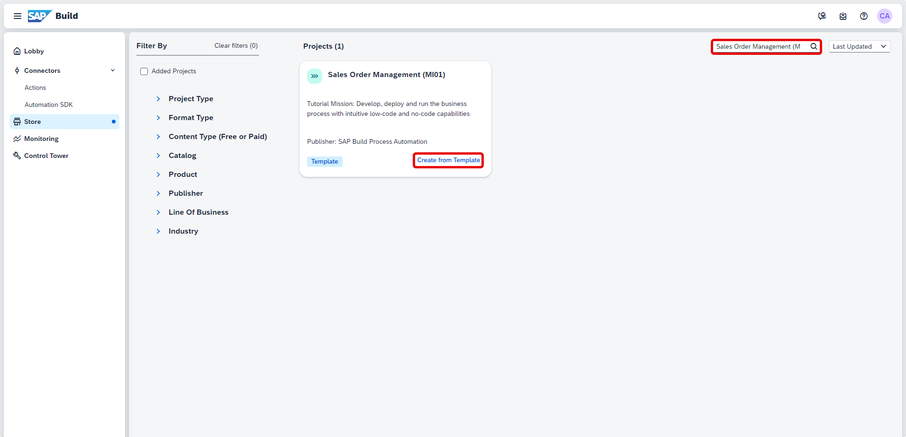

3. In the **Project Name** field, enter **Sales Order Approval**.
    - click **Create**

    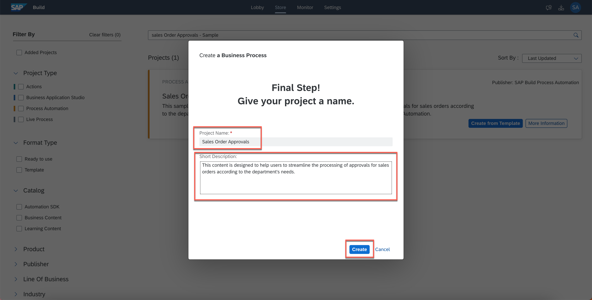

### Add Action

1. In the Process Builder canvas, click the **+** in output connector of **Auto Approval Notification**

    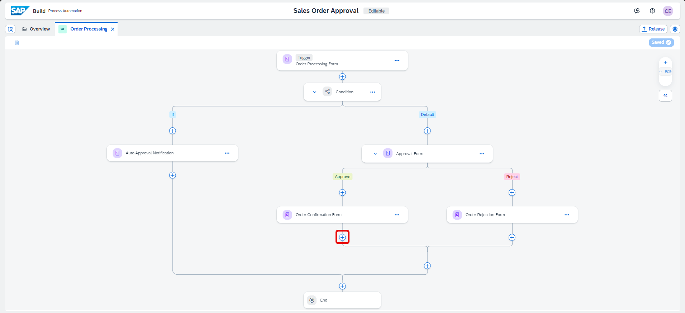

2. In the list, choose **Actions** > **Browse library**

    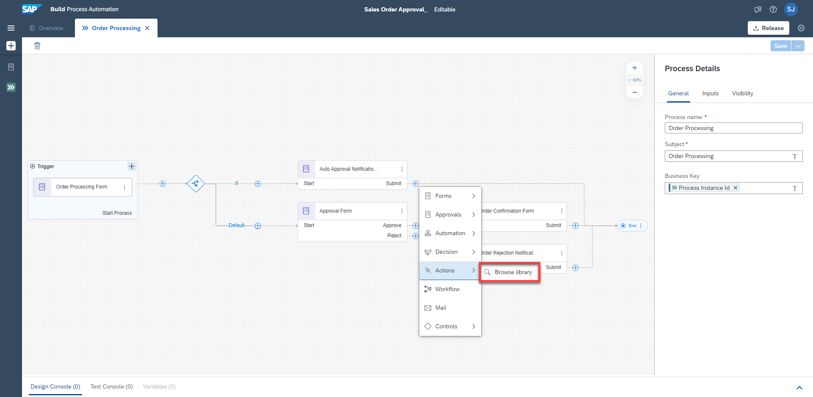

3. In the Action Library pop up, enter the action name like Sales Order, to find the list of actions on sales order published by you in the library.

    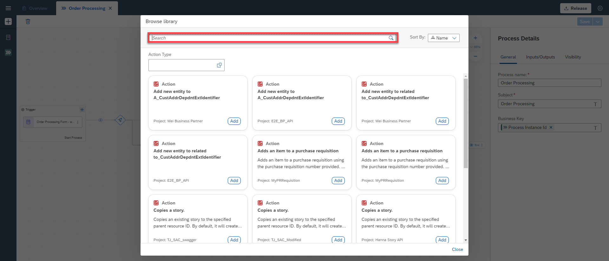

4. From the filtered list of actions, click **Add** on the action which is to create sales order.

    > This will add the action to connect process to the backend system in your business process

    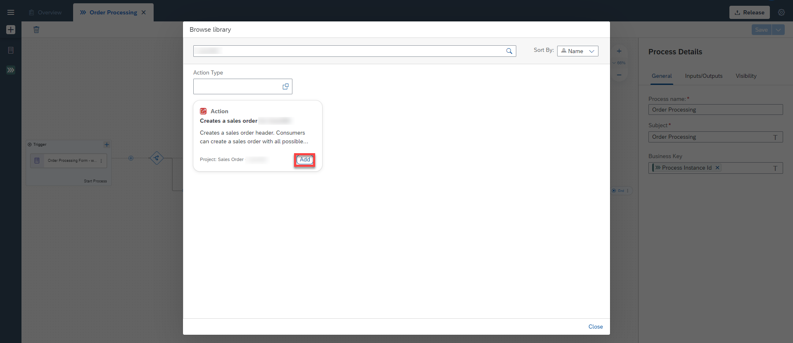

### Configure Action

1. In **General** tab of Action parameters, choose the corresponding **Destination variable** that you previously created.

    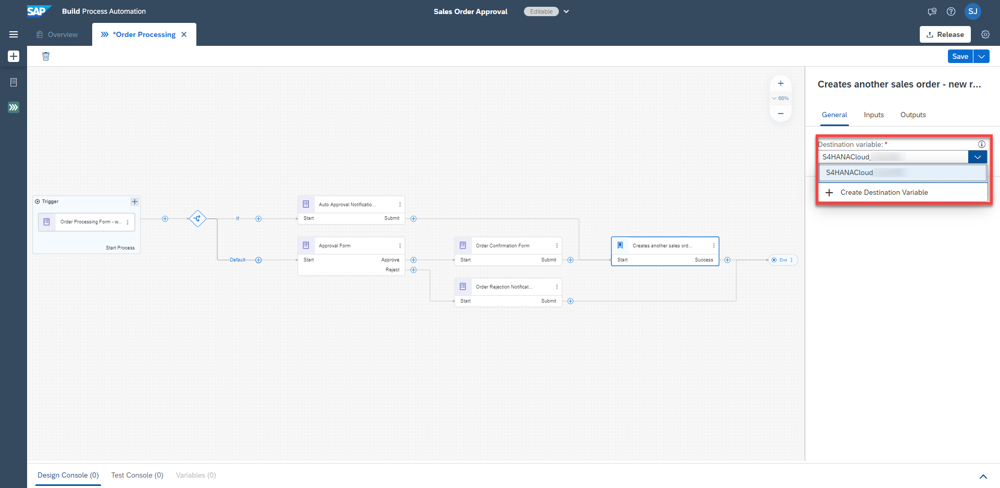

2. Click **Inputs** tab, and map each input to the actual process content.

    | Input Field | Process Content |
    |:---:|:---:|
    | DistributionChannel | Order Processing Form > Distribution Channel |
    | OrganizationDivision | Order Processing Form > Division |
    | PurchaseOrderByCustomer | Order Processing Form > Order Number |
    | SalesOrderType | Order Processing Form > Sales Order Type |
    | SalesOrganization | Order Processing Form > Sales Organisation |
    | SoldToParty | Order Processing Form > Ship To Party (Customer) |

    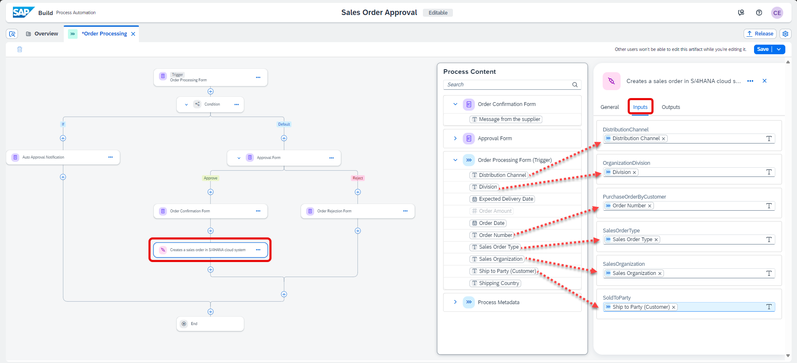

3. In **Outputs** tab, check to make sure all outputs are same as defined in the action project.

    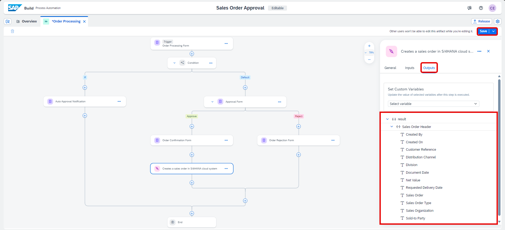

4. Finally, update the connections of **Order Confirmation Form** activity in the business process such that once the order is confirmed the sales order is created in the backend system.

    - select and delete the output connector from **Order Confirmation Form** to **End** activity.

    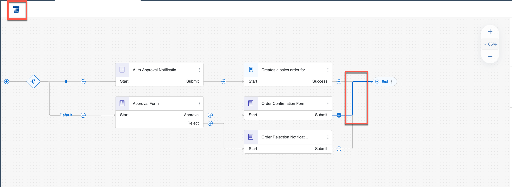

    - Drag and drop the **+** in the output connector of **Order Confirmation Form** to the Action activity.

    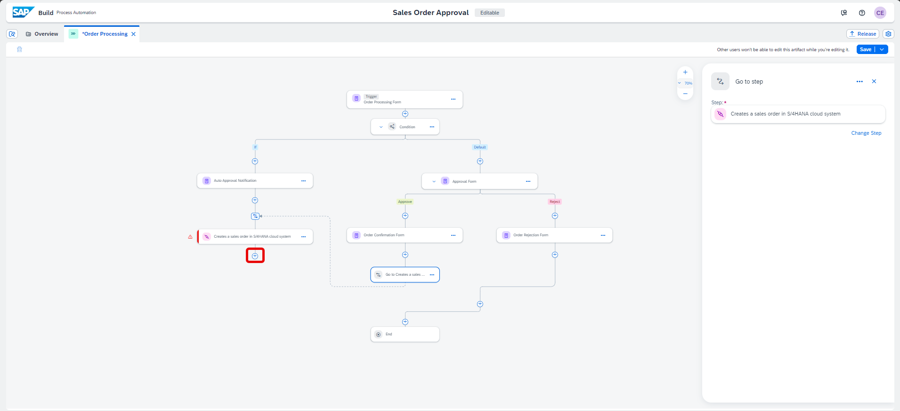

    > You can connect these nodes by simply dragging and dropping the lines. If a connected line can't be moved, simply click and delete the line, then drag and drop the resulting unconnected line to the proper node

    The final process should be same as shown below. Ensure that you have the right connections such that *Auto Approval Notification Form* and *Order Confirmation Form* connects to *Action* activity.

    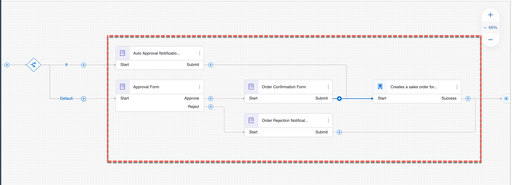

5. Click **Save** to save your work.

### Release Business Process Project

You will now release and deploy your project. The release process allows for semantic version control with format X.Y.Z, where you will be able to increment your project release version based on a major version change (X), minor version change (Y), or bug/patch version change (Z). Deploying your project will allow you to set the proper parameters, if necessary, to allow for project execution.

There are two possible  situations:
   - When you're releasing a new business process project, enter a brief summary of the changes in the **Release Notes** (optional) then Choose **Release**
   - When you're releasing a modified version of a business process project that is already released, in the Release **Version Contains dialogue**, select one of the following:
        - Select **Bug Fix** to indicate bug fixes. It updates the third digit of the version number.
        - Select **Minor Changes** to indicate small modifications. It updates the second digit of the version number.
        - Select **Major Changes** to indicate important modifications potentially leading to incompatibility between versions. It updates the first digit of the version number.

1. In the Process Builder, click **Release**

    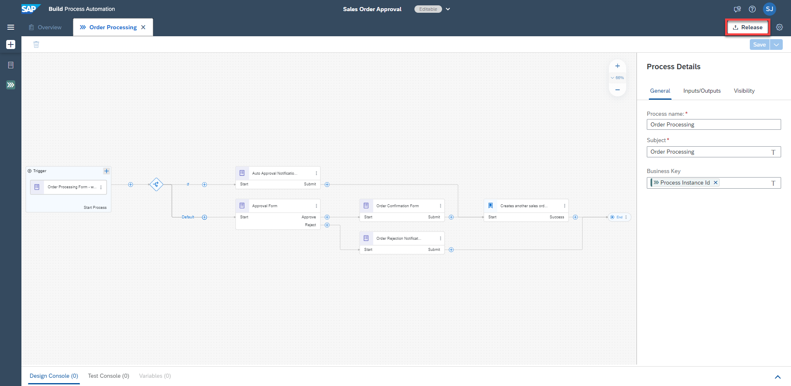

2. For the first version, add a **Version Comment** if needed and click **Release**

    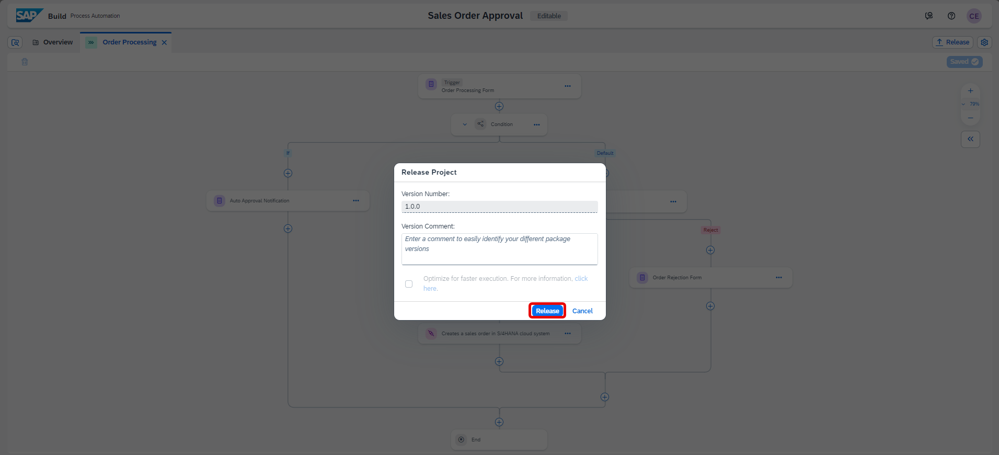

   - For the additional version, choose the type of version, add a **Version Annotation** if needed and click **Release**

        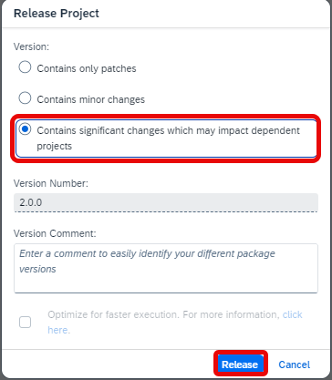

3. The successfully released project is ready to be deployed
    > If needed, you can refer to the [Documentation](https://help.sap.com/docs/PROCESS_AUTOMATION/a331c4ef0a9d48a89c779fd449c022e7/bcb638ecb98d4e1db8267ecccd8ffdf3.html?version=Cloud)

    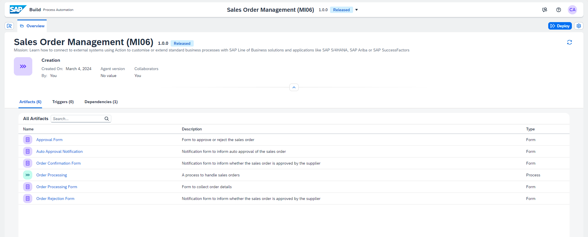

### Deploy Released Project

You can deploy business process projects from each released version of the project in the Process Builder or through Lobby.

1. From the released version of the business process project in the Process Builder, click **Deploy**

    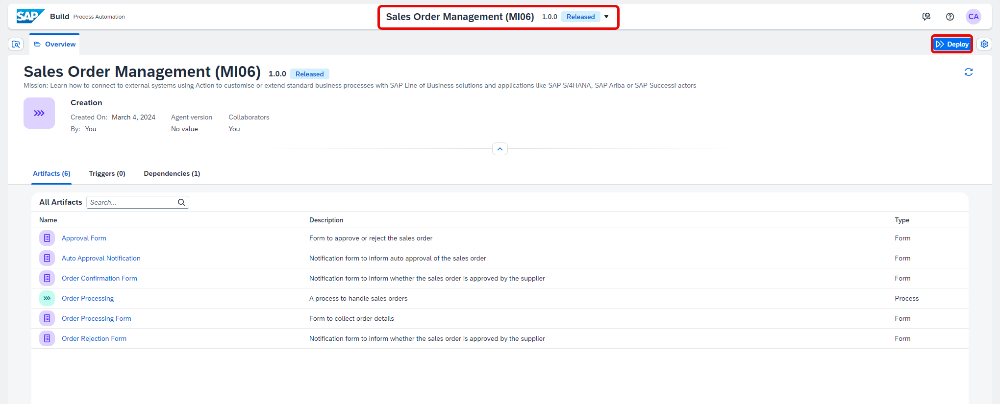

2. From the drop-down select the destination **S4HANACloud** and click **Confirm**

    > Variables allow you to reuse certain information for a given business process project deployment.

    >  You use variables to pass parameters to automations. You can create variables in the Process Builder for which you can later set values when deploying the  business process project. For example, in the current use case, you have created a *Destination* variable. Please use the same destination *S4HANACloud*.

    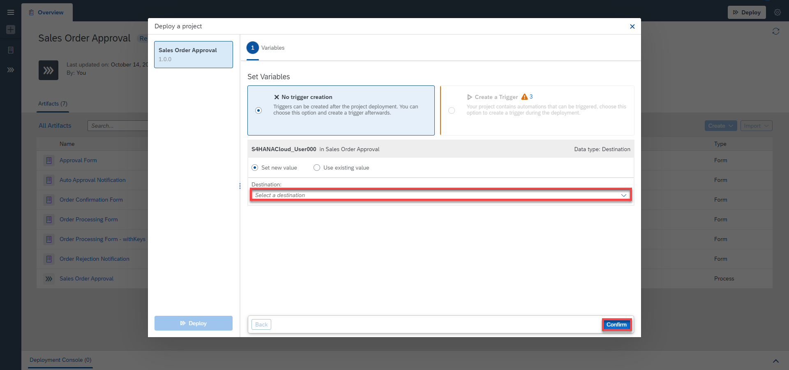

3. Click **Deploy**

    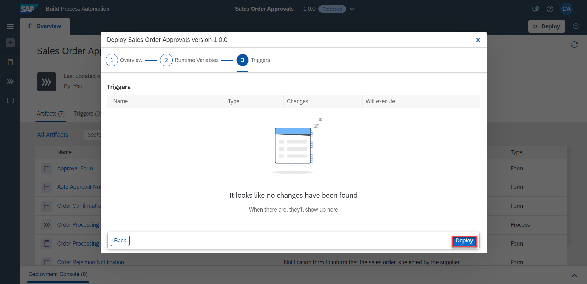

    The successfully deployed project is ready for running and monitoring

    > If needed, you can refer to the [Documentation](https://help.sap.com/docs/PROCESS_AUTOMATION/a331c4ef0a9d48a89c779fd449c022e7/d1e6a2d496f24ef1be43c2da8716c3b6.html?version=Cloud)

    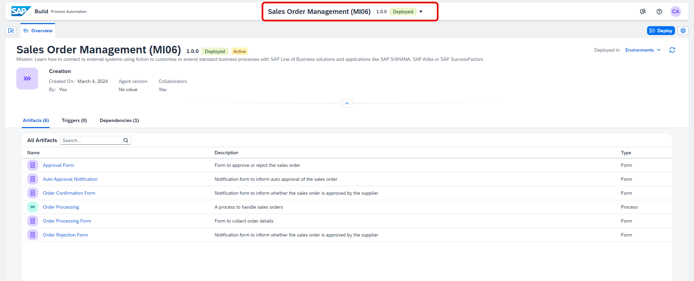

    You've successfully imported a sample process, added an action to create a sales order and configure the action with the environment variable to get the connection details from destination in SAP BTP cockpit.
