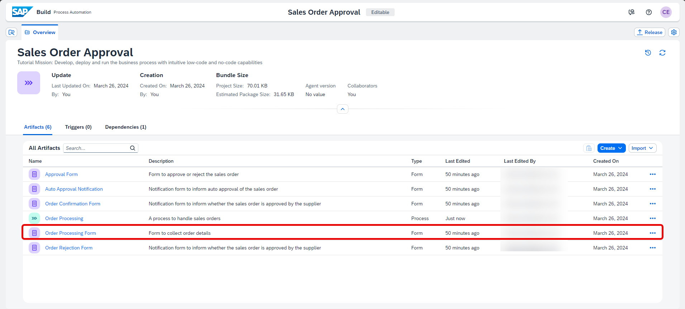
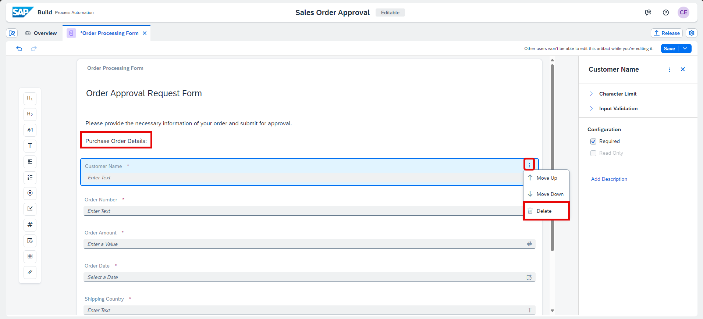
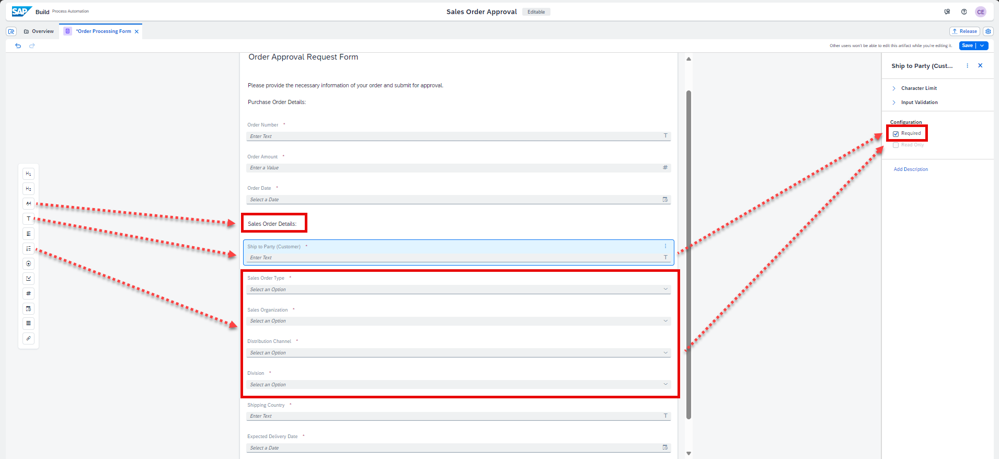
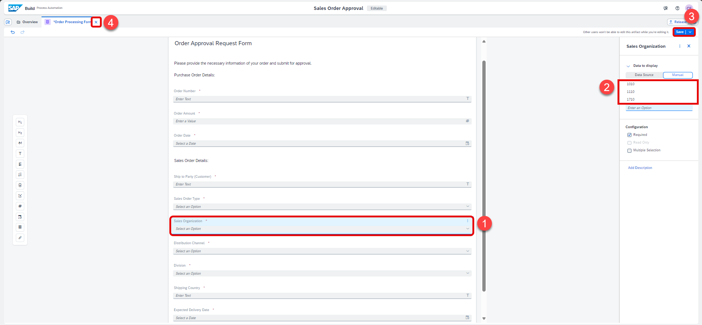
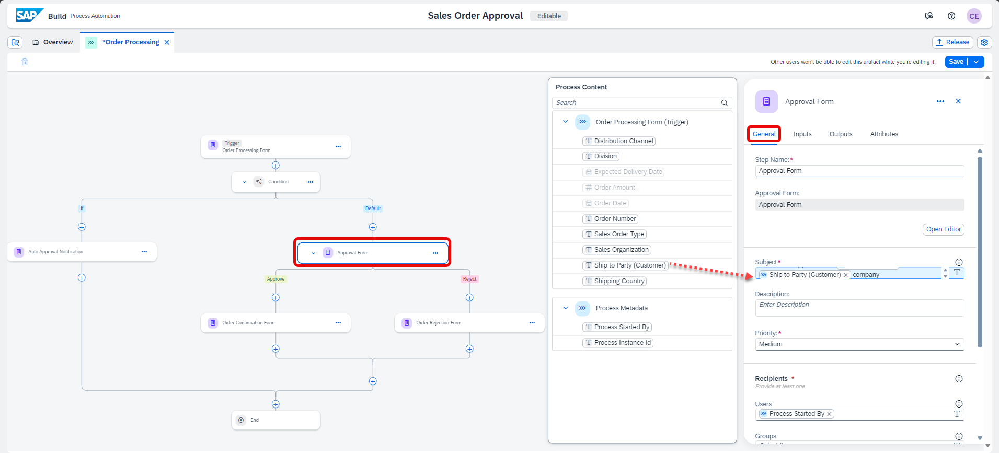
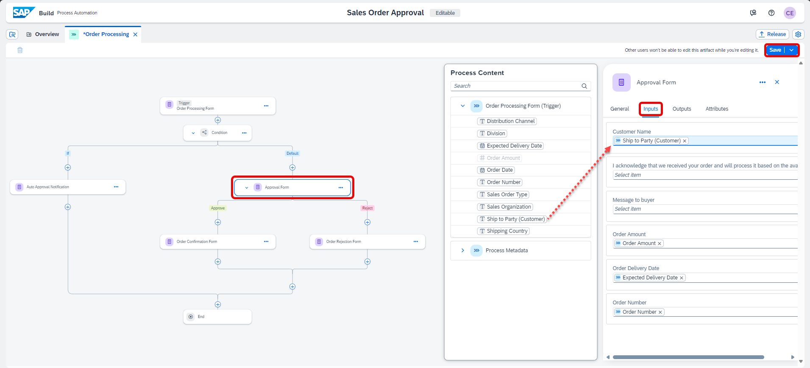
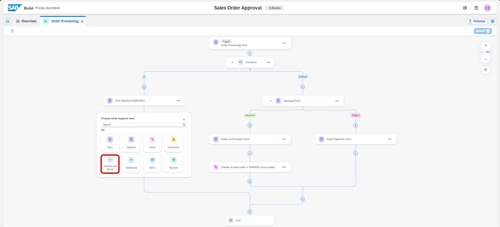
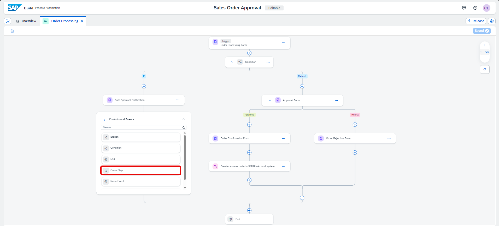
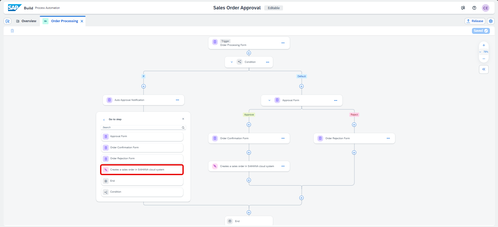
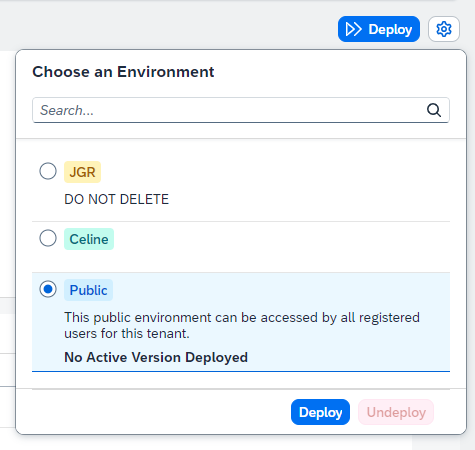

# Add Action to Business Process
<!-- description --> Add the action in the business process to connect to the backend system

## You will learn
- to import sample process
- to discover action from action library
- to add and configure action to the business process
- to map input fields of the action to the actual process content
- to release and deploy business process with actions

## Intro
Learn how to add the action in the business process to connect to backend system. You can do this by choosing the relevant action from the actions library, and then configuring the action's parameters.

### Import sample process as template

1. From the **SAP Build** Lobby, click on the **Store** tab.

    <!-- border -->

2. On the **Store** page, search for **Sales Order Management (MI01)** and once it loads, click **Create from Template**.

    <!-- border -->

3. In the **Create a Business Process project** pop-up:
   
    - In the Project Name field, enter **Sales Order Approval**.
  
    > You can keep the default description or enter the description of your choice

    - Click **Create**.

    <!-- border -->

4. Open **Lobby** and you will see your project created.

    <!-- border -->

### Update Order Processing Form

1. Click to open **Sales Order Approval** business process project from the **Lobby**.
   
    > When you open for the first time then you might get an option to Accept.

2. Select the **Order Processing Form**.

    <!-- border -->

3. The form editor opens. Do the following changes:

    - In the paragraph field, add **Purchase Order Details:**
  
    - Choose the three dots next to **Customer Name** field and select **delete**.
  
    <!-- border -->

    - Add a paragraph after **Order Date** and enter **Sales Order Details:**
   
    - Just below the **Sales Order Details** paragraph and before **Shipping Country** and **Expected Delivery Date** inputs, add the following input fields and enter the labels and select the **Required** checkbox:

    |  **Form Fields**   |  **Field Settings with Label**
    |  :------------- | :-------------
    | Text     | Ship to Party (Customer)
    | Dropdown | Sales Order Type
    | Dropdown | Sales Organization
    | Dropdown | Distribution Channel
    | Dropdown | Division
  
    <!-- border -->

    - Now enter values in the dropdown fields such as:

    |  **Dropdowns**   |  **Option value(s)**
    |  :------------- | :-------------
    | Sales Order Type    | OR
    | Sales Organization | 1010/1110/1710
    | Distribution Channel | 10
    | Division | 00

    <!-- border -->

    > You may enter any option of your liking depending on your available data set in your `S/4HANA system`.

4. Save and close the form.

### Add environment variable to access destination

1. In the **Overview** tab, click to open **Order Processing** process.

    <!-- border -->

2. In the process builder, click to open **Project Properties** from top-right corner of the page.

    <!-- border -->

3. In the **Project Properties** pop-up, select **Environment Variables** and choose **Create** to create an environment variable for this business process.

    <!-- border -->

4. Enter the following to create an environment variable:

    - **S4HANACloud** as **Identifier**.
    - Any **Description** of your choice.
    - **Destination** as variable type.

    <!-- border -->

    - Click **Create**.

5. Once the environment variable is created, **Close** the project properties' pop-up.

    <!-- border -->

### Configure Approval Form

1. Select the **Approval Form**.

2. In the **General** section, under **Subject** map the company to Order Processing Form > Ship to Party (Customer).
   
    <!-- border -->
  
3. Choose **Inputs**, map **Customer Name** input with Order Processing Form > Ship to Party (Customer).
   
4. Choose **Save**.

   <!-- border -->

### Add action

1. In the Process Builder canvas, click the **+** in output connector of **Order Confirmation Form**.

    <!-- border -->

2. In the list, choose **Action**.

    <!-- border -->

3. In the **Browse library** pop up, click **Add** on the action you just created.

    <!-- border -->

    > This will add the action to connect process to the backend system in your business process.

### Configure action

The action gets added to your process.

1. In **General** tab of action parameters, choose the corresponding **Destination variable** that you previously created.

    <!-- border -->

2. Click **Inputs** tab, and map each input to the actual process content.

    |  Input Field         |  Process Content
    |  :-------------------|  :-------------
    |  `DistributionChannel` |  Order Processing Form > Distribution Channel
    |  `OrganizationDivision` |  Order Processing Form > Division
    |  `PurchaseOrderByCustomer` |  Order Processing Form > Order Number
    |  `SalesOrderType` |  Order Processing Form > Sales Order Type
    |  `SalesOrganization` |  Order Processing Form > Sales Organization
    |  `SoldToParty` |  Order Processing Form > Ship To Party (Customer)

    <!-- border -->

3. In **Outputs** tab, check to make sure all outputs are same as defined in the action project.
   
4. Save your work.

    <!-- border -->

5. Update the connections of **Auto Approval Notification** activity in the business process such that once the order is auto approved, the sales order is created in the backend system:

    - Select **+** below **Auto Approval Notification**.

    <!-- border -->

    - Select **Controls and Events**.
  
    <!-- border -->

    - Select **Go to Step**.

    <!-- border -->
  
    - Choose **Creates a sales order in S/4HANA cloud system**.

    <!-- border -->
    
    The final process should be same as shown below. Ensure that you have the right connections such that *Auto Approval Notification* and *Order Confirmation Form* connects to *Action* activity.

    <!-- border -->

6. Click **Save** to save your work.

### Release business process project

You will now release and deploy your project. The release process allows for semantic version control with format X.Y.Z, where you will be able to increment your project release version based on a major version change (X), minor version change (Y), or bug/patch version change (Z). Deploying your project will allow you to set the proper parameters, if necessary, to allow for project execution.

There are two possible situations:

- When you're releasing a new business process project, enter a brief summary of the changes in the **Release Notes** (optional) then choose **Release**.
- When you're releasing a modified version of a business process project that is already released, in the release **Version Contains dialogue**, select one of the following:
    - Select **Bug Fix** to indicate bug fixes. It updates the third digit of the version number.
    - Select **Minor Changes** to indicate small modifications. It updates the second digit of the version number.
    - Select **Major Changes** to indicate important modifications potentially leading to incompatibility between versions. It updates the first digit of the version number.

1. In the Process Builder, click **Release**.

    <!-- border -->

2. For the first version, add a **Version Comment** if needed and click **Release**.

    <!-- border -->

    - For the additional version, choose the type of version, add a **Version Comment** if needed and click **Release**.

    <!-- border -->

3. The successfully released project is ready to be deployed.

    > If needed, you can refer to the [Documentation](https://help.sap.com/docs/build-process-automation/sap-build-process-automation/releasing-project?version=Cloud).

    <!-- border -->

### Deploy released project

You can deploy business process projects from each released version of the project in the Process Builder.

1. From the released version of the business process project in the Process Builder, click **Deploy**.

    <!-- border -->

2. Choose an environment and select **Deploy**.

    <!-- border -->

3. Now you will set the runtime variables. From the drop-down select the destination **S4HANACloud** and click **Deploy**.

    > Variables allow you to reuse certain information for a given business process project deployment.

    > You use variables to pass parameters to automations. You can create variables in the Process Builder for which you can later set values when deploying the business process project. For example, in the current use case, you have created a *Destination* variable. Please use the same destination *S4HANACloud*.

    <!-- border -->

4. The successfully deployed project is ready for running and monitoring.

    > If needed, you can refer to the [Documentation](https://help.sap.com/docs/build-process-automation/sap-build-process-automation/deploy-project?version=Cloud).

    <!-- border -->

    You've successfully imported a sample process, added an action to create a sales order and configure the action with the environment variable to get the connection details from destination in SAP BTP cockpit.
