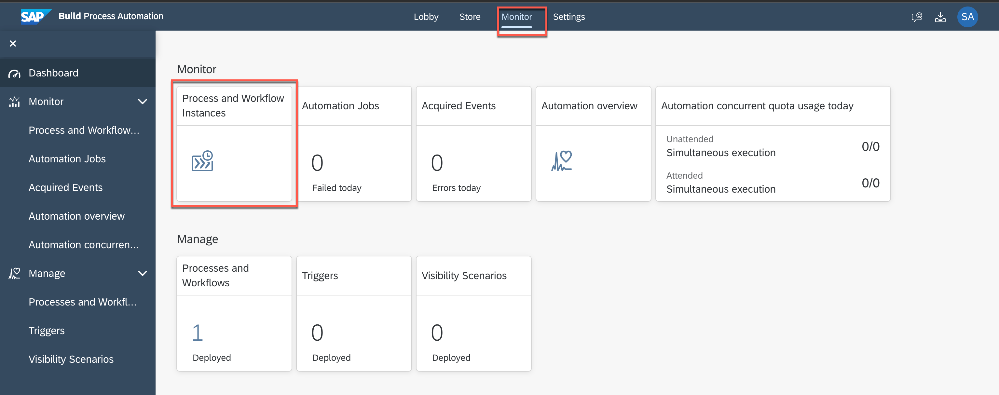
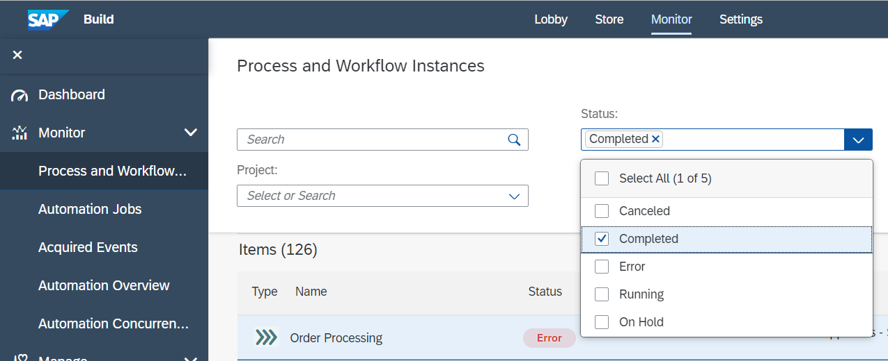
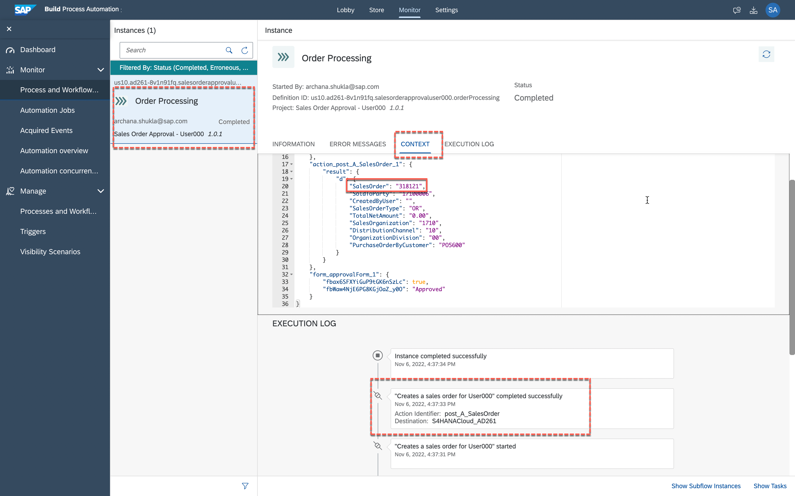
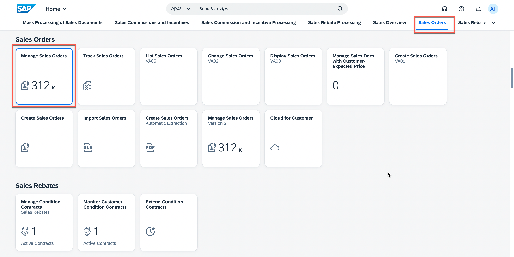
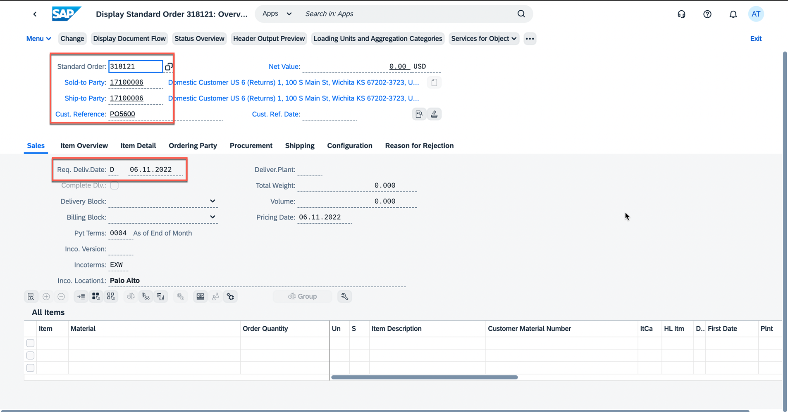

# Access S/4HANA Cloud System to View Sales Order
<!-- description --> Check the sales order created in the backend system after successful completion of business process with action

## You will learn
- How to access backend system to check the newly created business object that has been generated using APIs via business process

## Prerequisites
- You must have your own S/4HANA Cloud system with needed credentials to access to sales order business objects.

## Intro
Once the business process is successfully executed, a sales order will be created in the backend S/4HANA cloud system. Access the backend system to check if the sales order is actually created in the system with the given sales order details (as filled in the approval form).

### Get sales order number

1. Once the action is completed successfully, copy the sales order from **Process and Workflow Instances**.
    - Go to **Monitoring** section and click **Process and Workflow Instances** under **Monitor**.

    <!-- border -->

    - Click to filter **Completed** instances.

    <!-- border -->

    - Search for your Order Processing Instance.
    - Click **Logs** tab.
    - Check if the **Action** is completed.
    - Open **Context** tab.
    - Copy the sales order number.

    > This is the sales order that is newly created in the backend S/4HANA system.

    <!-- border -->

### Open S/4HANA system

1. Open your S/4HANA Cloud System and select **Sales Orders** tab, and then click to open **Manage Sales Order** tile.

    <!-- border -->

### Check sales order created

1. Enter the sales order number in **Sales Order**, click **Go**.
    - once you find the sales order, click **>** to navigate to the sales order.  

    <!-- border -->

2. You can now explore the sales order to check Ship to Party, Expected Delivery Date etc.

    <!-- border -->
