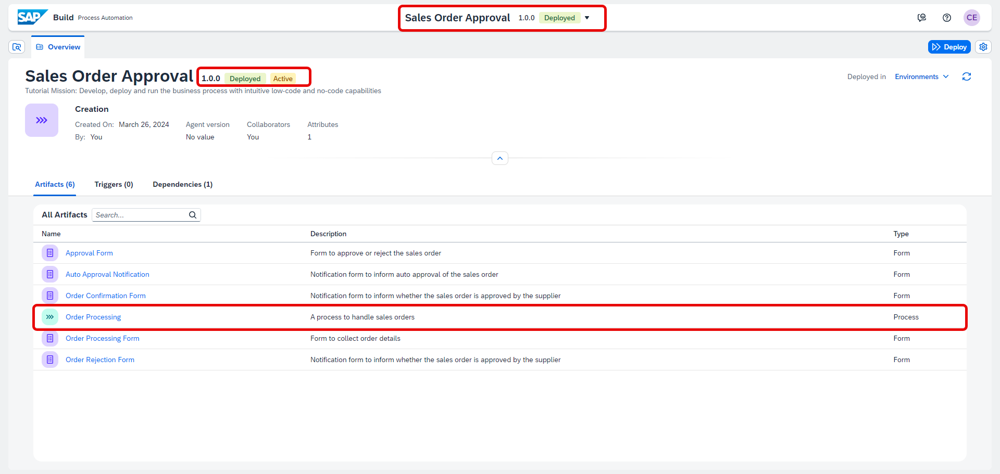
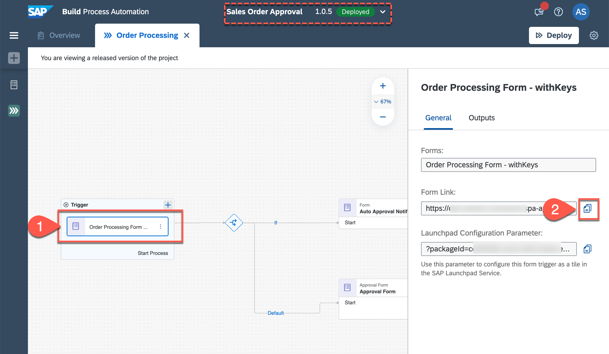
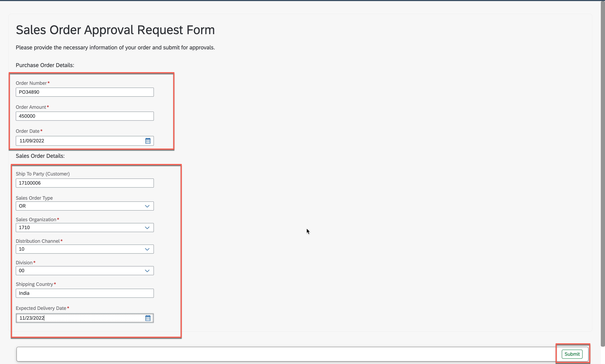
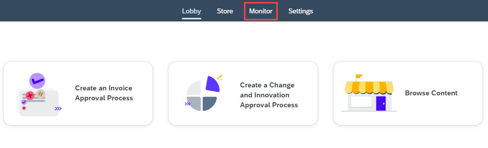
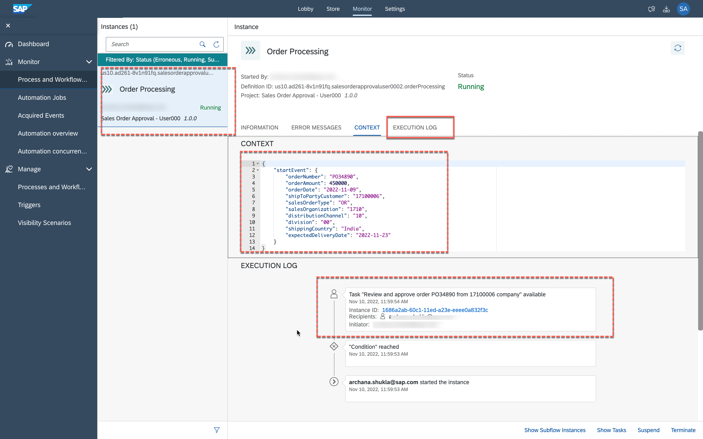
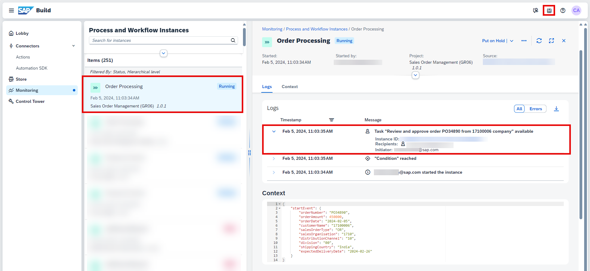
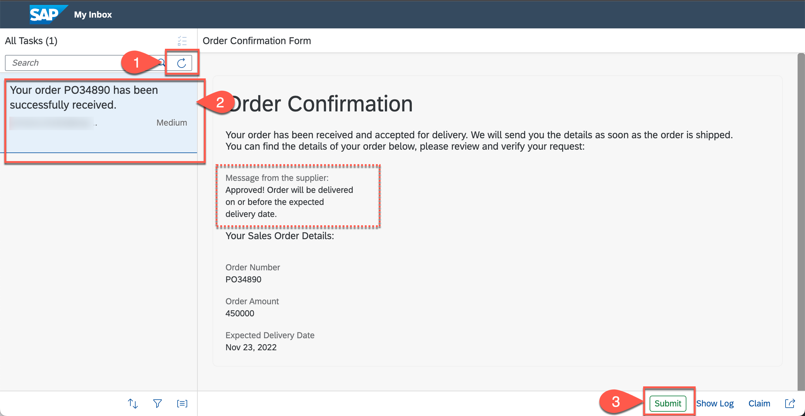
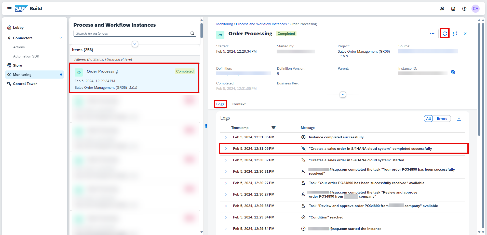
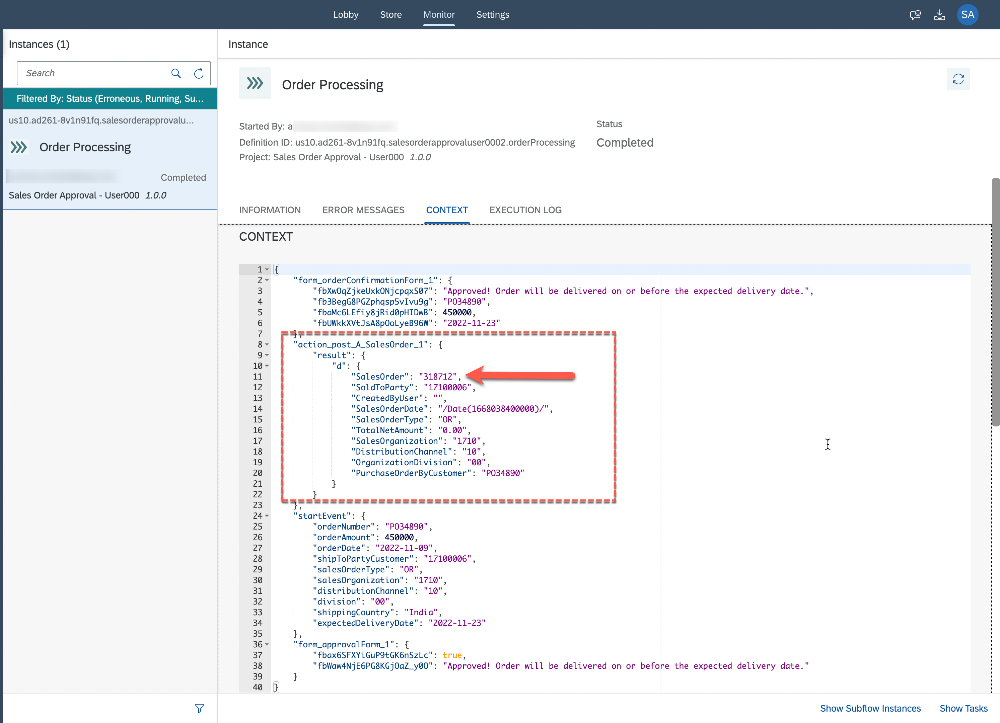

# Run Business Process
<!-- description --> Once the business process is deployed, learn how to run the business process and monitor the process with action execution details

## You will learn
- to run and monitor business process with action
- to observe the action logs and outcome of the action execution

### Run sales order approval business process

1. From the deployed version of the project, click **Order Processing** process from list of **Artifacts**.

    <!-- border -->

2. In the process editor,
    - select **Order Processing Form**.
    - copy the **Form Link**.
    - open it in new browser tab/window.

    <!-- border -->

3. Fill the form with following details and click **Submit**.

    > This will start the business process.

    | Form Field Name | Value    |
    | :------------- | :------------- |
    | Order Number  | any value like PO34890, 56390 etc. |
    | Order Amount | any number greater than 100000 |
    | Order Date | select any previous date from date-selector |
    | Ship To Party | 17100006   note: this is a customer ID in the   backend S/4HANA System|
    | Sales Order Type | OR   note: this stands for Standard Order  in the   backend S/4HANA System|
    | Sales Organization | 1710   note: this is the organisation ID already   existing in the backend S/4HANA System|
    | Distribution Channel | 10   note: this stands for Direct Sales distribution channel   in the backend S/4HANA System|
    | Division | 00   note: this stands for Product Division   in the backend S/4HANA System|
    | Shipping Country | any country name like India, Germany etc. |
    | Expected Delivery Date |  select any later date from the date-selector |

    > As per the process, if the order amount is > 100000 then it will go for approval or else it will auto-approved.

    > The sales order information in the form has to filled based on the available business object values in the backend system such that the sales order gets created successfully in S/4HANA system.

    <!-- border -->

### Monitor sales order approval process

1. Return to the lobby and select **Monitor** tab to monitor the process execution.

    <!-- border -->

2. In the **Monitor** section, click **Process and Workflow Instances** to see process instances details.

    <!-- border -->

3. In process instance detail page, select your process instance to inspect the instance details.

    - Look at the context section. In the context, you will see the order details that you entered in the form.
    - Go to **Execution Log** and you will see that the user task is waiting to be approved.

    <!-- border -->

### Approve sales order from MyInbox

1. Open `MyInbox` application from top-right corner of the screen.

    <!-- border -->

2. In `MyInbox` application, you will see a new task **Review and Approve order** with the given purchase order number in your inbox.

    > You can also search the inbox items with your purchase order number.

    - Select the acknowledgement checkbox.
    - Enter any comment of your choice.
    
    > This comment will be sent to the requester during final notification.

    - Click **Approve**.

    <!-- border -->

3. As per the process, once you approve the sales order - an explicit notification task is sent to the approver to inform him of the approval with the comment from the supplier.

    - Choose **Refresh** to get new tasks.
    - Select task with your purchase order number having text **Your order PO has been successfully received**.

    > You will see the message from the supplier.

    - Click **Submit** to acknowledge the response from the supplier.

    <!-- border -->

### Check action log

1. Go back to the **Monitor** application, select your process instance and observe the **EXECUTION LOG**.

    - **Refresh** the logs from top-right corner of the screen.
    - You will see the log entry for **Action** execution which informs you that a POST API for Sales Order has been executed, with the given destination configuration.

    <!-- border -->

2. Now click to open **CONTEXT** tab.

    - You can observe the process context as how it has been updated after successful execution of each process step.
    - Notice the output after the Action execution.
    - Copy this `SalesOrder` number from the output to validate it in
      SAP S/4HANA system.

    <!-- border -->

You've successfully built and executed an automated sales order approval process where the sales order is created in the backend S/4HANA Cloud system once the approval is done.
