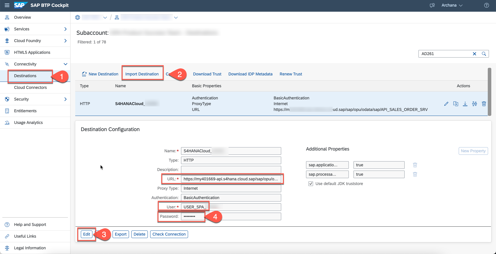
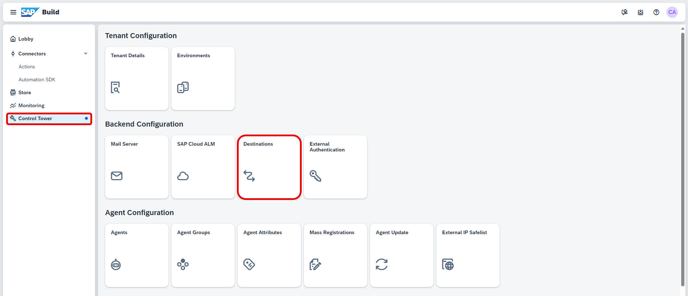
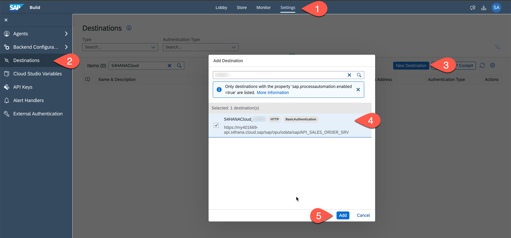
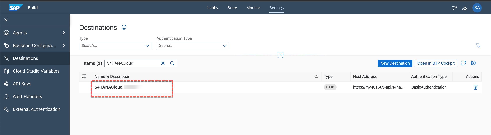

# Setup Environment
<!-- description --> Create destination and environment variables for action configuration

## You will learn
  - How to create destination in SAP BTP Cockpit to connect to backend system
  - How to add destination based environment variable in business process for action configuration

## Intro
> **IMPORTANT:** Please refer to sample **Sales Order Management (MI06)** in the SAP Build Store if you face any issues while following the tutorials. To retrieve the sample refer to **step 5** of [Run Business Process](spa-process-action-run).

To configure action in business process, you will need to create an environment variable to access the destination that is created in SAP Business Technology Platform. A destination is needed to connect to the S/4HANA system to execute the APIs. The destination-based environment variable will be used to configure the action of the business process.

### Add destination in SAP Build Process Automation

1. To add the destination in your BTP Cockpit, do the following:

    - [Download](https://www.sap.com/registration/trial.f47300f6-63b8-4f22-b189-dbadd3c903d6.html?id=0055000000004802023) the S4HANACloud destination file.
    - Go to **Connectivity > Destinations** in your **BTP Cockpit**.
    - Click **Import Destination** and select the downloaded destination file.
    - Update the **URL**, **User** and the **Password** based on your **S4HANACloud** setup.
    - **Save** the changed.

    <!-- border -->

    > Note that there is a property **sap.processautomation.enabled** added to the destination. The destinations which have this property set as true can be discovered and added in SAP Build Process Automation.

2. Set this destination, created in BTP cockpit, in SAP Build Process Automation. To do so:

    - Open **SAP Build** development workbench.
    - Click **Control Tower > Destinations**.
  
    <!-- border -->

    - Click **New Destination**.
    - From **Add Destination** pop-up, select `S4HANACloud` destination.
    - Click **Add** to add a new destination in SAP Build Process Automation.

    <!-- border -->

    A new destination will be added.

    <!-- border -->

    > This destination will be associated with the environment variable while deploying the business process.

    You have successfully created and configured the destination to be accessed while configuring business process.
