# Run a Business Process From the Business Site
<!-- description --> Configure a form trigger in the Business Site to run a Business Process

## Prerequisites
 - Complete [Configure SAP Build Work Zone, standard edition](spa-configure-workzone) tutorial

## You will learn
  - How to configure your form trigger as a tile in the Business Site.

---

### Configure the Process Trigger

You completed [Configure SAP Build Work Zone, standard edition](spa-configure-workzone) tutorial. You assigned **My Inbox**, **Process Workspace**, **Visibility Scenario Dashboard** and **Visibility Scenario Instances** to **Everyone** role and clicked **Save**.

<!-- border -->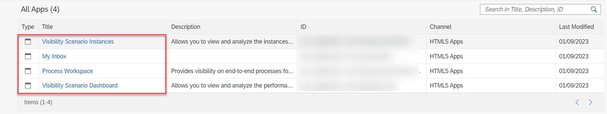

1. Go back to **Content Manager** page.

    <!-- border -->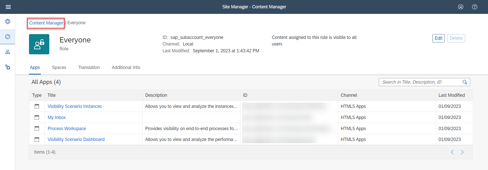

2. Select **Process Trigger**.

    <!-- border -->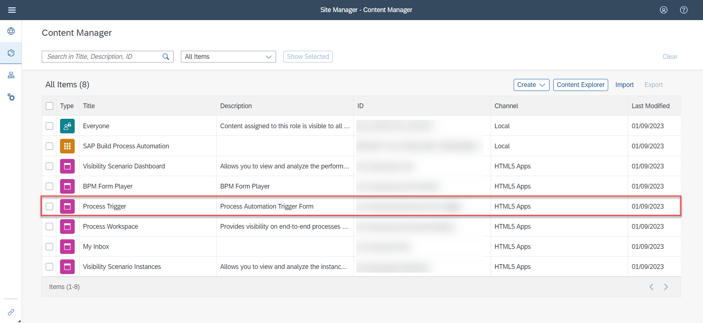

3. Choose **Create a Local Copy**.

    <!-- border -->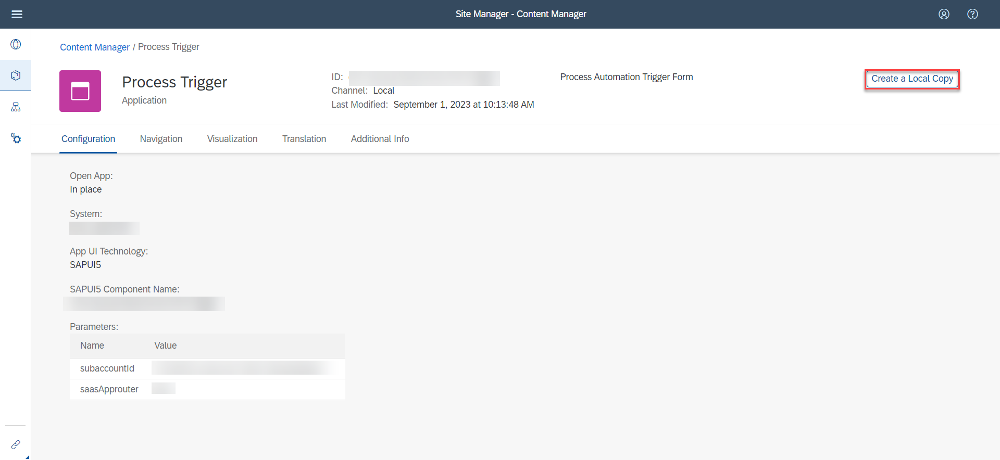

4. Choose **Edit** to make changes to the **Process Trigger** app.

    <!-- border -->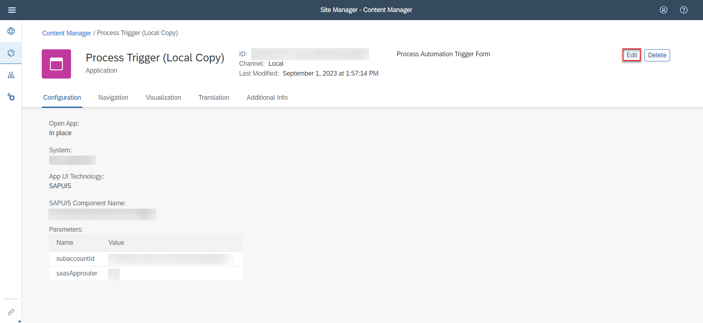

5. Change the name of the app to **Sales Order Management**.

    <!-- border -->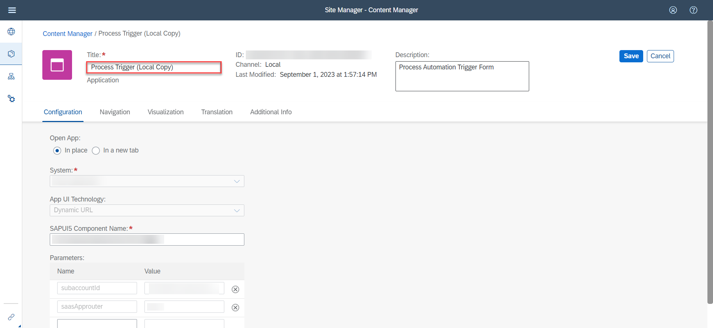

6. Select the tab **Navigation**.

    <!-- border -->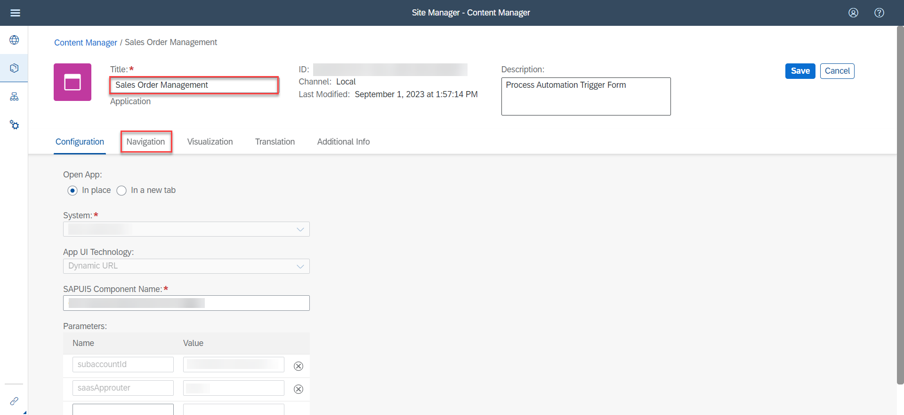

7. Now you need to fill the **Default Value** of the app's parameters with the **Launchpad Configuration Parameter** of your process' **Trigger Settings**.

    <!-- border -->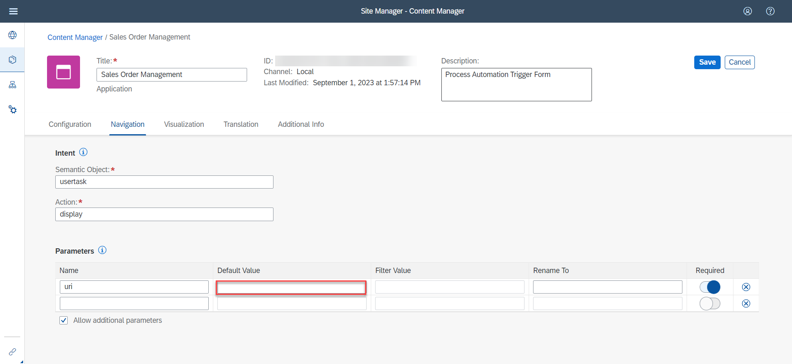

8. Navigate back to your deployed project in the **SAP Build Process Automation**.

9. Select the **Order Processing Form**.

10. Copy the **Launchpad Configuration Parameter**.

    <!-- border -->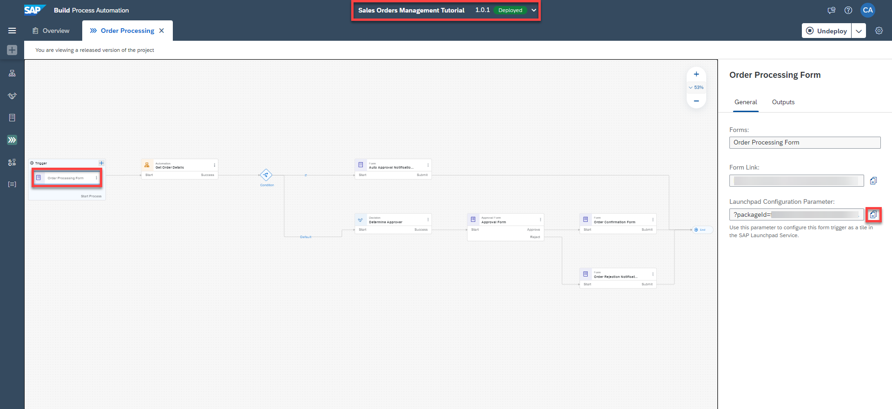

    >This is the parameter you need to configure this form trigger as a tile in the Business Site.

11. Now navigate back to the Work Zone.

12. Paste the value in the **Default Value** field of the Sales Order Management app's parameters.

    <!-- border -->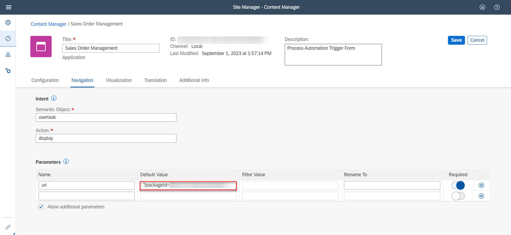

13. Select the tab **Translation**.

14. Change the name of the **Title** to **Sales Order Management**.

    <!-- border -->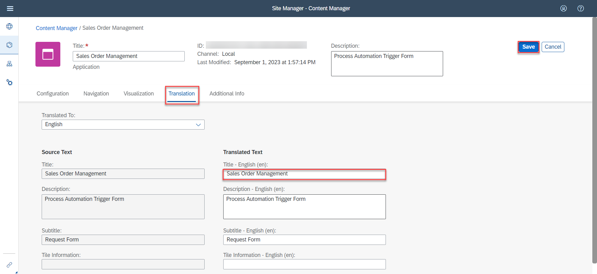

15. Choose **Save**.

### Assign Sales Order Management Trigger to SAP Build Process Automation Group

1. Navigate back to **Content Manager**.

    <!-- border -->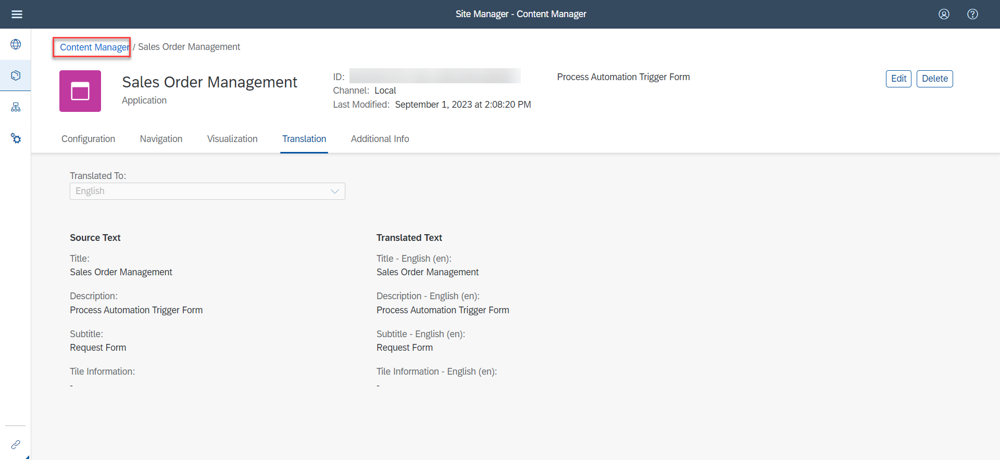

2. Select **SAP Build Process Automation** group.

    <!-- border -->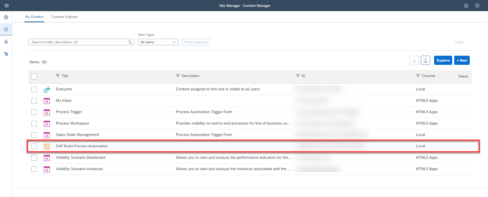

3. Choose **Edit** to make changes to the group.

    <!-- border -->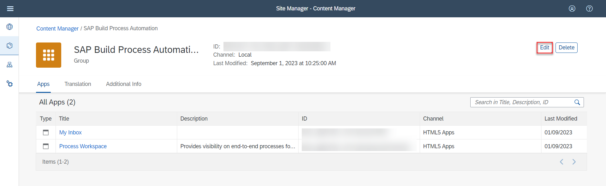

    You will now assign the **Sales Order Management** trigger to your group.

4. Select the search bar.

5. Click on the **On/Off Button** to add the **Sales Order Management** item.

6. Choose **Save**.

    <!-- border -->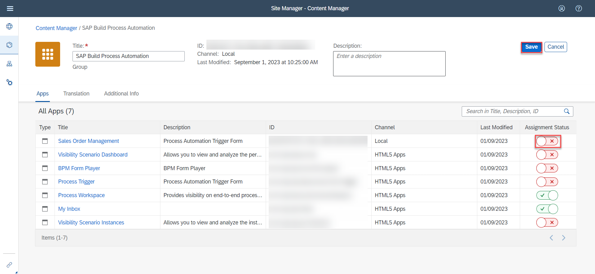

### Assign Sales Order Management Trigger to Everyone Role

1. Go back to **Content Manager**.

    <!-- border -->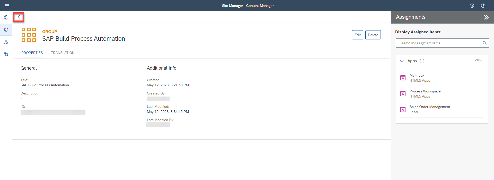

2. Choose **Everyone**.

    <!-- border -->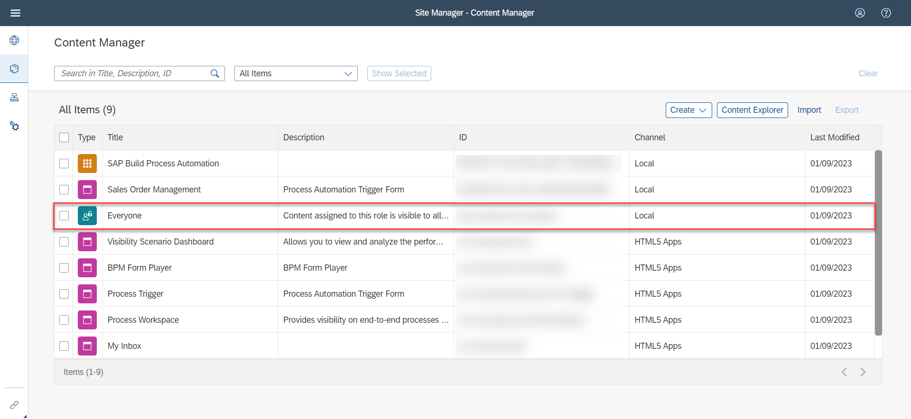

3. Choose **Edit**.

4. You will now assign the **Sales Order Management** trigger to Everyone role.

5. Click on the **On/Off Button** to add the **Sales Order Management** item.

6. Choose **Save**.

    <!-- border -->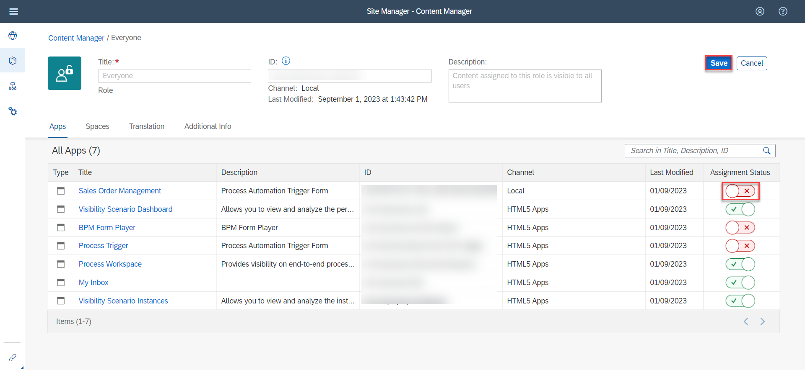

### Launch the Business Site

1. Navigate back to the **Site Directory**.

    <!-- border -->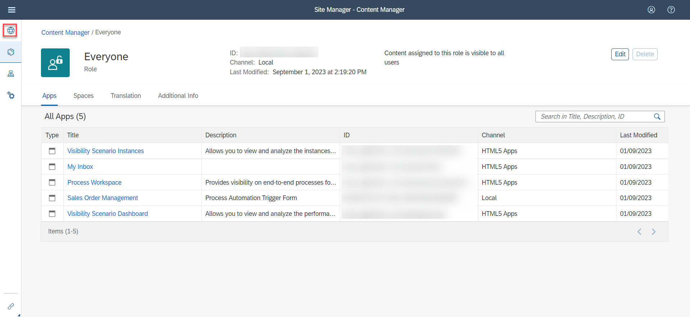

2. Go to the site.

    <!-- border -->

    You will be directed to the **Business Site** where the Sales Order Management tile has been created.

    You can now trigger the process from the **Business Site**.

3. Choose **Sales Order Management** tile.

    <!-- border -->

    > You can also see **My Inbox** and **Process Workspace** tiles added to the **Business Site** which can be used by the business users to access the tasks and monitor the processes respectively.

    You will be redirected to the **Order Approval Request Form**.

    <!-- border -->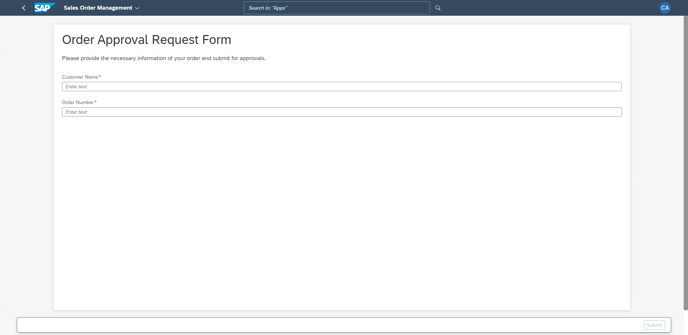

---
