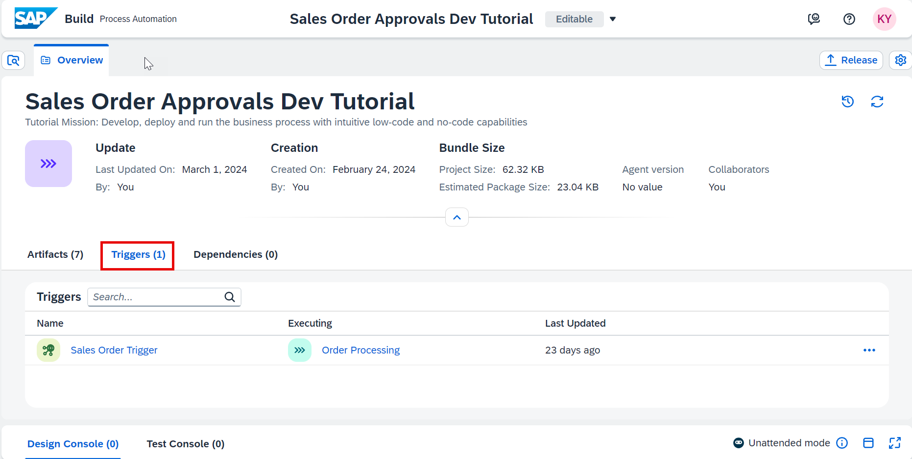
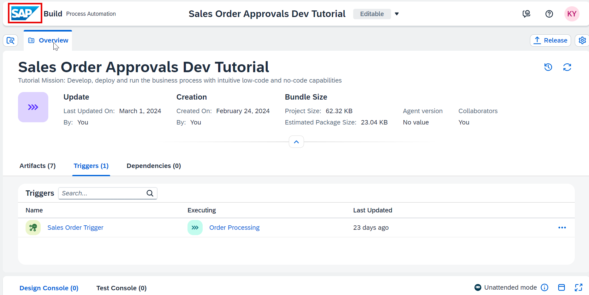
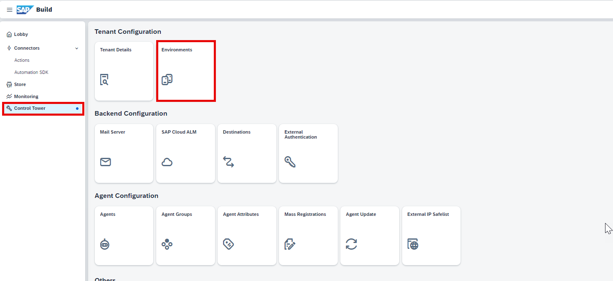
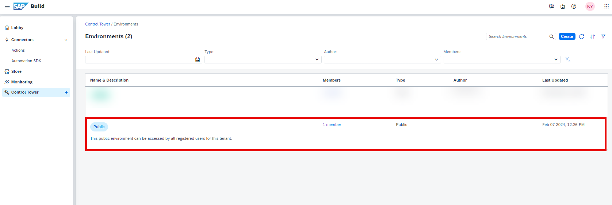
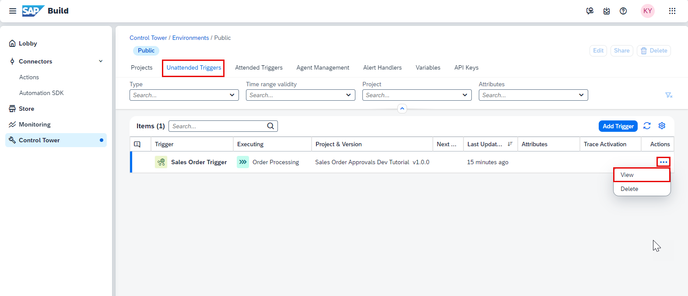
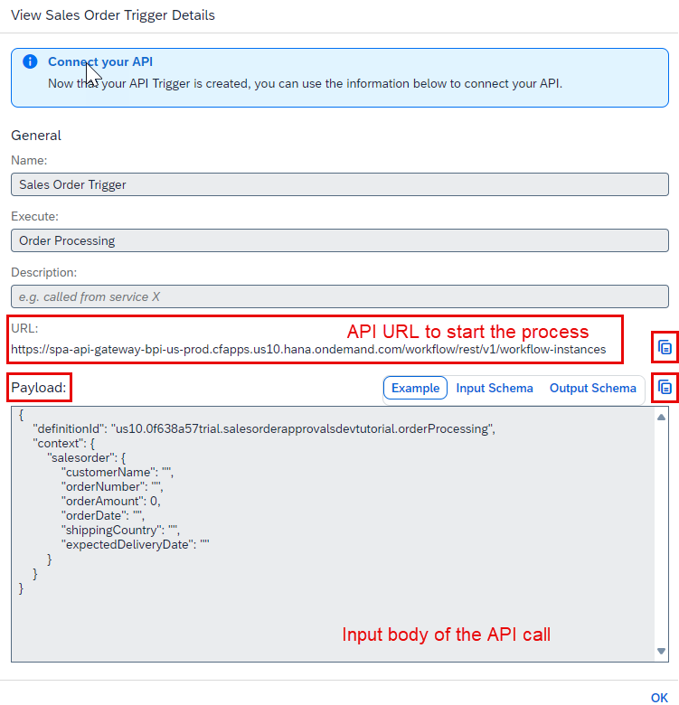
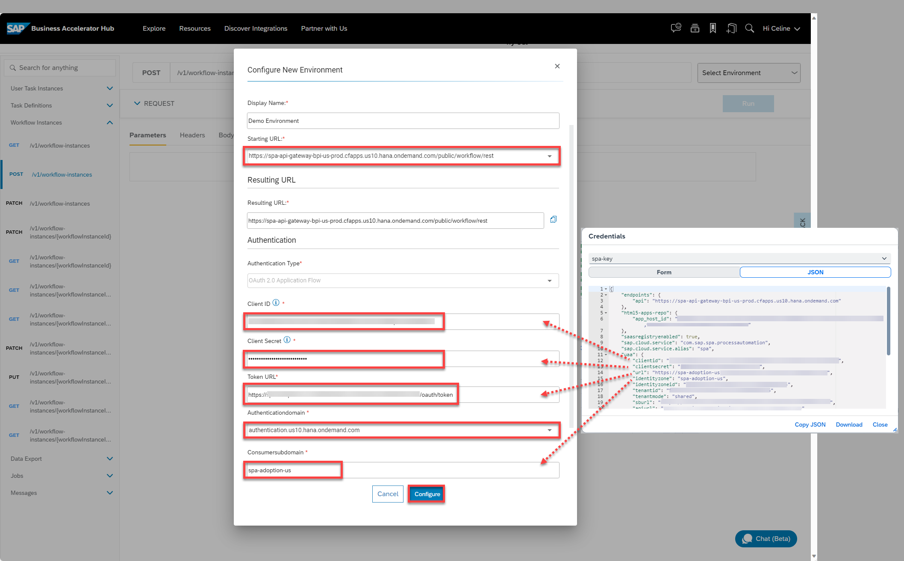

# Test an API Trigger for a Business Process
<!-- description --> Run API trigger for the Business Process.

## Prerequisites
 - Complete [Create an API trigger for the Process ](spa-create-process-api-trigger)
 - Complete [Create Destination to Trigger Process From any Service](spa-create-service-instance-destination)

## You will learn
- How to discover APIs in SAP Business Accelerator Hub
- How to test APIs in SAP Business Accelerator Hub
- How to test an API trigger of a business process
- How to start the business process from other services

---

### View an API trigger for the process

Once you have successfully deployed the business process with an API trigger, you can view the API trigger in the **Overview** section under the tab **Triggers**.

<!-- border -->

1. To view the context of the workflow API, navigate to the Lobby by clicking on the SAP logo.

    <!-- border -->

2. Choose **Control Tower** > **Environments**.

    <!-- border -->

3. Choose the environment in which the project is deployed.

    <!-- border -->

3. You can view the trigger in the **Unattended Triggers** tab. Click on **View**.
    
    <!-- border -->

2. You can view the API URL and the payload to start the process.

3. Copy the payload which would be used in the later steps.

    <!-- border -->  

    Details of the payload:

    |  **Name**    | **Details**
    |  :------------- | :-------------
    |  `definitionId`       | ID of the process after it is deployed
    |  `salesorderdetails`       | Input parameter for the API trigger

    You can even get the process `definitionId` from the **Monitoring** section as shown below.

    <!-- border -->
  
    <!-- border -->

### Create demo environment to test API trigger

All Process Automation APIs (except Inbox APIs which are OData v2 API) are REST APIs that are based on OAuth 2.0 and other methods like API keys.

1. Login to [SAP API Business Hub](https://api.sap.com/package/SAPProcessAutomation/all) to explore them.

    <!-- border -->

2. To trigger the process with an API Trigger, click on **Workflow**.

    <!-- border -->

3. Click on **API Reference**, and then navigate to **Workflow Instances > `POST /v1/workflow-instances`** to view the API.

    <!-- border -->

4. Select **Try Out > Workflow Instances > `POST /v1/workflow-instances` > Select Environment > + Add New Environment** to create a Demo Environment to test the API.

    <!-- border -->

5. In the **Configure New Environment** window, perform the following:
   
    - For **Display Name**, enter a name such as Demo Environment
    - For **Starting URL**, select from the dropdown the URL with you domain such as `https://spa-api-gateway-bpi-us-prod.cfapps.us10.hana.ondemand.com/public/workflow/rest`
    - **Client ID**: enter Client ID from the service key credentials
    - **Client Secret**: enter Client secret from the service key credentials
    - For **Authentication domain**, select from the dropdown the authentication with your domain such as `authentication.us10.hana.ondemand.com`
    - **Consumer subdomain**: enter `identityzone` from the service key credentials and **Token URL** will get updated
  
    > **Token URL** is  `url/oauth/token`, where `url` is noted from the service key credentials
 
    - Choose **Configure**.

    <!-- border -->

    <!-- border -->

6. After successful creation of demo environment, the token for the API call would be added to the **Headers** section.

    <!-- border -->  

### Test API trigger for the process

1. Navigate to **Body** and copy the payload that you copied in Step 1 of section **View an API trigger for the process** and paste it as shown below.

    <!-- border -->  

2. Fill in the values for the input fields as in screenshot below. 
   
    The payload looks as below before execution of the API. 
   
3. Click **Run** to trigger the API, which would start your process.

    <!-- border -->

3.  You can see the status code of the API as **201**, which is Success, meaning the process was triggered.

    <!-- border -->

### Monitor the triggered process in Home Page

In the home page of SAP Build Process Automation tenant, navigate to **Monitoring** > **Process and Workflow instances** to view the running instance of your process that was triggered from API call.

  <!-- border -->
