# Test an API Trigger for a Business Process
<!-- description --> Run API trigger for the Business Process.

## Prerequisites
 - Complete [Create an API trigger for the Process ](spa-create-process-api-trigger)
 - Complete [Create Destination to Trigger Process From any Service](spa-create-service-instance-destination)

## You will learn
- How to discover APIs in SAP Business Accelerator Hub
- How to test APIs in SAP Business Accelerator Hub
- How to test an API trigger of a business process
- How to start the business process from other services

---

### View an API trigger for the process

Once you have successfully deployed the business process with an API trigger, you can view the API trigger in the **Overview** section under the tab **Triggers**.
 
<!-- border -->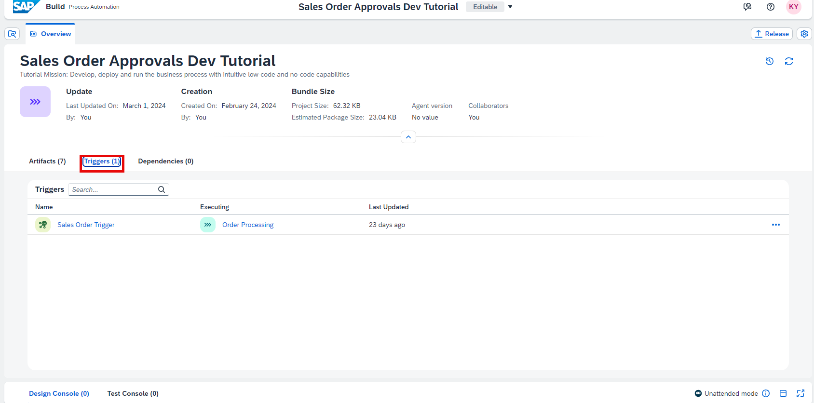

1. To view the context of the workflow API, navigate to the Lobby by clicking on the SAP logo.

    <!-- border -->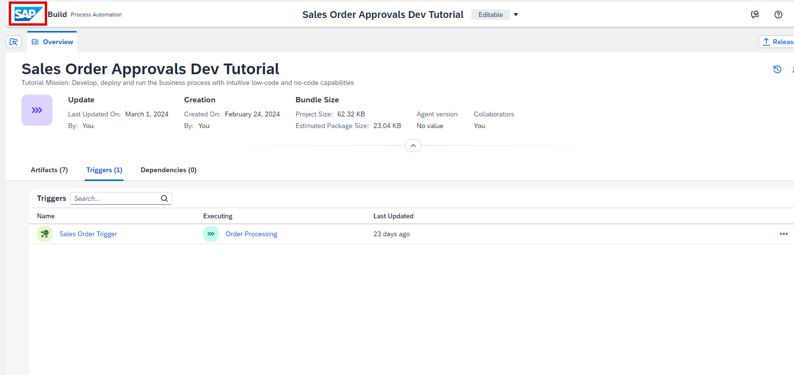

2. Choose **Control Tower** > **Environments**.

    <!-- border -->

3. Choose the environment in which the project is deployed.

    <!-- border -->

3. You can view the trigger in the **Triggers** tab. 

    >If there are a lot of projects and triggers, you can view only yours by selecting your project in the project filter.

    <!-- border -->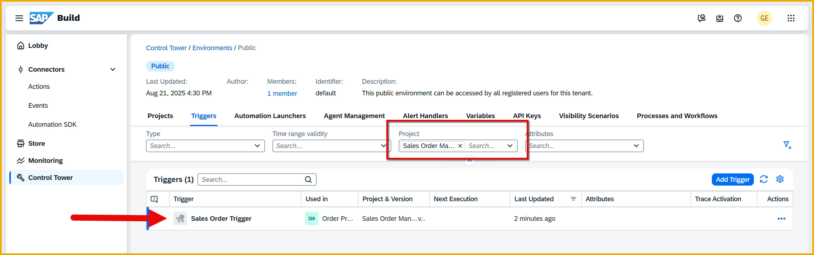

2. Click **View** for your trigger.

    <!-- border -->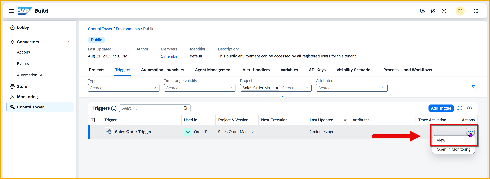

    You will see the details of the API: the URL, the required payload and more.

    <!-- border -->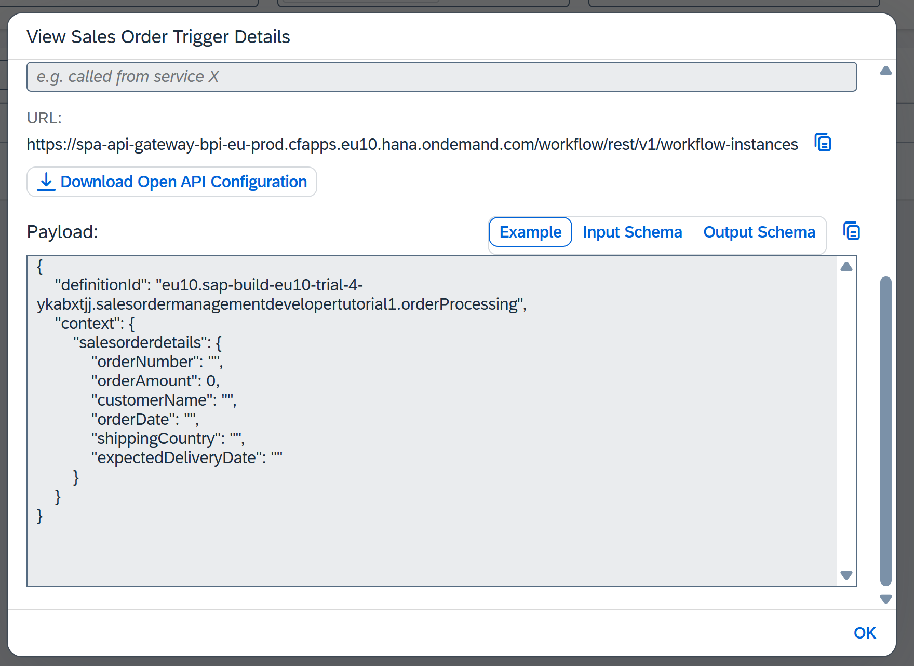

    >We will trigger the process with the tools in SAP Build Process Automation and not call the API directly.


### Trigger the process
Again, generally you will trigger the process via an API. For more information the API, you can explore the [SAP Business Accelerator Hub](https://api.sap.com/package/SAPProcessAutomation/all) and the SAP Build Process Automation APIs, specifically, the Workflow package.

<!-- border -->

And even more specific, the **workflow-instances** API call.

<!-- border -->

BUT ... we will NOT call the API but trigger the process through the tools of SAP Build Process Automation.

1. Go to the Control Tower, open the **Environments** tile, and then open the **Public** environment.

    <!-- border -->

2. Select the **Process and Workflows** tab, then filter the list by your project, and find your process.

    <!-- border -->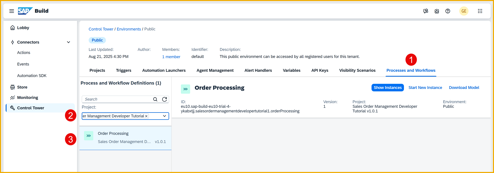

3. With your process selected, click **Start New Instance**.

    In the dialog, delete everything and replace with the following:
    
    ```JavaScript
     {
        "salesorderdetails": {
            "orderNumber": "156789",
            "orderAmount": 40000,
            "customerName": "ABC Widgets",
            "orderDate": "2025-11-23",
            "shippingCountry": "Germany",
            "expectedDeliveryDate": "2025-12-25"
        }
    }
    ```

    Click **Start New Instance and Close**.

    <!-- border -->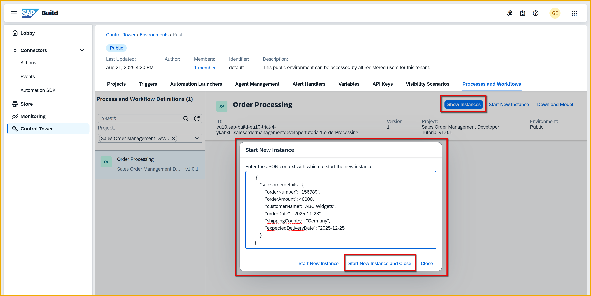

    If all goes well, you should get a confirmation.

    <!-- border -->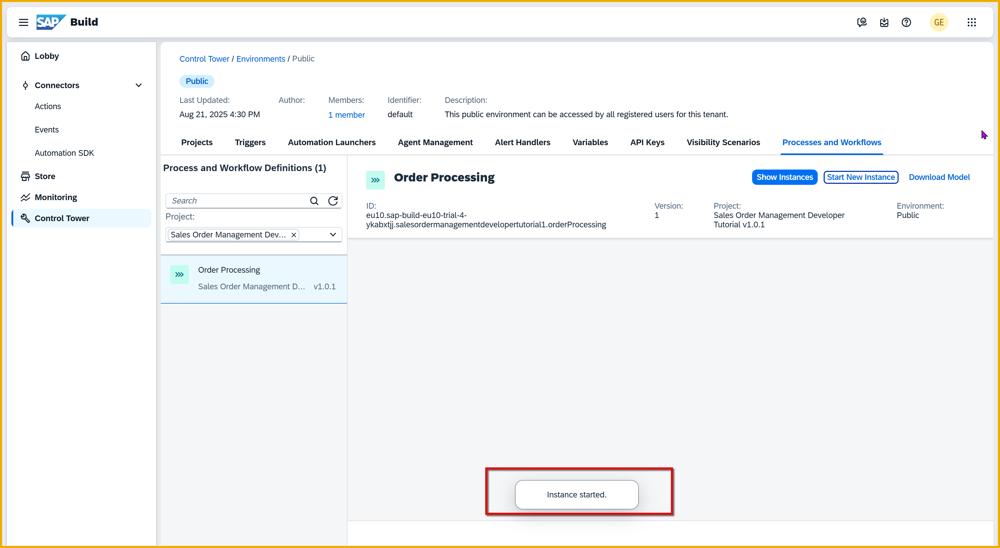


### Monitor the triggered process in Home Page
Let's see what we you have wrought.

1. In the home page of SAP Build, click **Monitoring**, and then select the **Process and Workflow Instances** tile.

    <!-- border -->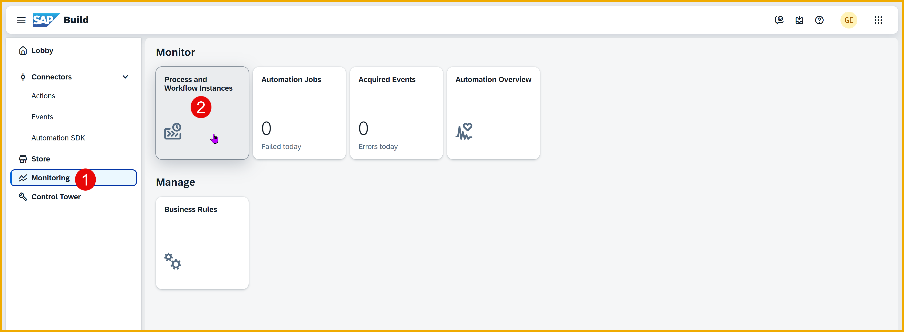

2. Find the process you triggered by filtering by your project.    

    <!-- border -->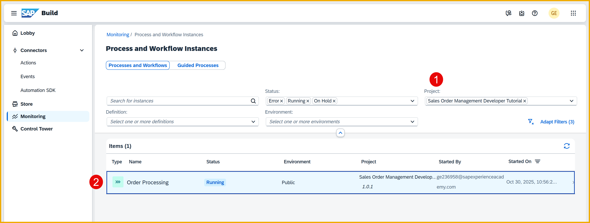

3. Click on the process you started, and you will see:

    - **General information**, like when the process instance was started, by whom, the process definition ID it is based on, status, and more.

    - **Logs**, which show what steps were started and completed, and additional information about each one. For example, for an approval task, you can see who has been assigned the task.

    - **Context**, all the information that has passed through the instance, such as the input parameters passed in, any data retrieved via actions inside the process, the custom variables, and more.

    <!-- border -->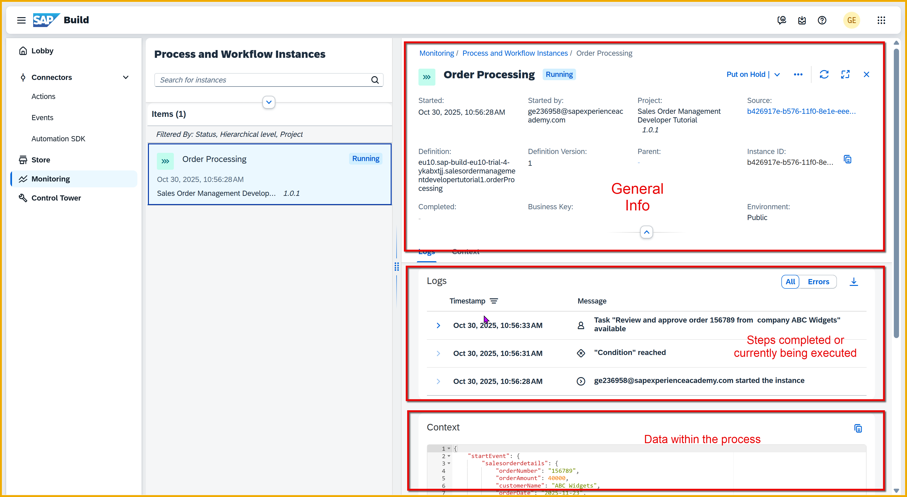
