 
# Install and Set Up Desktop Agent 2
<!-- description --> Install and set up the Desktop Agent 2 to run your automation

## Prerequisites
 - A Windows PC
 - If you are using a MAC, please install a VDI
 - Access to a [SAP BTP tenant with SAP Build Process Automation](spa-subscribe-booster)

## You will learn
  - How to install the Desktop Agent 2
  - How to register a tenant in the Desktop Agent 2

---

### About the Desktop Agent

The Desktop Agent is a component of SAP Build Process Automation that is installed locally on user desktops. It executes automation projects that launch and run applications of various kinds, reads information from screens, enters data, clicks options, and processes data.

Projects are assigned to tenants running on a Desktop Agent. You can see what your Desktop Agent is doing at all times thanks to the convenient system tray, or `Systray`, that is always accessible while your Desktop Agent is ready or active.

When it is installed, the Desktop Agent is configured to start at Windows logon automatically. You should not change this setting because your Agent might be assigned background (unattended) jobs at any time.

The very first time you launch the Desktop Agent on your workstation, you will be prompted to log in. If you are unsure of your login details, please ask an administrator.

### Download the Desktop Agent

The setup program is provided in the form of an industry standard Windows MSI installer. You can download it from the SAP Software Center [page](https://me.sap.com/softwarecenter/search/Intelligent%20Robotic%20Process%20Automation).

1. Download the **latest version** of the MSI file extension.

<!-- border -->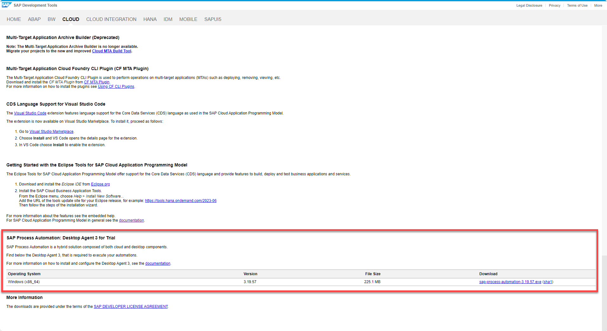

### Install the Desktop Agent 2

When you install the Desktop Agent 2, this will automatically set up the web browser extension for Google Chrome and Microsoft Edge.

> To prevent issues during the installation, please close all the Chrome and Edge tabs opened on your machine. 

> The minimum version of the Desktop Agent supported by SAP Build Process automation is **2.0.20**.

1. Launch the MSI file execution.
   
2. Select **Next** to begin the installation process.

    <!-- border -->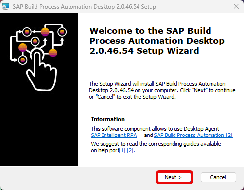

3. On the **Installation type** pop-up, select the **Desktop Agent** option and choose **Next**.

    <!-- border -->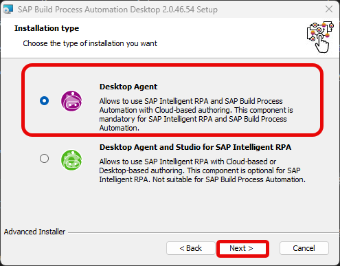

4. Optional: choose **Browse** to change the destination of the installation folder, choose **Next**.

    <!-- border -->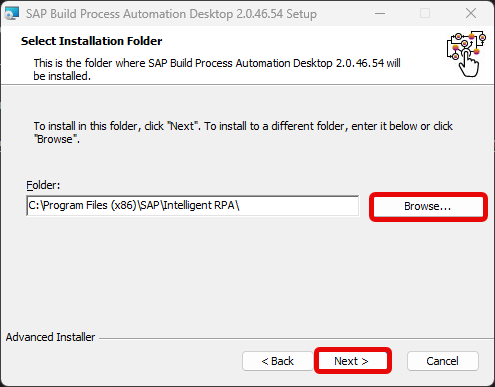

5. Select **Install** to start the installation.

    <!-- border -->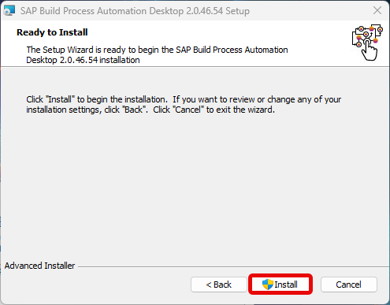

    An authorization request to bring change to the computer might appear, choose **OK** if so.

    <!-- border -->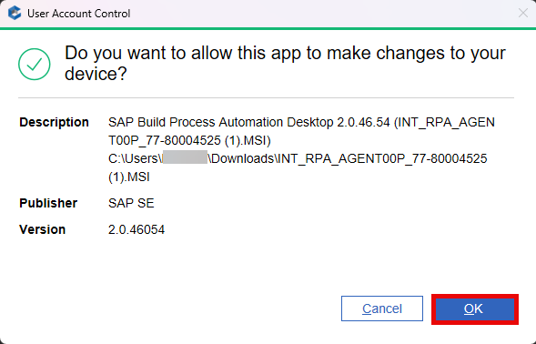

    The installation process may take a few seconds to complete.

    <!-- border -->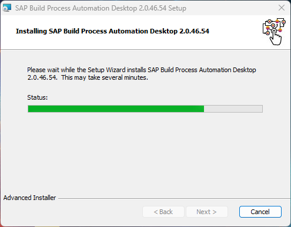

6. Once the installation is successfully completed, choose **Finish** and launch your Desktop Agent.

    <!-- border -->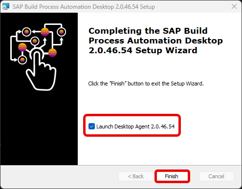

    > Microsoft Edge and Google Chrome are used for the rendering of the Desktop Agent. If you use Edge, the Edge 'WebView2' component is mandatory: if not already installed on your machine, please install Edge WebView2 from the Microsoft website.

    > A Google Chrome extension and a Microsoft Edge add-on are installed when you install the Desktop Agent but you have to enable them (at least the Google Chrome extension).

7.  On Google Chrome, select **Manage extensions** under Extensions.
   
    <!-- border -->

8.  Enable **SAP Build Process Automation Extension** if it is disabled.

    <!-- border -->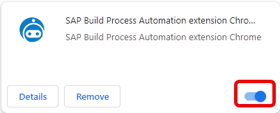
    
9.  Do the same for the Edge extension.

    <!-- border -->

    
    You now need to register the Desktop Agent to finalize the installation.

### Register the Desktop Agent Tenant

Once you've completed the installation steps of the SAP Build Process Automation setup wizard, you need to register your agent and connect it to a SAP Build Process Automation tenant in order to execute automations.

> Once the Desktop Agent is installed, the icon will be available on your System Tray.

1. Select the Desktop Agent icon, choose the 3 dots and select **Tenants**.

    <!-- border -->

2.  Choose **Add**.

    <!-- border -->

3.  Navigate to **SAP Build** lobby, go to **Control Tower > Agents** then choose **Register new agent** button on the right-hand side of the screen.

    <!-- border -->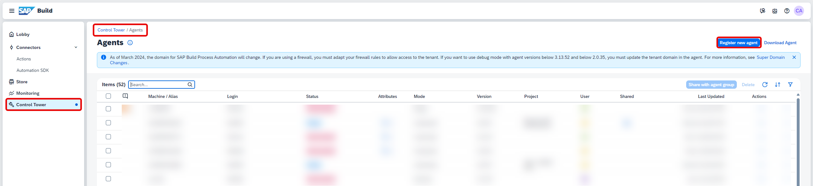

4. When the pop-up opens, select **Copy and Close**.

    <!-- border -->

5. Then paste the URL into the **Domain** field on your **Desktop Agent Tenant Registration** window and choose **Save**.

    <!-- border -->

6. Select the tenant, choose **Activate** and confirm.

    <!-- border -->

7. Log in to your tenant with your user name or e-mail and password.

    <!-- border -->

8. The Agent should be in **Idle** state, waiting to start a project.

    <!-- border -->

9. To check, go to **Control Tower** and select **Agents**.

    <!-- border -->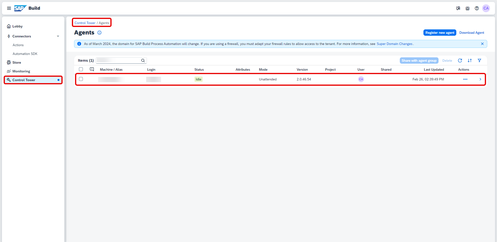

### Create an environment to add your agent

After you have installed the desktop agent, you need to add your agent so that it is able to run an automation.

1. Navigate back to **Control Tower**. Select **Environments** under **Tenant Configuration**.
    
    <!-- border -->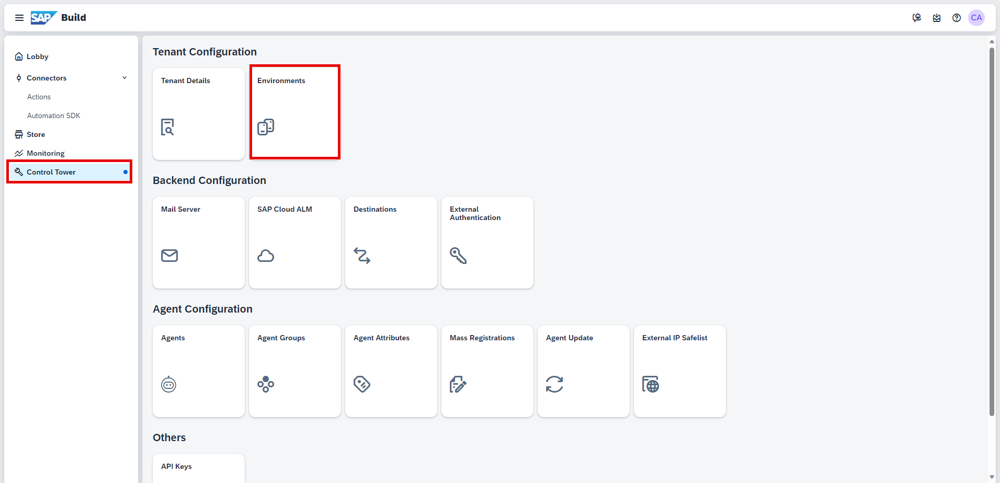
   
2. Choose **Create Environment**.
   
3. In the **Create Environment** window do the following:

    - Give your environment a name
    - Select a color
    - You may enter a short description
    - Choose **Create**

    <!-- border -->

4. Select the created environment to add your agent in it.

    <!-- border -->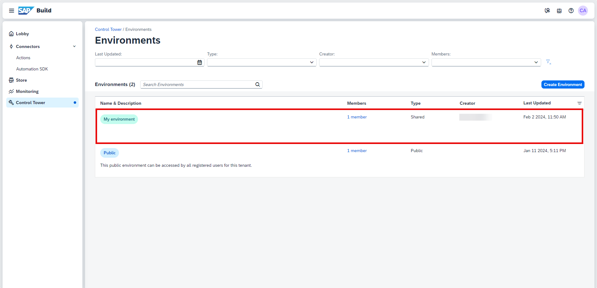

5. Select **Agent Management > Add Agent**.

6. In the **Add Agent** window, select your agent and choose **Add agent**.

    <!-- border -->

7.  Your agent is now added and ready to run.

    <!-- border -->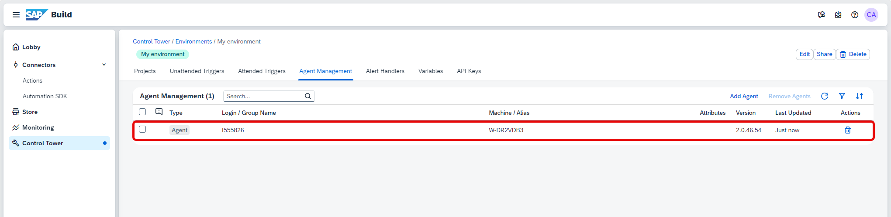

---
