# Create an Automation to Trigger Technical Events
<!-- description --> Create an automation to retrieve details on an excel spreadsheet

## Prerequisites
 - [Subscribe to SAP Build Process Automation](spa-subscribe-booster)
 - Complete [Capture and Declare an Application to Trigger Technical Events](spa-technical-events-capture-declare)

## You will learn
  - How to design an automation that will retrieve order details from an application and read them on excel.

---

### Create the automation

1. Now you will create your automation.

2. In the **Overview** of **Build Process Automation**, choose **Create** and select **Automation**.

    <!-- border -->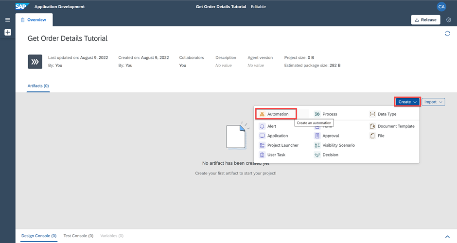

3. In the **Create Automation** window, name the automation **Get Order Details Assistant**, add a description and choose **Create**.

    <!-- border -->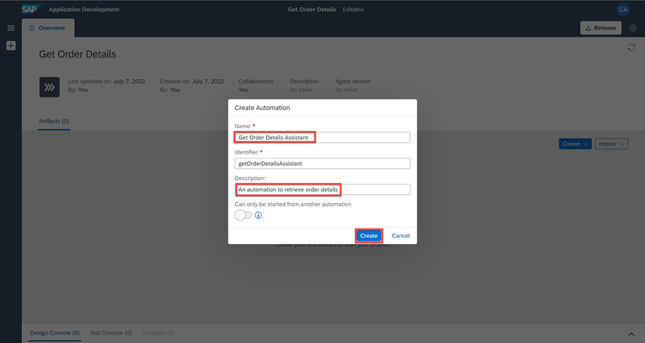

4. You will be navigated to the **Get Order Details Assistant** automation editor.

### Create the user task

You will now create a User Task that will prompt you if you want to retrieve the details on an excel sheet.

1. Navigate back to the **Overview** tab, choose **Create** and **User Task**.

    <!-- border -->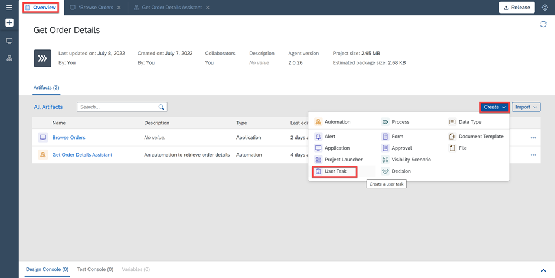

2. In the **Create User Task** window, under the **Name** field enter **Order Details Assistant**.

3. You can enter a description and choose **Create**.

    <!-- border -->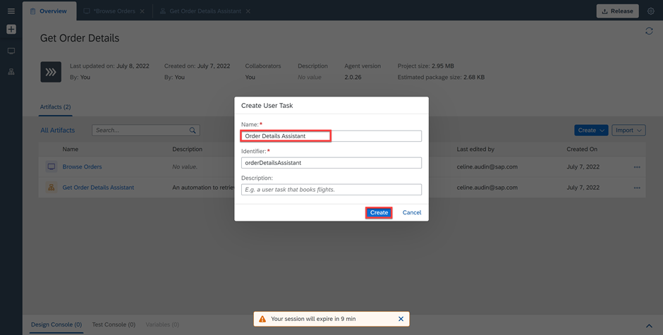

4. You will be navigated to the User Task you just created.

5. You can now drag and drop components to build your user task. Drag and drop the component **Title**.

    <!-- border -->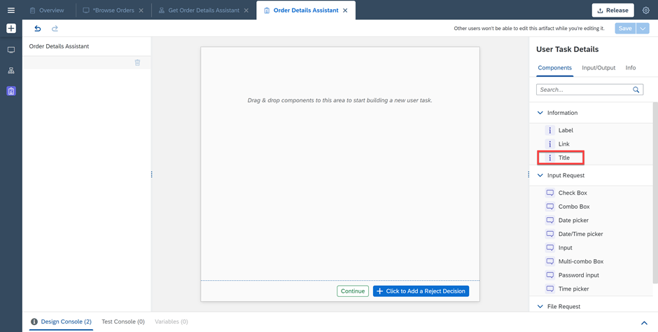

6. Select the title and enter the following question: **Do you wish to retrieve the order details in an Excel worksheet?** under the text field, then select the text in quotation marks and hit enter.

7. Choose **+ Click to Add a Reject Decision**.

    <!-- border -->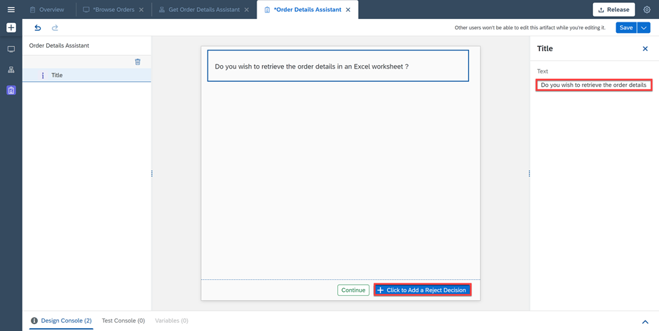

8. Now you have a **Continue** and **Reject** button. Choose **Save**.

    <!-- border -->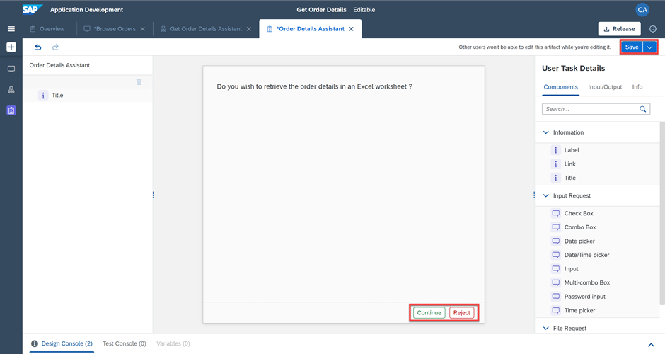

### Design the automation - Add user task and set condition

You will now design the automation **Get Order Details Assistant**.

1. Navigate back the **Overview** tab, choose **Get Order Details Assistant**.

    <!-- border -->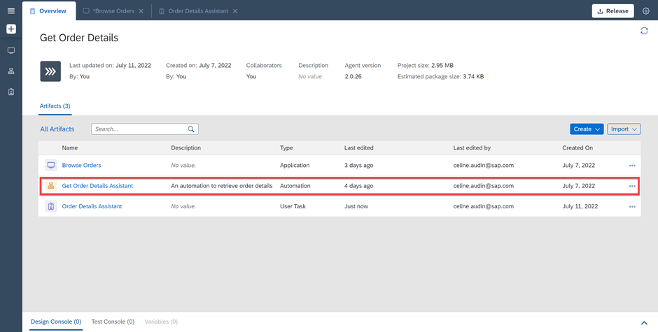

2. You will be navigated to the automation editor where you can start dragging and dropping activities into the workflow.

3. In the **Automation Details** panel, under **User tasks**, choose the **Order Details Assistant** user task you just created and drag and drop it into the workflow.

    <!-- border -->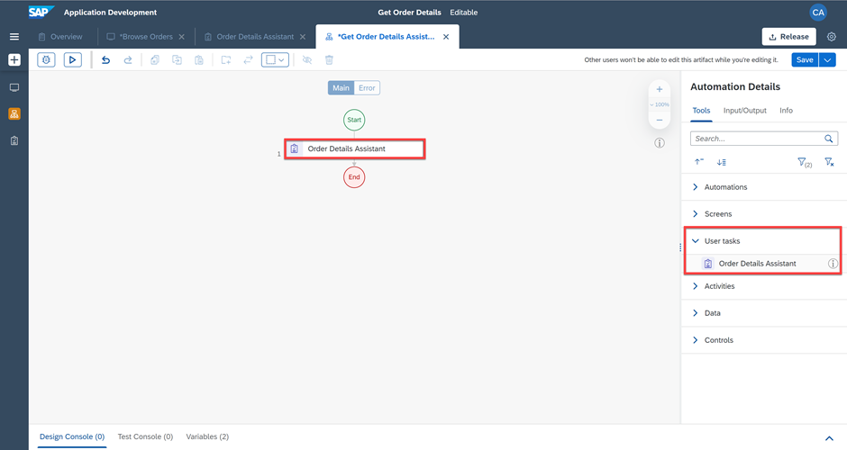

4. Now search for the **Log Message** activity and drag and drop it into the workflow.

    <!-- border -->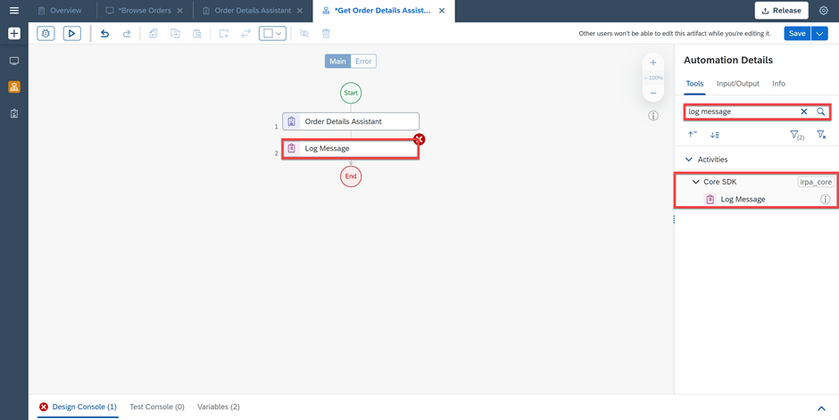

5. Select the **Log Message** activity. Under **Input Parameters**, select `1 decision` as **message**.

    >This refers to the decision made: either Approve or Reject.

    <!-- border -->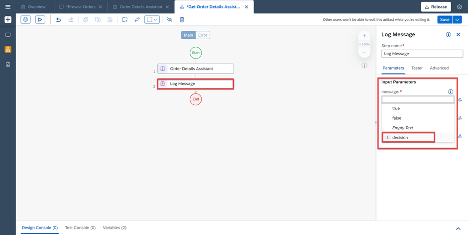

6. Search for the **Condition** control and drag and drop it into the workflow.

    <!-- border -->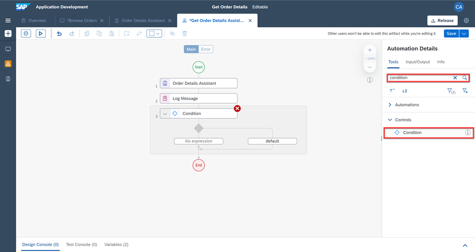

7. Select the **Condition** control and under the **Condition Expression**, choose the three dots to edit the formula.

    <!-- border -->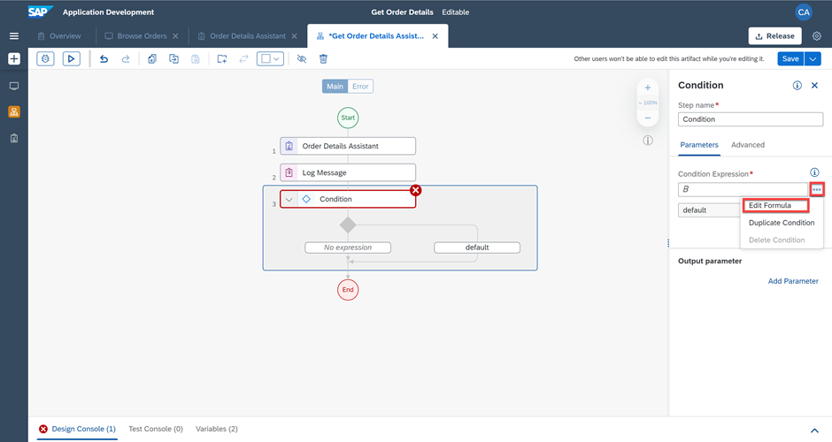

8. Select the decision variable and add == "approve".

9. Choose **Save Expression**.

    <!-- border -->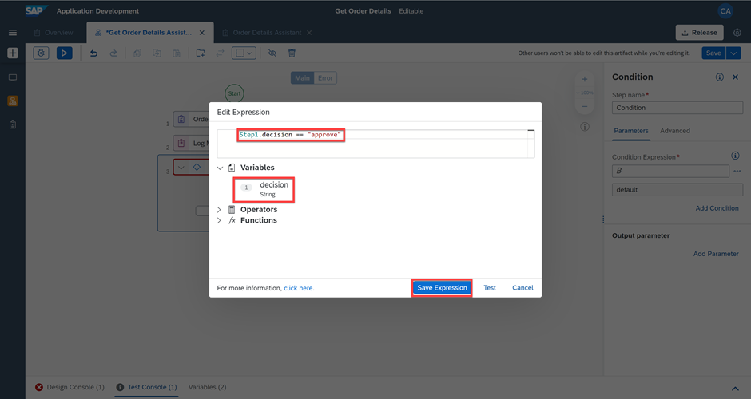

    > This means that if the decision **approve** is selected, the bot will retrieve the details in an excel spreadsheet.

10. Search for the **Log Message** activity and drag and drop two **Log Message** activities under the first and second branch of the **Condition**.

    <!-- border -->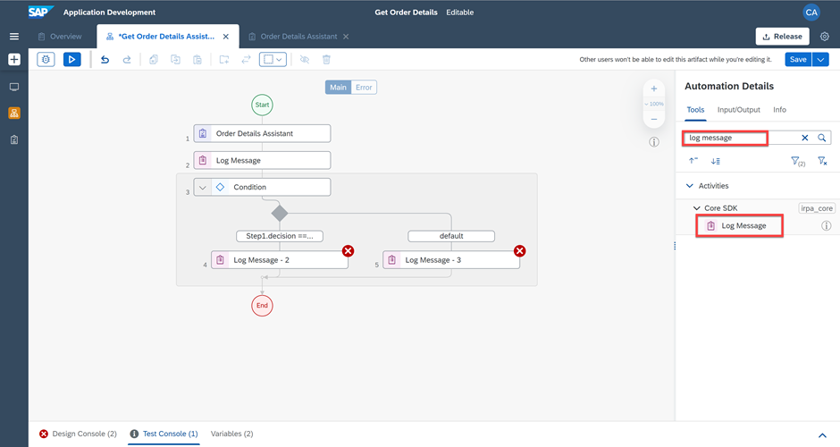

11. Now select the first **Log Message** and under the **Input Parameters** as a message, enter **Confirmed** and select the text in quotation marks and hit enter.

12. Do the same for the second **Log Message** but this time enter **Declined** as a message under **Input Parameters**.

    <!-- border -->

13. Change the names of the **Log Message** step names to **Log Message - Confirmed** and **Log Message - Declined**.

### Design the automation - Add the captured screen and get the order details

1. Now you will add the screen you captured. Under **Automation Details**, choose **Screens** and select **Order Details**.

2. Drag and drop the screen into the workflow, just below the first condition branch.

    <!-- border -->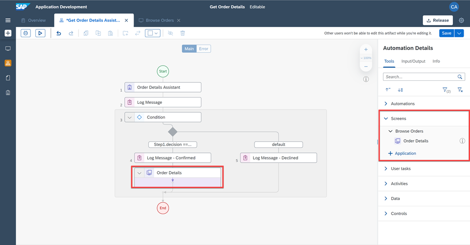

    > You will now drag and drop the activities you want your automation to perform to the corresponding element you previously declared on the screen.

    For instance, you will drag and drop three **Get Element** activities to get the Customer Name, the Order Amount and Order Reference.

3. Double click on the **Order Details** screen, under the **Screen** panel, search for the **Get Element** activity.

4. Drag and drop it on the **Customer Name** element you previously declared.

    <!-- border -->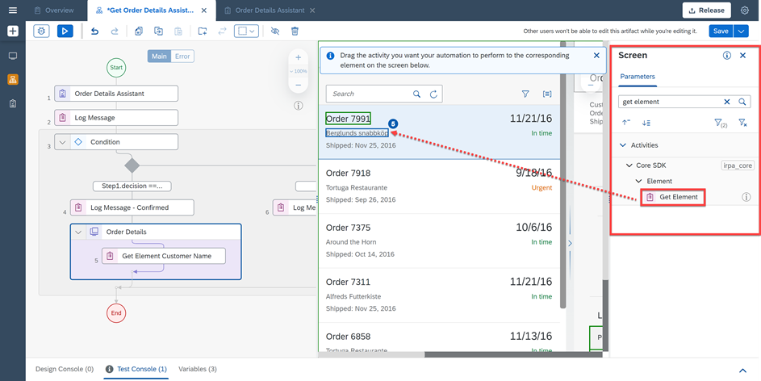

5. Under **Get Element** activity, set the **Output Parameters** to `5 customerName`.

    <!-- border -->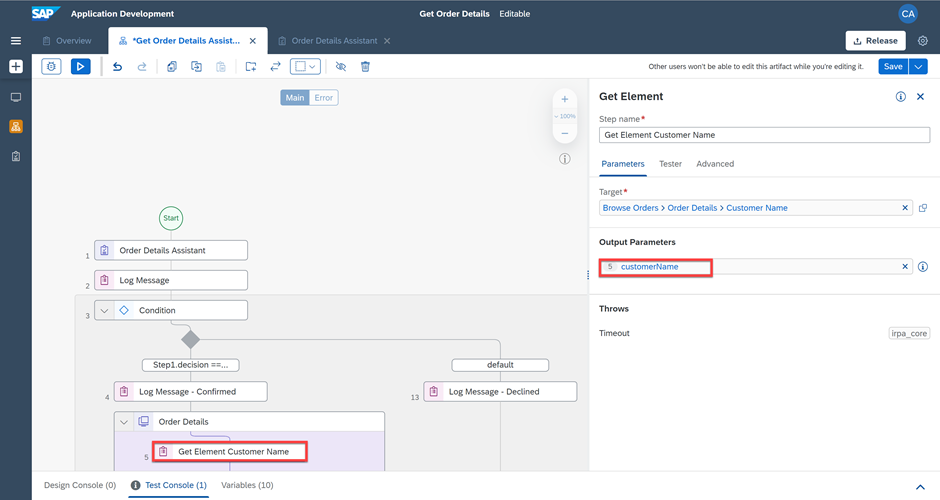

6. Now perform the same for Order Amount and Order Reference, setting the **Output Parameters** to `6 orderAmount` and `7 orderReference` respectively.

    <!-- border -->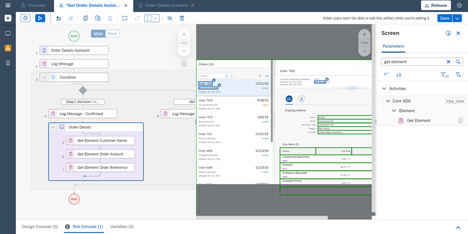

7. Save your work.

### Design the automation - Get the shipping address details

Now you will create the Shipping Address Group that will group all the Shipping Address details.

1. Click on the canvas to go back to the **Automation Details**. Search for the **Group** control and drag and drop it into the workflow just below the **Get Element Order Reference** activity.

    <!-- border -->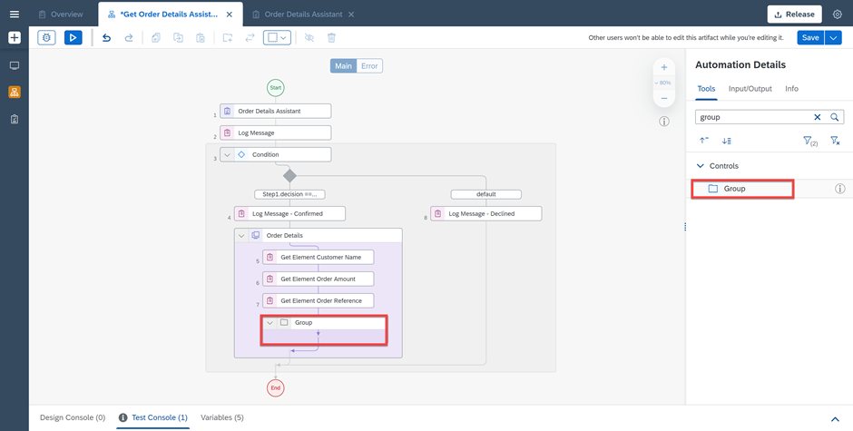

2. Select the **Group** control and change the **Step Name** to **Group Shipping Address**.

3. You may change the color of your Group so it stands out in the workflow.

    <!-- border -->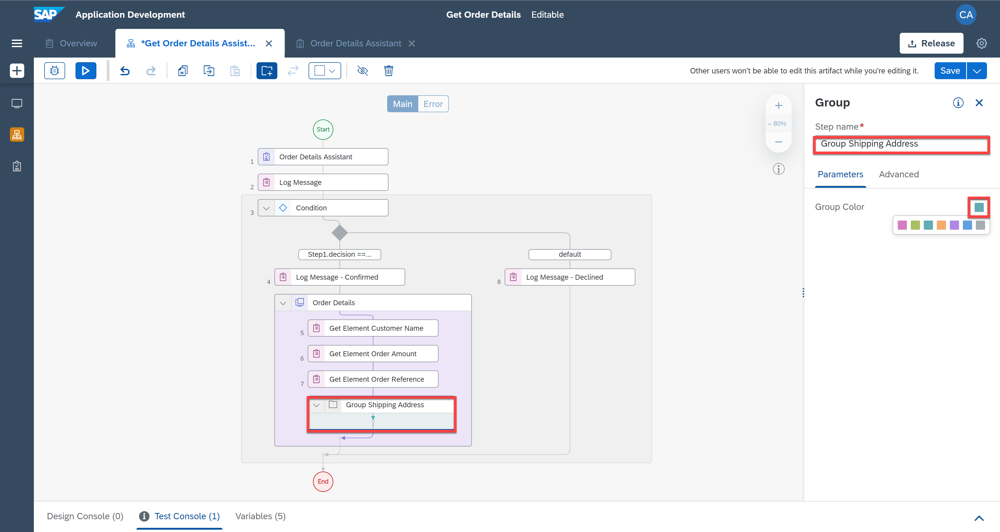

4. Double click on the **Order Details** screen on your workflow.

    > Now you will get the elements corresponding to the Shipping Address details.

5. Search for the **Get Element** activity and drag and drop it on the Shipping Address Name element on the screen.

    <!-- border -->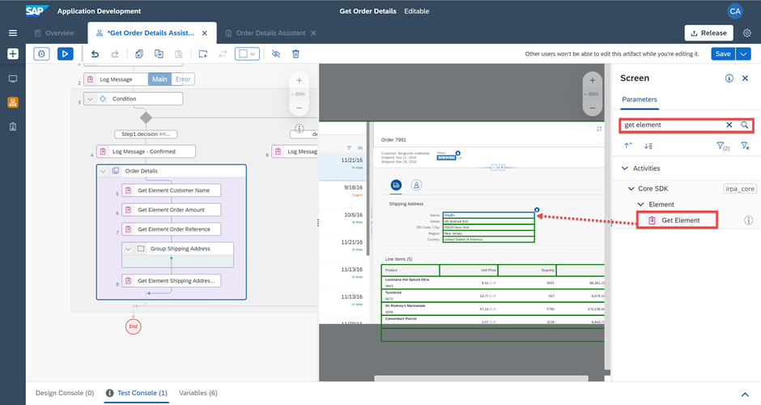

6. Set the **Output Parameters** to `8 addressName`.

7. Drag the **Get Element Shipping Address Name** activity and put it in the **Group Shipping Address**.

    <!-- border -->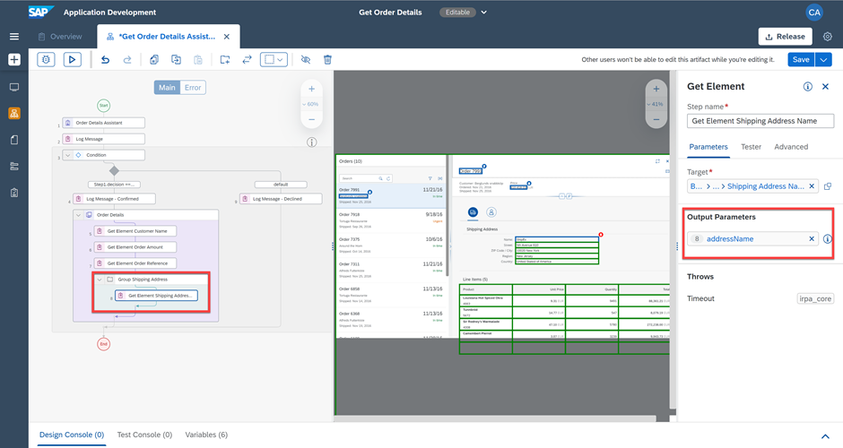

8. Now perform the same actions for :
    - Shipping Address Street, setting the **Output Parameters** to `9 addressStreet`.
    - Shipping Address Zip Code City, setting the **Output Parameters** to `10 addressZipCodeCity`.
    - Shipping Address Region, setting the **Output Parameters** to `11 addressRegion`.
    - Shipping Address Country, setting the **Output Parameters** to `12 addressCountry`.

9. Save your work.

    This is the expected result of your Automation at the end of this step:

    <!-- border -->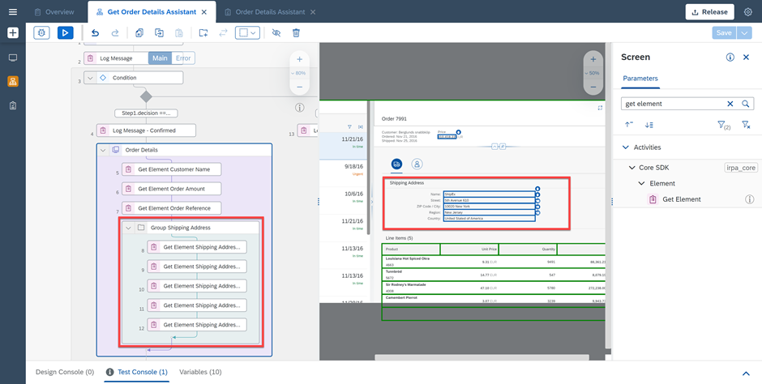

### Import the excel template

Download the [Order Details Assistant](https://github.com/sap-tutorials/sap-build-process-automation/blob/main/tutorials/spa-technical-events-automation-user-task/OrderDetailsAssistant.xlsx) excel file.

Once you have downloaded your excel template file, you will add it to your artifacts.

1. Go back to the **Overview** tab.

2. Choose **Import** and then **File**.

    <!-- border -->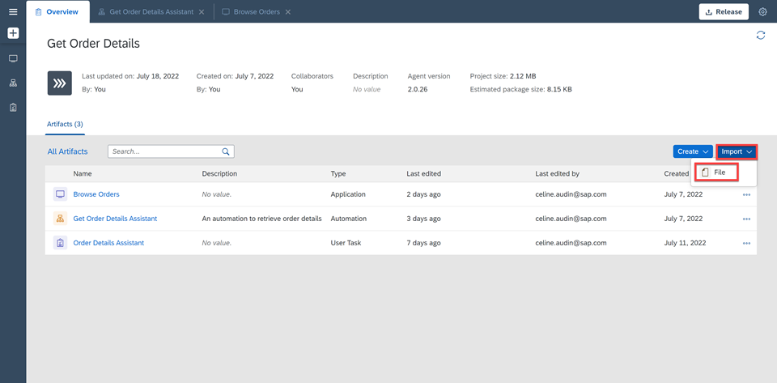

3. Fill in the **Import File** window.

4. Choose **Import**.

    <!-- border -->

5. The file has been imported successfully.

6. Check **File is active**, this way you may use it in your automation.

7. Choose **Save**.

    <!-- border -->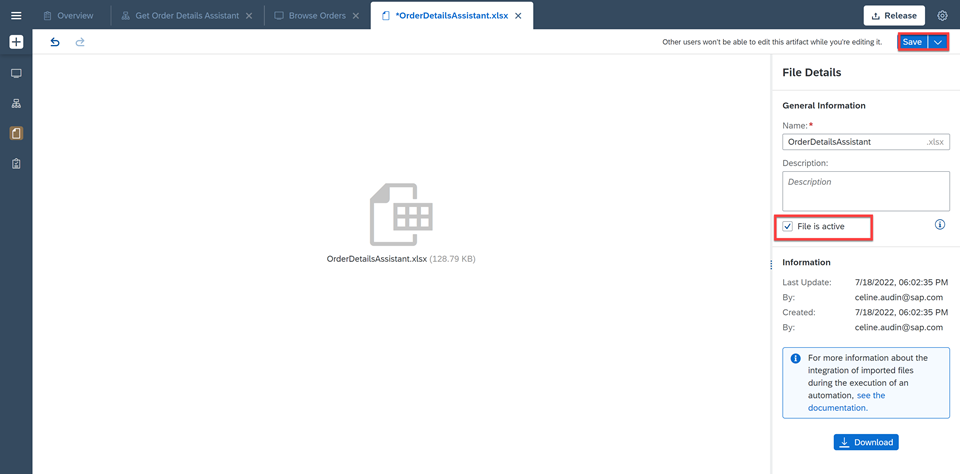

8. If you go back to the **Overview** tab, you will see that the file has been added as an artifact.

    <!-- border -->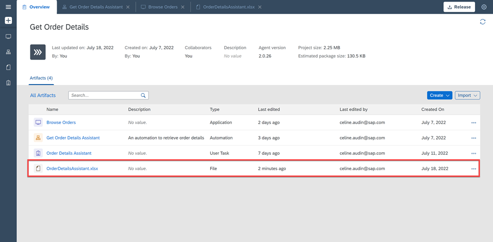

### Design the automation - Set the order details in excel

You will now create the Excel Group that will group all the excel activities that are necessary to retrieve the order details into an excel spreadsheet.

1. Go back to the automation workflow. Under **Automation Details**, search for the **Group** control.

2. Drag and drop it into the workflow just below the **Group Shipping Address**.

    <!-- border -->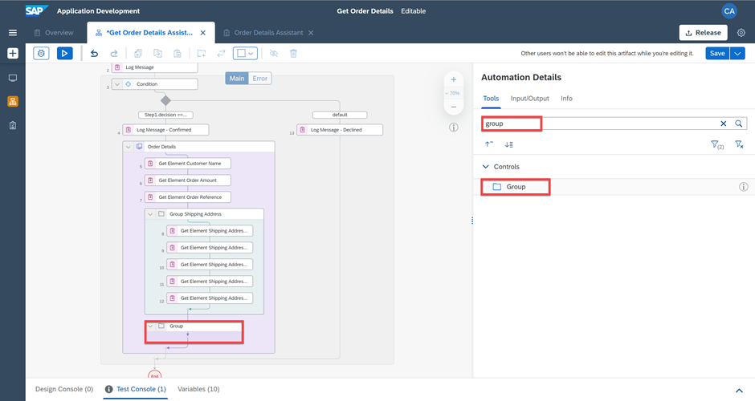

3. Select the **Group** control and change the **Step Name** to **Group Excel**.

4. You may change the color of your Group so it stands out in the workflow.

    <!-- border -->

5. Under **Automation Details**, search for the **Open Excel Instance** activity.

    > This is a mandatory activity when using MS Excel, it opens an instance of MS Excel. Once you open an Excel instance, you can start using other MS Excel activities.

6. Drag and drop it into the workflow inside the **Group Excel**.

    <!-- border -->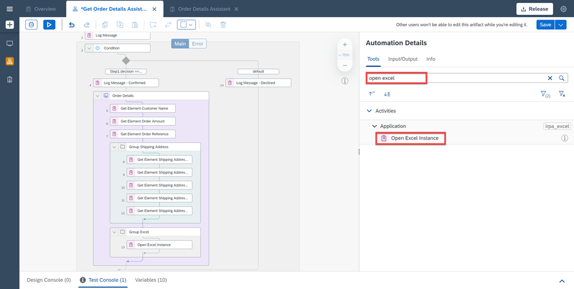

7. Now search for the **Open Workbook** activity and drag and drop it in the **Group Excel** under **Open Excel Instance**.

8. Select the activity and under **Input Parameters**, choose the pencil icon next to the `workbookPath` field.

9. Edit the Expression to: `irpa_core.enums.path.files + '/OrderDetailsAssistant.xlsx'`

10. Choose **Save Expression**.

    <!-- border -->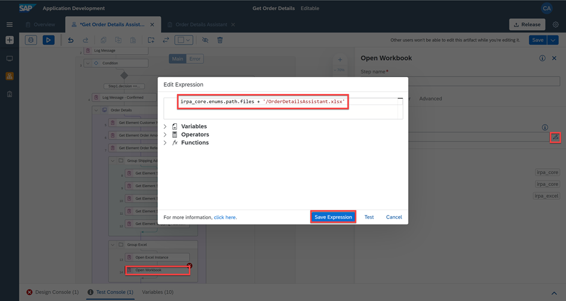

    >This action opens the excel template that was just imported so that it can receive the details that need to be set in it.

     This is the excel template **Order Details Assistant** that was just imported. You will now set the values of a specified cells range (order details) in the worksheet: Order Reference (D5), Customer Name (D6), and Order Amount (D7).

     <!-- border -->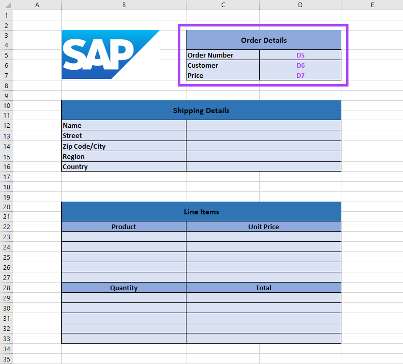

11. Under **Automation Details**, search for the **Set Values (Cells)** activity.

12. Drag and drop it into the workflow under the **Open Workbook** activity.

    <!-- border -->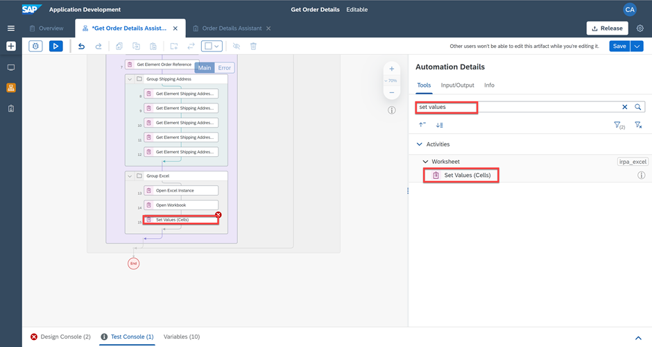

13. Select the activity and change the **Step Name** to **Set Values - Customer Name**.

14. Under **Input Parameters**, set the **range Definition** to D6 and select the text in quotation marks.

15. For the **values** select `5 customerName`.

    <!-- border -->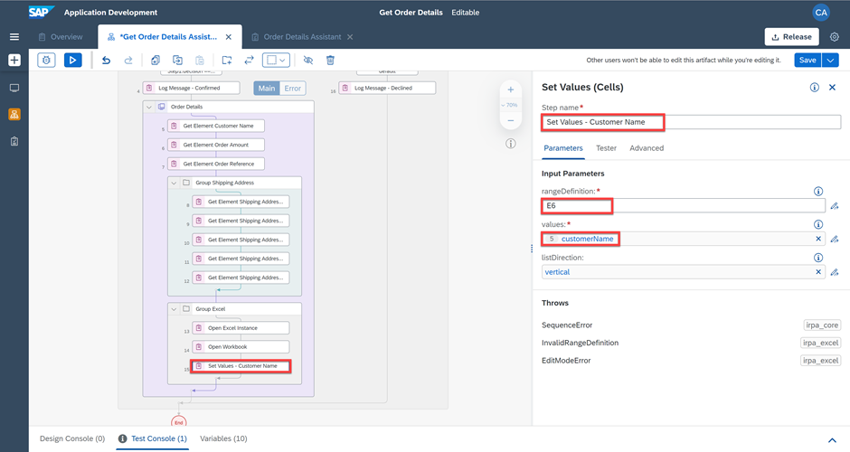

16. Now perform the same actions using the details in the table below :

    | Activity    | Step Name | range Definition | values
    | :-----------| :---------| :--------- | :-------
    | Set Values  | Set Values - Order Amount | D7 | `6 orderAmount`
    | Set Values  | Set Values - Order Reference | D5 | `7 orderReference`

17. Save your work.

18. At this step, your automation should look like this :

    <!-- border -->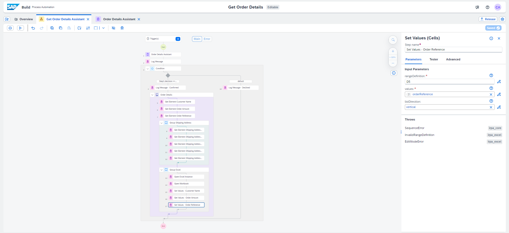

### Design the automation - Set the shipping address details in excel

  Now that you have set the values for Customer Name, Order Amount and Order Reference, you will set the values for the Shipping Address Details.

  <!-- border -->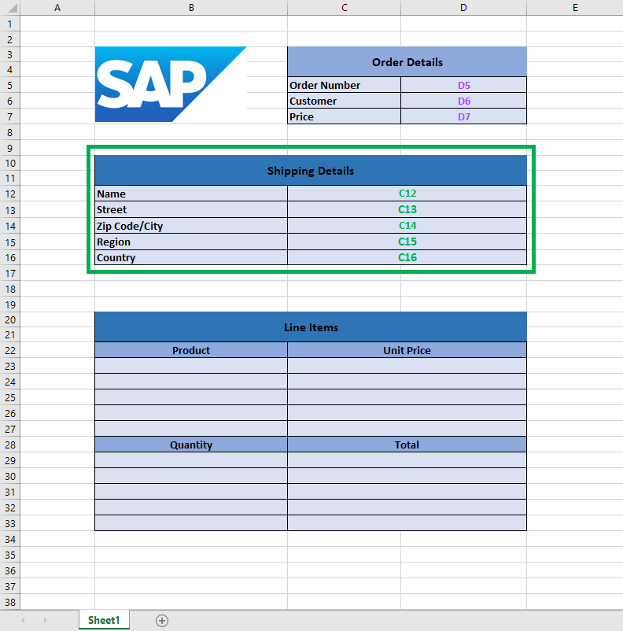

1. Under **Automation Details**, search for the **Group** control.

2. Drag and drop it into the workflow in the **Group Excel** just below **Set Values-Order Reference** activity.

     <!-- border -->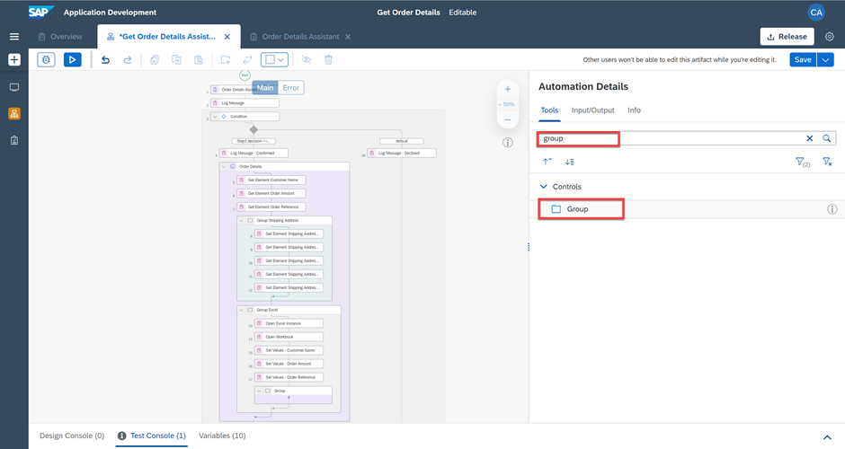

3. Select the **Group** control and change the **Step Name** to **Group Shipping Address Details**.

4. You may change the color of your Group so it stands out in the workflow.

5. Search for the **Set Values (Cells)** activity.

6. Drag and drop it into the workflow inside the **Group Shipping Address Details**.

7. Select the activity and change the **Step Name** to **Set Values - Address Name**.

8. Under **Input Parameters**, set the `rangeDefinition` to C12 and choose the text in quotation mark.

9. For the **values**, select `8 addressName`.

     <!-- border -->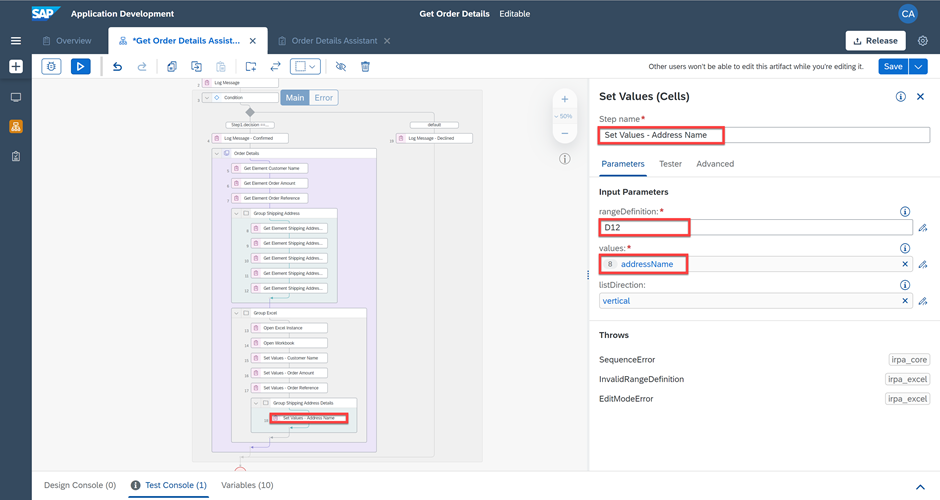

10. Now perform the same actions using the details in the table below :

    | Activity    | Step Name | range Definition | values
    | :-----------| :---------| :--------- | :-------
    | Set Values  | Set Values - Street | C13 | `9 addressStreet`
    | Set Values  | Set Values - Zip Code City | C14 | `10 addressZipCodeCity`
    | Set Values  | Set Values - Region | C15 | `11 addressRegion`
    | Set Values  | Set Values - Country | C16 | `12 addressCountry`

11. Save your work.

12. At this step, your automation should look like this :

     <!-- border -->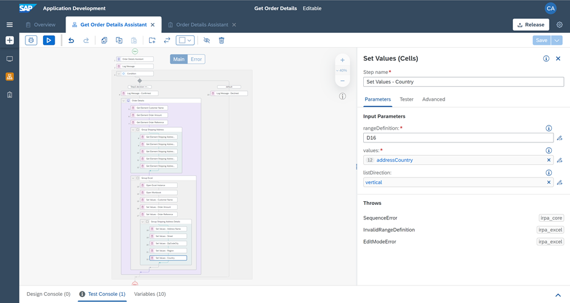

### Design the automation - Get and set the line items in excel

You will now retrieve the values in the Line Items table and set them in excel.

1. Under **Automaton Details**, search for the **Group** control.

2. Drag and drop it into the workflow in the **Group Excel** just below the **Group Shipping Address Details**.

     <!-- border -->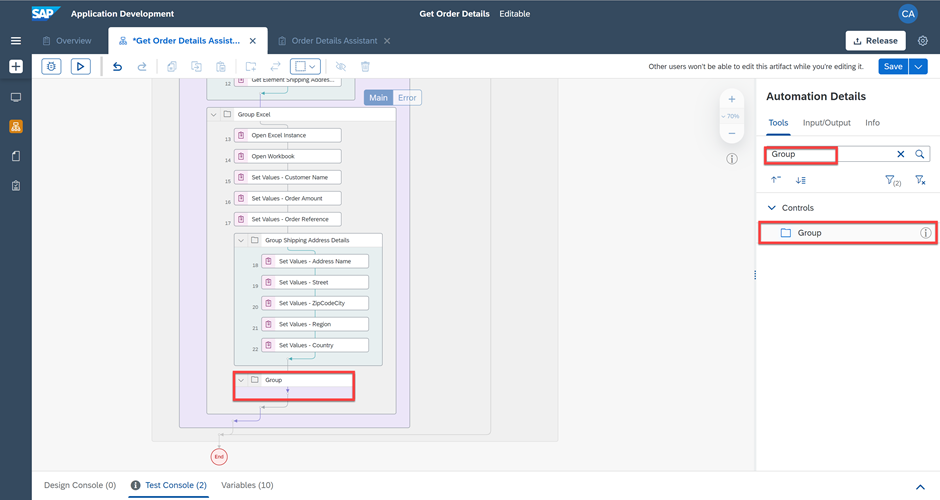

3. Select the **Group** control and change the **Step Name** to **Group Line Items**.

4. You may change the color of your Group so it stands out in the workflow.

5. Double click on the **Order Details** screen to have a view of the screen.

6. Under the **Screen** panel, search for the **For Each** control. 

7. Drag and drop the control on the Table Row that you previously declared.
   
8.  Select the Item: Table Row with Index: all.

    <!-- border -->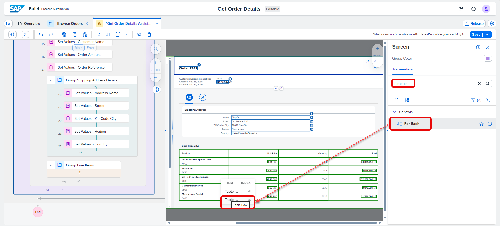

9.  Drag the **For Each** control inside the **Group Line Items**.

10. Change the **Step Name** of the For Each loop to: **For Each Line Items Row**.

    <!-- border -->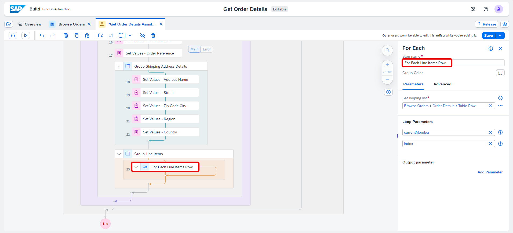

11. Now you will get the item values inside the table. Double click on the **Order Details** screen.
    
12. Search for the **Get Element** activity.
    
13. Drag and drop it into the workflow, just below the **For Each Line Items Row**.

    <!-- border -->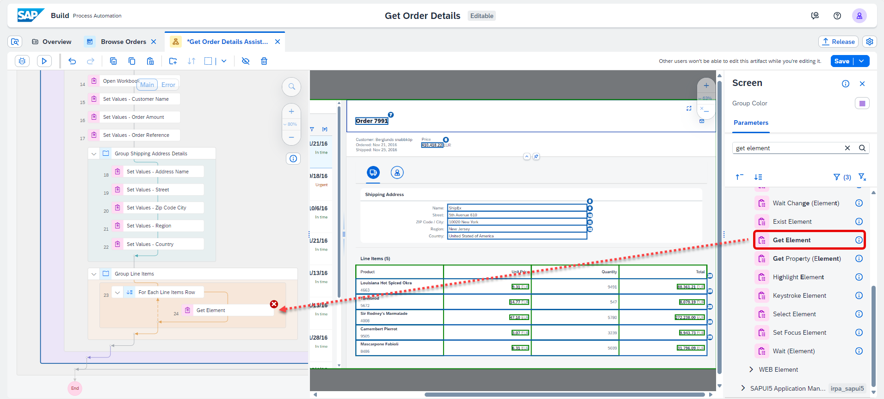

14. Change the **Step name** to **Get Line Items Table Product**.
    
15. Open the target editor to set the target element.
    
16. Select **Table Product** element.
    
17. Choose `23 index` as index of the element.
    
18. Choose **Confirm**.

    <!-- border -->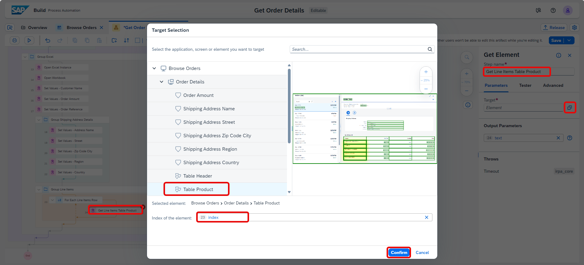

19. For **Output Parameters**, change the text to `25 tableProduct`.

    <!-- border -->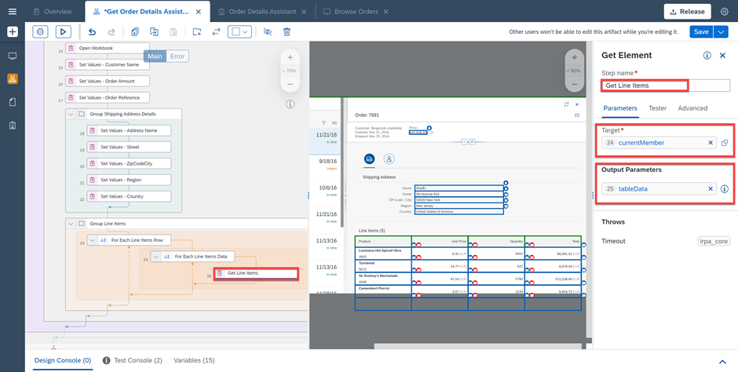

    The last step will be to set these Line Items values in the Excel spreadsheet.

    <!-- border -->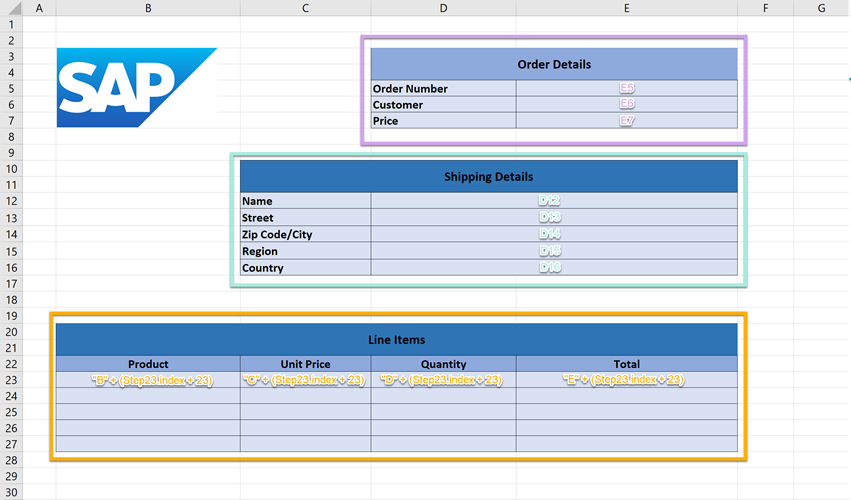  

20. To do so, under **Automation Details**, search for the **Set Values (cells)** activity.

21. Drag and drop the activity into the workflow, just below **Get Line Items Table Product**.

     <!-- border -->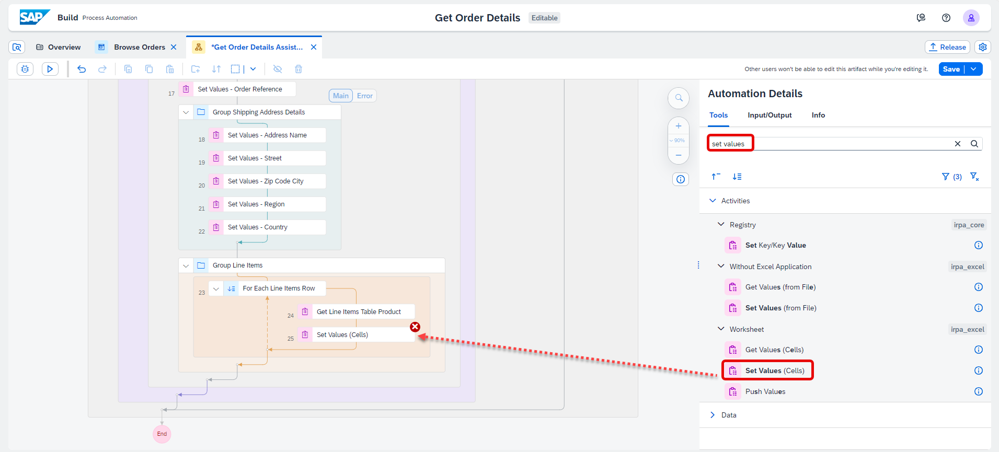

22. Now select the activity and change the **Step name** to **Set Table Product**.

23. Under **Input Parameters**, open the expression editor to set the **range Definition**.

24. In the **Edit Expression** window, set the following expression: `"B" + (Step23.index + 23)`

     <!-- border -->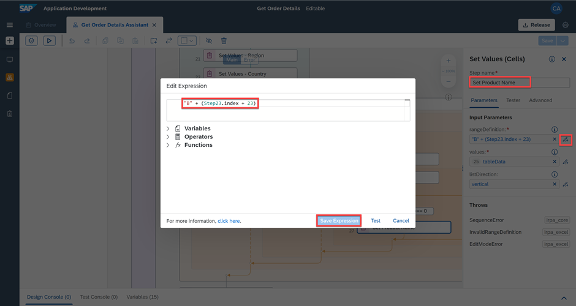

25. Under **Input Parameters**, set the **values** to `24 tableProduct`.

26. Save your work.

     <!-- border -->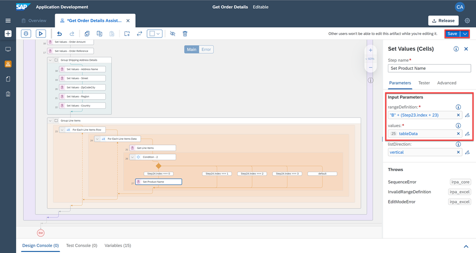

     You have set the values of the Product Name into the excel spreadsheet. Now you will repeat the above steps for the other Line Items such as Unit Price, Product Quantity and Total Price.

27. Similarly, drag and drop **Get Element** activities and **Set Values (Cells)** activities respectively into the workflow and for each Line Items: Unit Price, Product Quantity and Total Price.
    
28. For **Get Element** activities, perform the same actions using the details in the table below:

    | Activity      | Step Name | target | Output Parameters
    | :------------| :---------| :--------- | :-------
    | Get Element  | Get Line Items Table Unit Price | Browse Orders > Order Details > Table Unit Price > index | `26 tableUnitPrice`
    | Get Element  | Get Line Items Table Quantity | Browse Orders > Order Details > Table Quantity > index   | `28 tableQuantity`
    | Get Element  | Get Line Items Table Total | Browse Orders > Order Details > Table Total > index  | `30 tableTotal`

    > Please make sure not to copy and paste the `target` values directly in the field but to follow the steps mentioned above.

29. For **Set Values (Cells)** activities, perform the same actions using the details in the table below :

    | Activity    | Step Name | range Definition | values
    | :-----------| :---------| :--------- | :-------
    | Set Values (cells) | Set Table Unit Price | `"C" + (Step23.index + 23)` | `26 tableUnitPrice`
    | Set Values (cells) | Set Table Quantity | `"B" + (Step23.index + 29)` | `28 tableQuantity`
    | Set Values (cells) | Set Table Total | `"C" + (Step23.index + 29)` | `30 tableTotal`

    > Please make sure not to copy and paste the `rangeDefinition` values directly in the field but to follow the steps mentioned above.
    
    Your automation should look like this:

    <!-- border -->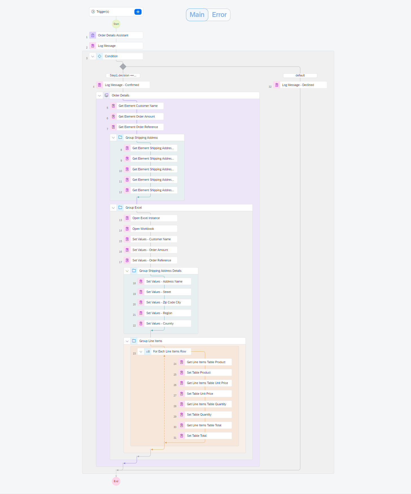

### Design the automation - Save and release

The last step consists in saving the workbook you created and releasing the excel instance.

1. To do so, under **Automation Details**, search for the **Save As Workbook** activity.

2. Drag and drop the activity into the workflow in the **Group Excel** just below the **Group Line Items**.

     <!-- border -->

3. Under **Input Parameters**, fill in the **file Path** field with the destination you wish to save your workbook.

3. Now search for the **Release Excel Instance** activity.

4. Drag and drop it into the workflow, just below **Save As Workbook** activity.

5. Save your work.

    <!-- border -->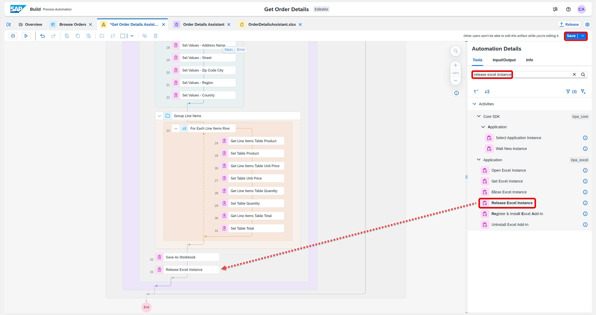

    This is what your final automation should look like:

    <!-- border -->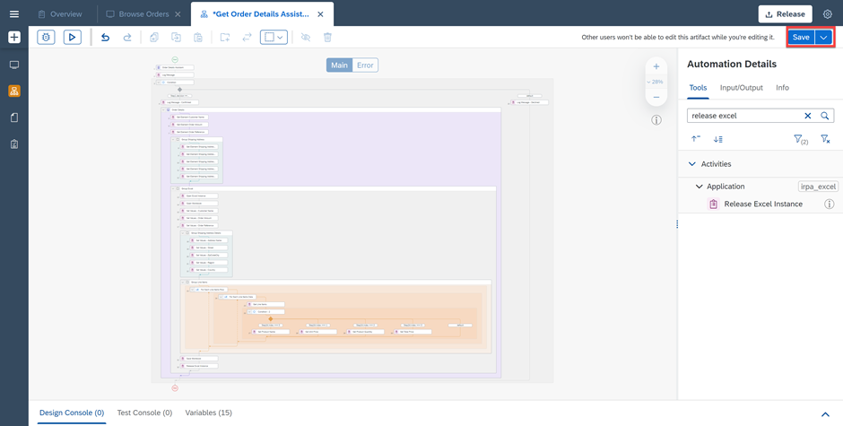

---
