# Capture and Declare an Application to Trigger Technical Events
<!-- description --> Capture and declare an order detail application to retrieve details on an excel spreadsheet

## Prerequisites
 - [Subscribe to SAP Build Process Automation](spa-subscribe-booster)

## You will learn
    - How to capture and declare a Sales Orders application
    - How to declare the elements

---

### Create a project

The first step consists in creating a project.

1. In the **Lobby** of **SAP Build**, choose **Create**.

    <!-- border -->

2. Select **Build an Automated Process**.

    <!-- border -->

3. Select **Task Automation**.

    <!-- border -->

4. In the **Create a Task automation project** window, name the project **Get Order Details** and choose **Create**.

    <!-- border -->

5. You will be navigated to the **Get Order Details** project overview page.

6. You will be prompted to configure your agent version. Select the agent version that is registered on your machine.

7. Choose **Confirm**.

    <!-- border -->

 8. A pop-up window asking you to create an automation will appear, please choose **Cancel**.

    <!-- border -->

    > ### What is going on?
    > As you will be using the capture feature, you do not need to create an automation but an application.

    The next step would be to create your application within your project.

### Capture and declare the application

Now you can start capturing the application you wish to retrieve the order details from.

1. Open the [Browse Orders](https://openui5.hana.ondemand.com/test-resources/sap/m/demokit/orderbrowser/webapp/test/mockServer.html#) application in a different window. You will capture the details of one order from the **Browse Order** page. To do so, select an order.

    > Make sure the Browse Order page is open in a separate window than SAP Build Process Automation.

2. Navigate back to the **Overview** tab.

3. In the **Overview** page, select **Create** and then **Application**.

    <!-- border -->

4. In the **Create Application** window, name your application: **Browse Orders** and choose **Create**.

    <!-- border -->

5. Select the **Browse Orders** screen from the list, choose **Next**.

    <!-- border -->

6. Choose **Manual Capture** as type ad select **Capture**.

    <!-- border -->

    The screen that you captured will appear in **SAP Build Process Automation**.

7. Choose **Go to Application** to view it.

    <!-- border -->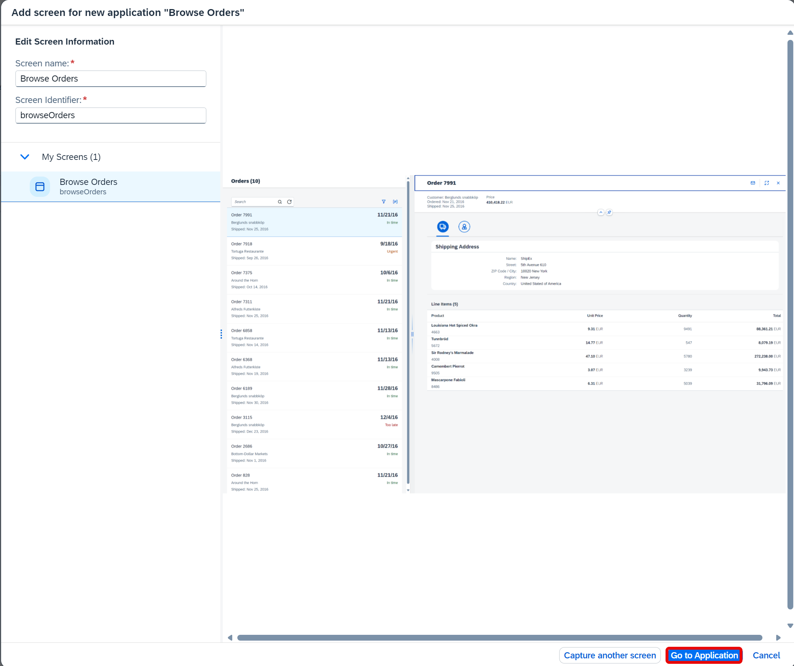

8. In the **Screen Details** panel change the name to **Order Details**.

9.  Remove the criteria **Mainframe** and add the criteria **URL**. 
    
10.  Select the **URL** criteria and change the Operator to **contains** and the Value to **tab=shipping**. Choose **Apply**.

11. Choose **Save**.

    <!-- border -->

### Declare the order reference

1. You will now declare an Order Reference on the **Order Details** screen.
   
2. You may choose **Both** to have a view of the screen and the tree.

3. Find the element that corresponds to an order. In this case, order 7991 is chosen.

4. In the **Element Details** panel, remove **Text** as criteria and add **id** as criteria.

5. Change the **Name** to **Order Reference**.

6. Choose **Declare Element** and hit **Save**.

  <!-- border -->

### Declare the customer name

1. You will now declare the customer name related to order 7991. Select the **Order Details** screen.

2. Choose **Both** to have a view of the screen and the tree.

3. Find the element that corresponds to the customer `Berglunds snabbköp`.

4. In the **Element Details** panel, remove **Text** as criteria and add **id** and **class** as criteria.

5.  Change the **Name** to **Customer Name**.

6. Choose **Declare Elements** and hit **Save**.

  <!-- border -->

### Declare the order amount

7. You will now declare the order amount of this order. Select the **Order Details** screen.

8. Select the order amount on the screen.

9. In the **Element Details** panel, change the name to **Order Amount**.

10. Remove **Text** as criteria and add **id** and **class**.

11. Choose **Declare Element** and hit **Save**.

  <!-- border -->

### Declare the shipping address details

1. You will declare the shipping address name. Select the **Order Details** screen.

2. Choose **Both** to have a view of the screen and the tree.

3. Find the **DIV** that corresponds to the shipping address name on the screen.

4. In the **Element Details** panel, change the name to **Shipping Address Name**.

5. Remove **Text** as criteria and add **class** and **nth-child-tag=1**.

6. Choose **Declare Element** and hit **Save**.

    <!-- border -->

7. You will move on to declare the next shipping detail: the street. Select the **Order Details** screen.

8. Choose **Both** to have a view of the screen and the tree.

9. Find the **DIV** that corresponds to the shipping address street on the screen.

10. In the **Element Details** panel, change the name to **Shipping Address Street**.

11. Remove **Text** as criteria and add **Class** and **nth-child-tag=3**.

12. Choose **Declare Element** and hit **Save**.

    <!-- border -->

13. You will declare the next shipping detail: the zip code/city. Select the **Order Details** screen.

14. Choose **Both** to have a view of the screen and the tree.

15. Find the **DIV** that corresponds to the shipping address zip code/city on the screen.

16. In the **Element Details** panel, change the name to **Shipping Address Zip Code City**.

17. Remove **Text** as criteria and add **class** and **nth-child-tag=5**.

18. Choose **Declare Element** and hit **Save**.

    <!-- border -->

19. You will declare the next shipping detail: the region. Select the **Order Details** screen.

14. Choose **Both** to have a view of the screen and the tree.

15. Find the **DIV** that corresponds to the shipping address region on the screen.

16. In the **Element Details** panel, change the name to **Shipping Address Region**.

17. Remove **Text** as criteria and add **class** and **nth-child-tag=7**.

18. Choose **Declare Element** and hit **Save**.

    <!-- border -->

19. Lastly, you will declare the last shipping detail: the country. Select the **Order Details** screen.

14. Choose **Both** to have a view of the screen and the tree.

15. Find the **DIV** that corresponds to the shipping address country on the screen.

16. In the **Element Details** panel, change the name to **Shipping Address Country**.

17. Remove **Text** as criteria and add **class** and **nth-child-tag=9**.

18. Choose **Declare Element** and hit **Save**.

    <!-- border -->

### Declare the line items

   Now you will declare the Line Items on the Order Details screen. 
   
1. First, you will declare the Table Header (TH) element:

    - Select the **Order Details** screen.
    - Choose **Both** to have a view of the screen and the tree.
    - Find the **TH** that corresponds to the **Product** header on the screen.
    - In the **Element Details** panel, change the name to **Table Header**.
    - Remove **Text** as criteria.
    - Choose **Declare Element**.

    <!-- border -->

    - Now choose the three dots next to the **TH** element and select **Set as collection**.

    > The Table Header consists of several items hence it needs to be set as a collection.

    - Choose **Save**.

    <!-- border -->

2. Next, you will declare the Table Row (TR) element:

    - Select the **Order Details** screen.
    - Choose **Both** to have a view of the screen and the tree.
    - Find the **TR** that corresponds to the first row's table on the screen.
    - In the **Element Details** panel, change the name to **Table Row**.
    - Remove **Text** as criteria.

    <!-- border -->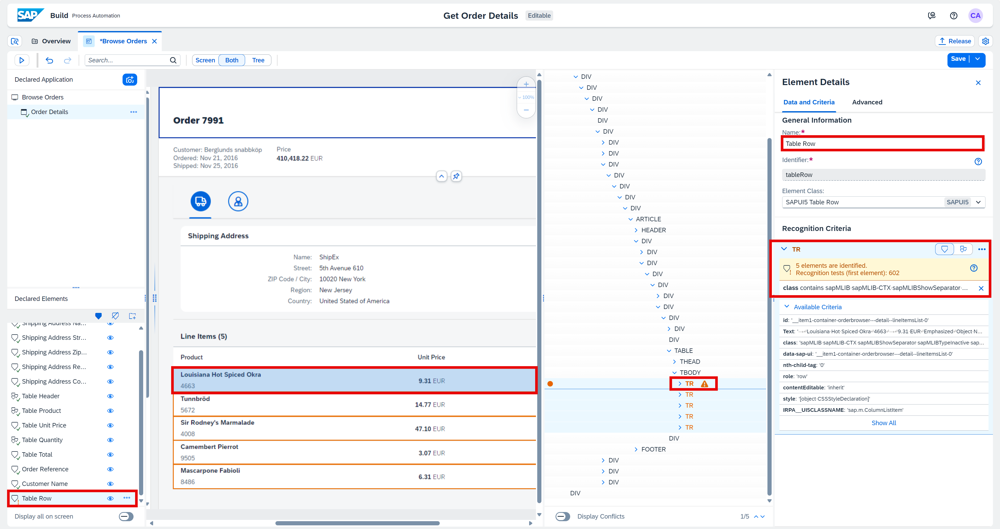
   
    - Now choose the three dots next to the **TR** element and select **set as collection**.
   
    - Choose **Declare Element** and hit **Save**.

    <!-- border -->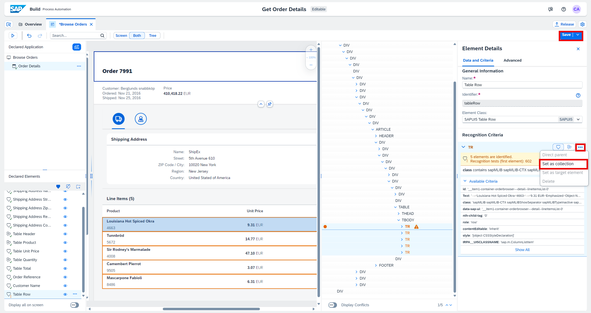

3. Then, you will declare each of the columns of the table. You will do so by creating collections for each column.

4.  Start by declaring the Table Data (TD) element for the **Product** column. On the **Order Details** screen:
    - Choose **Both** to have a view of the screen and the tree.
    - Find the **TD** that corresponds to the data found in the first row's table of the **Product** column on the screen.
    - In the **Element Details** panel, change the name to **Table Product**.
    - Remove **Text** as criteria and add **aria-colindex**.
    - Choose **Declare Element**.

    <!-- border -->

    - Now choose the three dots next to the **TD** element and select **Set as collection**.
    - Click on **Save**.

    <!-- border -->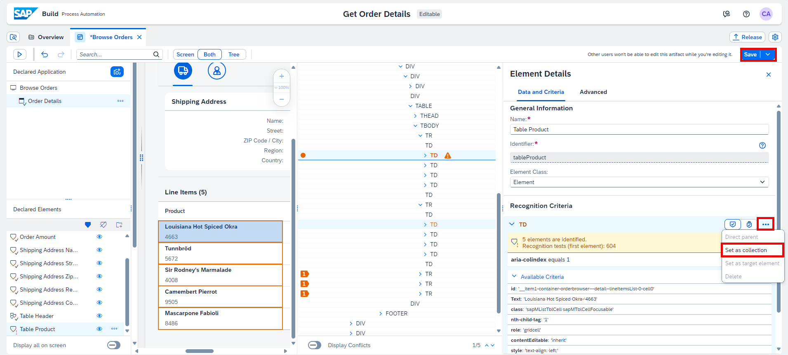

5.  Secondly, you will declare the Table Data (TD) element for the **Unit Price** column. On the **Order Details** screen:

    - Choose **Both** to have a view of the screen and the tree.
    - Find the **TD** that corresponds to the data found in the first row's table of the **Unit Price** on the screen.
    - In the **Element Details** panel, change the name to **Table Unit Price**.
    - Remove **Text** as criteria and add **aria-colindex**.
    - Choose **Declare Element**.

    <!-- border -->

    - Now choose the three dots next to the **TD** element and select **Set as collection**.

    <!-- border -->

    - In the tree, find the **SPAN** that corresponds to the data found in the first row's table of the **Unit Price** column.
    - Right click on the **SPAN** and select **Add to criteria**.

    <!-- border -->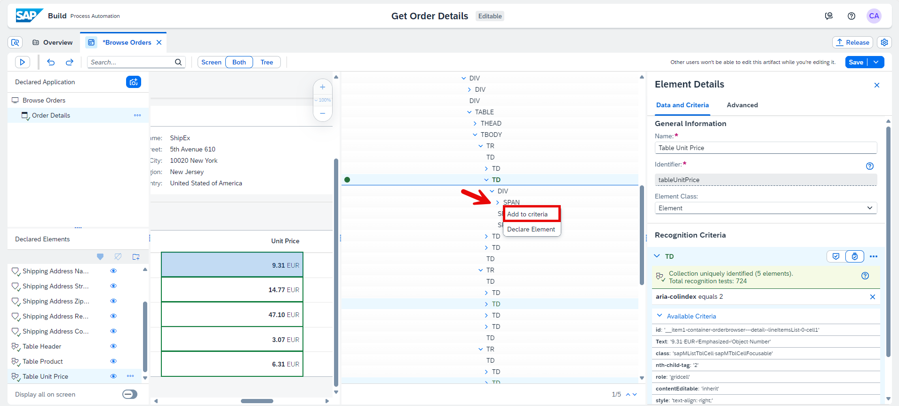
    
    - Remove **id** as criteria and add **class**.
    - Select the three dots next to **SPAN** criteria and select **Set as target element**.

    <!-- border -->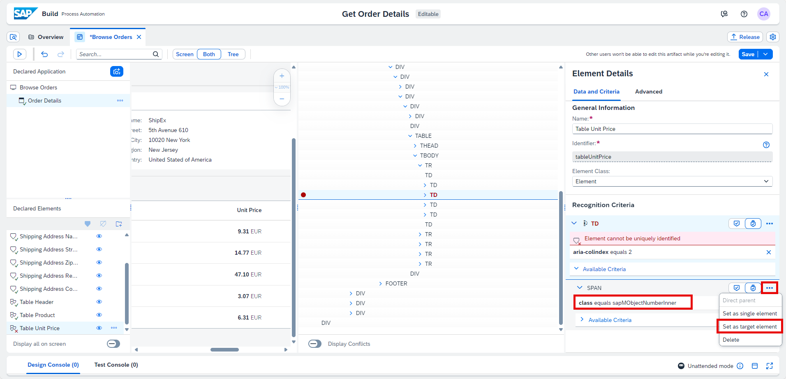

    - Now, select the three dots again and select **Set as single element**.
    - Click on **Save**.

    <!-- border -->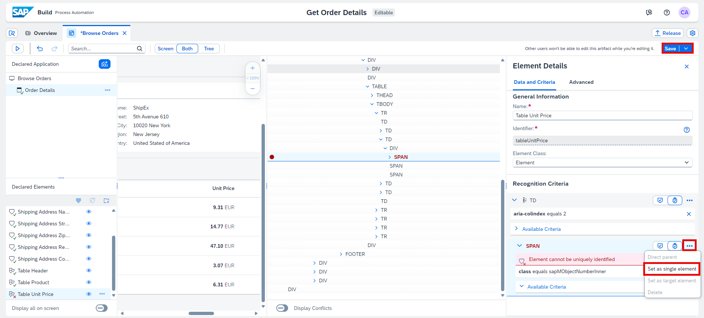

    > ### What is going on?
    > As the **text** criteria for the collection of **TD** does not render the value displayed on the table (i.e. *9.31 EUR Emphasized Object Number*), you need to work through the tree to find the criteria that displays the value needed. (i.e. *9.31 EUR*). In this use case, the **SPAN** needs to be added as criteria and set as target **and** single element to your collection of **TD**.

    <!-- border -->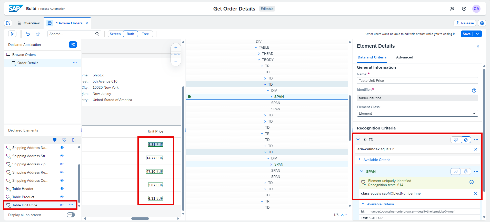

6.  Thirdly, you will declare the Table Data (TD) element for the **Quantity** column. Select the **Order Details** screen:

    - Choose **Both** to have a view of the screen and the tree.
    - Find the **TD** that corresponds to the data found in the first row's table of the **Quantity** column on the screen.
    - In the **Element Details** panel, change the name to **Table Quantity**.
    - Remove **Text** as criteria and add **aria-colindex**.
    - Choose **Declare Element**.

    <!-- border -->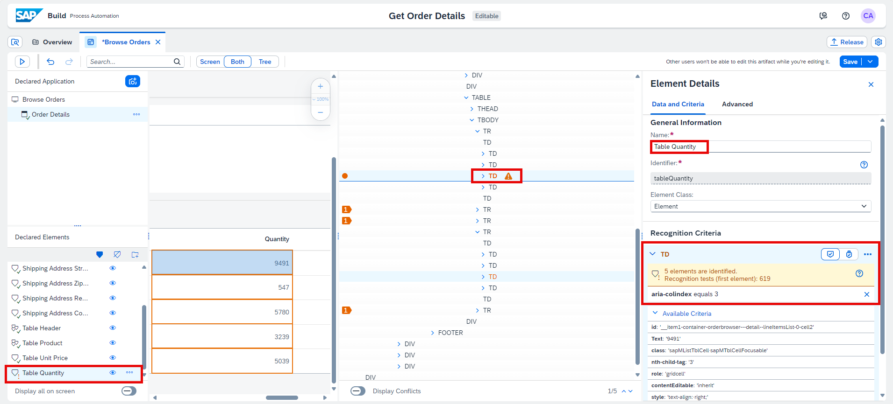

    - Now choose the three dots next to the **TD** element and select **Set as collection**.
    - Click on **Save**.

    <!-- border -->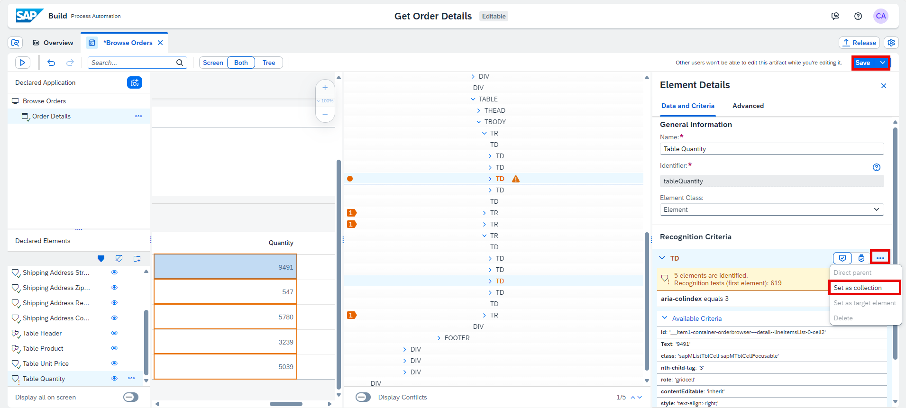

7.  Finally, you will declare the Table Data (TD) element for the **Total** column. Select the **Order Details** screen.
    
    As for the **Unit Price**, you will need to declare the **SPAN** as criteria and set it as target and single element to your collection of **TD**.

    Let's do this but in a different way yielding the same result:
    
    - Choose **Both** to have a view of the screen and the tree.
    - Find the **SPAN** that corresponds to the data found in the first row's table of the **Total** on the screen.
    - In the **Element Details** panel, change the name to **Table Total**.
    - Remove **Text** as criteria and add **class**.
    - Choose **Declare Element**.

    <!-- border -->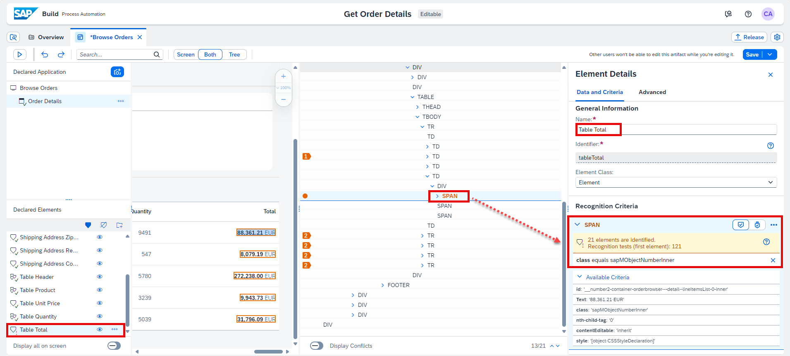
    
    - Now right click on the **TD** in the tree corresponding to the data found in the first row's table of the **Total** on the screen, and select **Add to criteria**.

    <!-- border -->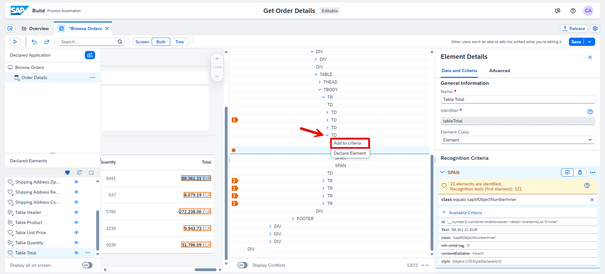
    
    - Remove **id** and add **aria-colindex**.
    - Choose **Set as collection** by clicking on the icon this time.

    <!-- border -->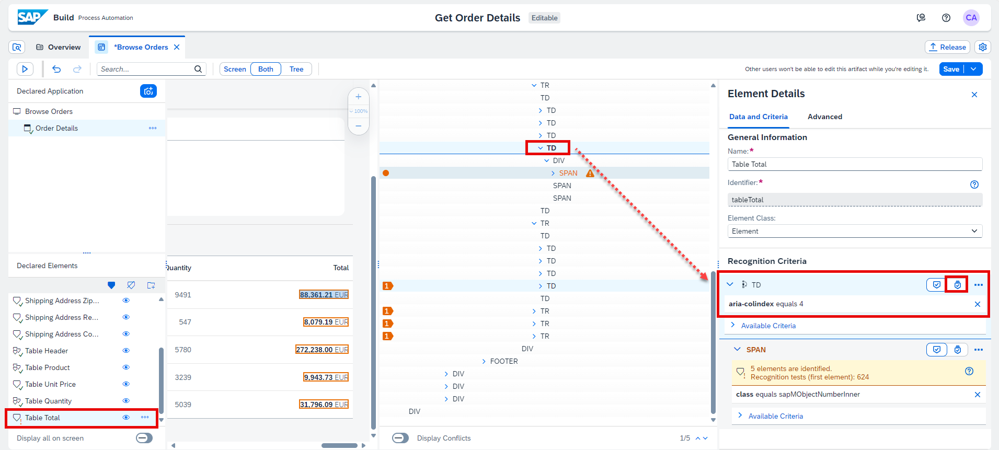

    - Choose **Save**.

    <!-- border -->

    Now that the application is fully captured and declared, you may start designing your automation.

---
