# Use Google Workspace to create Google Docs
<!-- description --> Use Google Workspace to automate Google Docs in SAP Build Process Automation

## Prerequisites
 - Complete [Google Authorization](spa-authorize-google-sdk) tutorial
 - Install and set up the [Desktop Agent 3](spa-setup-desktop-3-0-agent) to run the automation

## You will learn
- How to use Google Workspace to automate the creation of a new Google document
- How to insert header, footer and text in Google Document
- How to retrieve a specific document and replace text in it

## Intro
In this tutorial, you will build an automation that will create a Google Document where you will insert a header and a footer as well as some text. You will then retrieve the Google document and replace some text in the document.

---

### Create an automation

1. In the **Lobby**, select the **Google Suite** project that has been done as part of previous tutorials as mentioned in pre-requisites.

2. In **Build Process Automation**, choose **Create** and then select **Automation**.

    <!-- border -->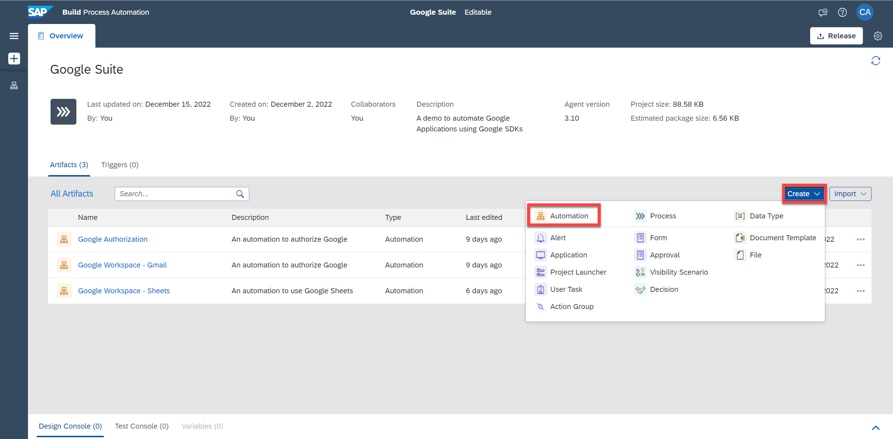

3. In the **Create Automation** window, enter **Google Workspace-Docs** as name and **An automation to use Google Docs** as a description.

    <!-- border -->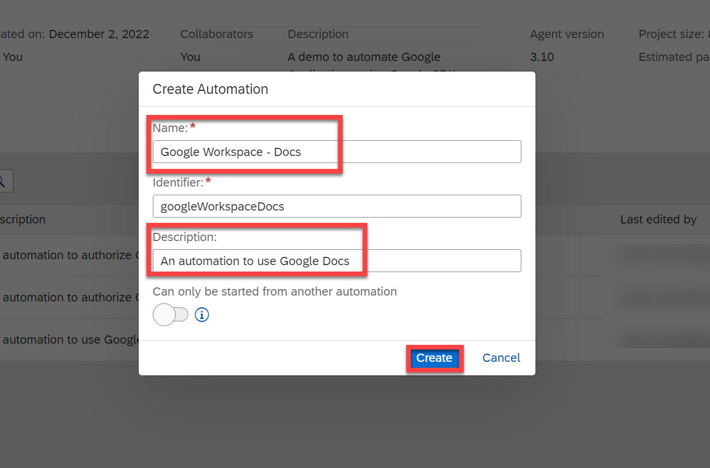

    You will be navigated to the automation editor of the newly created automation.

### Build an automation to create a Google document

1. In the **Automation Details** panel, under **Automations**, drag and drop the [Google Authorization](spa-authorize-google-sdk) automation you created as mentioned in the pre-requisites.

    This automation will allow to authorize your Google Workspace account.

    <!-- border -->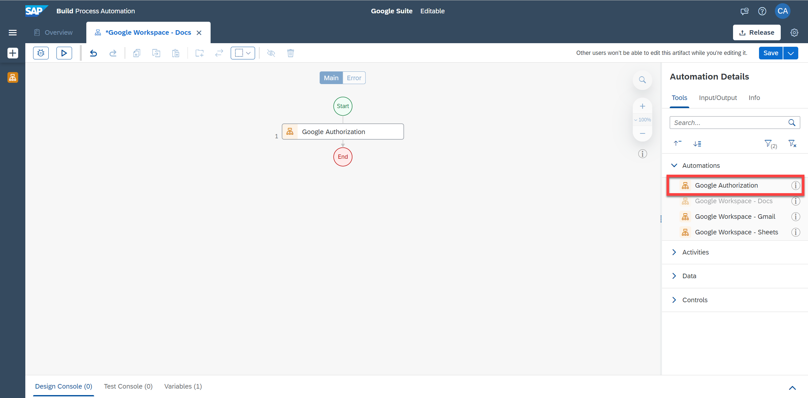

2. You will automate the creation of a new Google Document in your **Google Drive**.

    In the **Automation Details** panel, under **Tools**, search for the **Create Document (Google Docs)** and drag and drop it into the workflow.

    > This activity takes an optional parameter for title of document. If not specified untitled document will be created.

3. Select the activity **Create Document (Google Docs)**. Under **Input Parameters** as a **title** type **Automation Document** and select the expression in quotes.

    <!-- border -->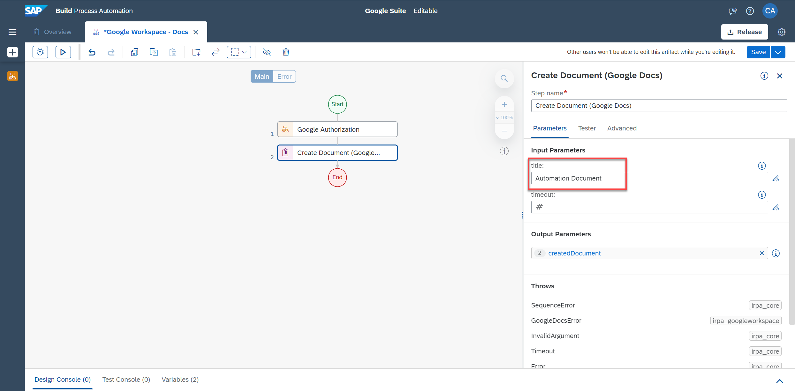

    Now you will add content in the document. You will use **Insert Text (Google Docs)** activity to do so.

    > **CAUTION:** Currently there is no support for styles in Google docs automation activities and this has to be done manually.

4. In the **Automation Details** panel, under **Tools**, search for the **Insert Text (Google Docs)** and drag and drop it into the workflow. Then perform the following steps:

    - Select the activity. Under **Input Parameters**, for `documentId`, choose the pencil to open the expression editor.

    - Choose as **Variables**: `createdDocument`>`documentId`.

    - Choose **Save Expression**.

    <!-- border -->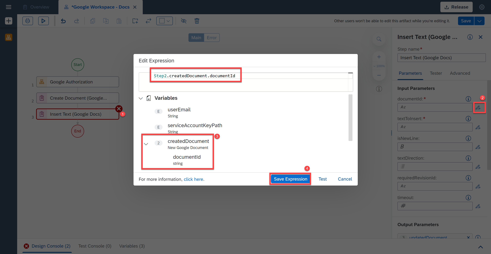

    > # What is going on?
    > Google Documents can be updated with other activities using the document Id. By entering the Id of the document you would indicate the automation in which document it has to insert text in.

5. For `textToInsert` parameter, enter the following text: **Hello from SAP Build Process Automation. Today you will learn how to use Google docs**. Please select the expression in quotes and hit enter.

    <!-- border -->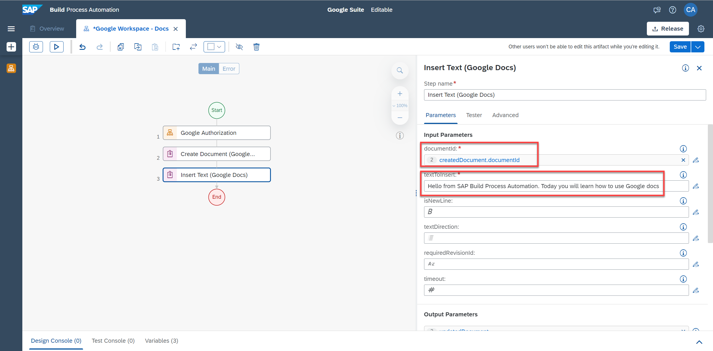

6. In the **Automation Details** panel, under **Tools**, search for the **Create Header (Google Docs)** and drag and drop it into the workflow. Then perform the following steps:

    - Select the activity. Under **Input Parameters**, for `documentId`, choose the pencil to open the expression editor.

    - Choose as **Variables**: `createdDocument`>`documentId`.

    - Choose **Save Expression**.

    <!-- border -->

7. For `headerText`, enter the following header to insert: **SAP Build Process Automation** and select the expression in quotes.

    <!-- border -->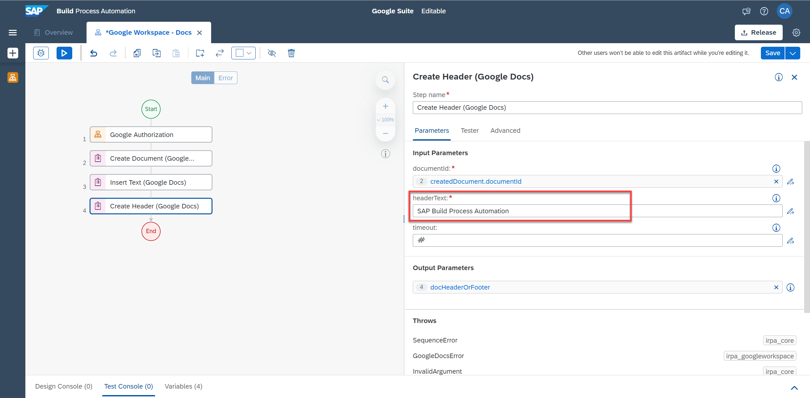

8. In the **Automation Details** panel, under **Tools**, search for the **Create Footer (Google Docs)** and drag and drop it into the workflow. Then perform the following steps:

    - Select the activity. Under **Input Parameters**, for `documentId`, choose the pencil to open the expression editor.

    - Choose as **Variables**: `createdDocument`>`documentId`.

    - Choose **Save Expression**.

    <!-- border -->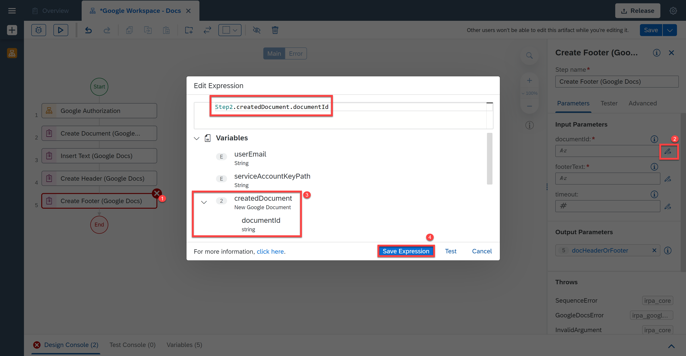

9. For the parameter `footerText`, enter the following footer to insert: **SAP** and select the expression in quotes.

    <!-- border -->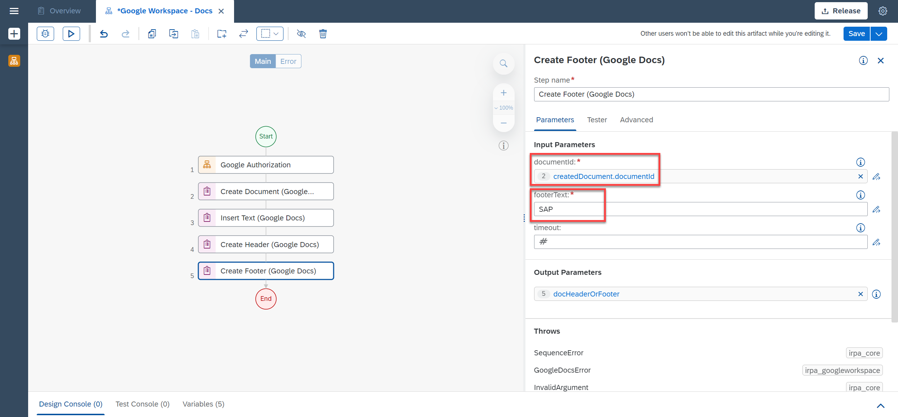

10. Choose **Save**.

### Test Google workspace for new Google document in Google drive

1. Choose **Test**.

2. Fill in the **Environment Variables**:
    - For `userEmail`: your Gmail user email
    - For `serviceAccountKeyPath`: the full path to the json file

    <!-- border -->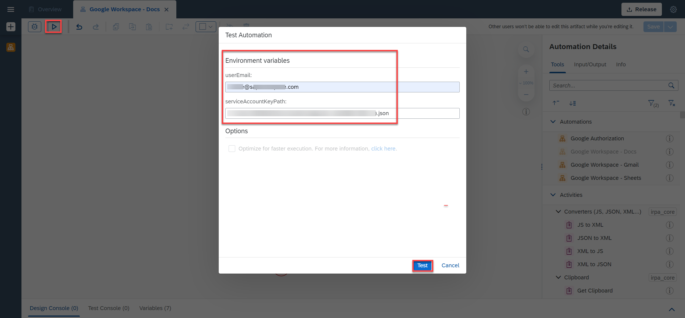

3. Choose **Test**.

    <!-- border -->

    The testing was successful.

4. You may go to your Google Docs in your Google Drive and you will see that a new document named **Automation Document** was successfully created.

    <!-- border -->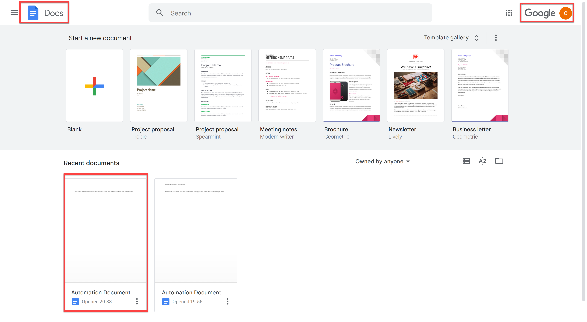

5. After opening it, you will see that the header, footer and text were successfully inserted in the document as well.

    <!-- border -->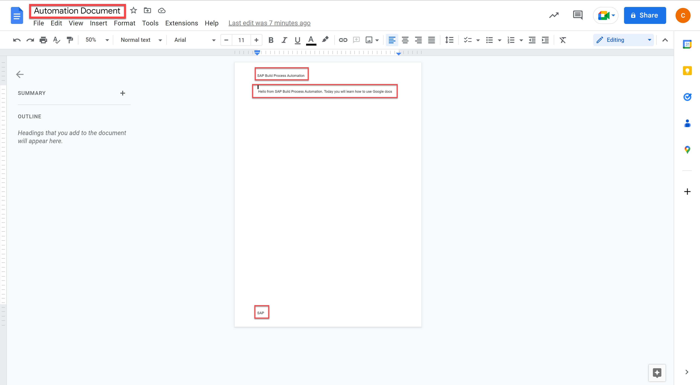

### Retrieve the Google document

You will add an activity in the automation to retrieve a Google Docs document from your Google Drive that was created in the above steps:

- In the **Automation Details** panel, under **Tools**, search for the **Get Document (Google Docs)** and drag and drop it into the workflow.

There are two ways to retrieve the document id of the Google Document, either through the URL of Google Document or through the **Create Document (Google Docs)** activity (step2 of the automation).

[OPTION BEGIN [`FromURL`]]

1. You can find the Document Id of the Google Document in the URL.

    <!-- border -->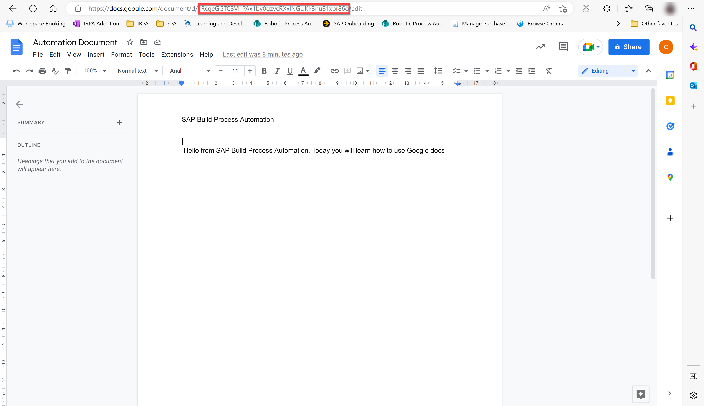

2. Select the activity. Under **Input Parameters**, for `documentId`, enter the id of the document you want to retrieve from Google Drive and select the expression in quotes.

3. Choose **Save**.

    <!-- border -->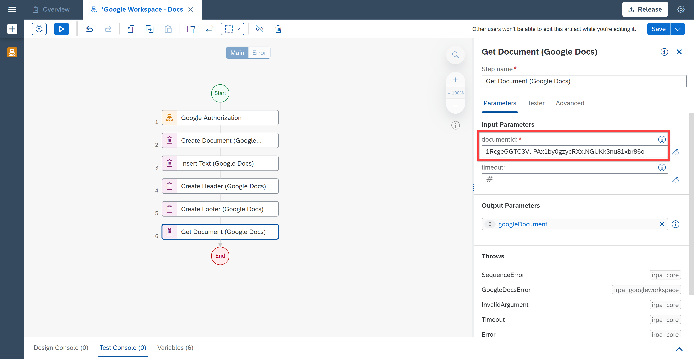

[OPTION END]

[OPTION BEGIN [`FromCreatedDocument`]]

1. Search for the activity **Get Document (Google Docs)** activity. Drag and drop the activity to your workflow. Under **Input Parameters**, for `documentId`, choose the pencil to open the expression editor.

2. Choose as **Variables**: `createdDocument`>`documentId`.

3. Choose **Save expression**.

4. Save your work.

    <!-- border -->

[OPTION END]

### Replace the text in the Google document and disconnect Google

Next step is to replace the matching text in the Google Docs document with a new value.

1. In the **Automation Details** panel, under **Tools**, search for the **Replace Text (Google Docs)** and drag and drop it into the workflow.

2. Select the activity. Under **Input Parameters**, for `documentId`, choose the pencil to open the expression editor.

    You need to specify the Id of the document in which you want to replace some text. You have already retrieved the document from the activity **Get Document (Google Docs)**. Map the parameters accordingly as explained below.

3. Choose as **Variables**: `googleDocument`>`documentId`.

4. Choose **Save Expression**.

    <!-- border -->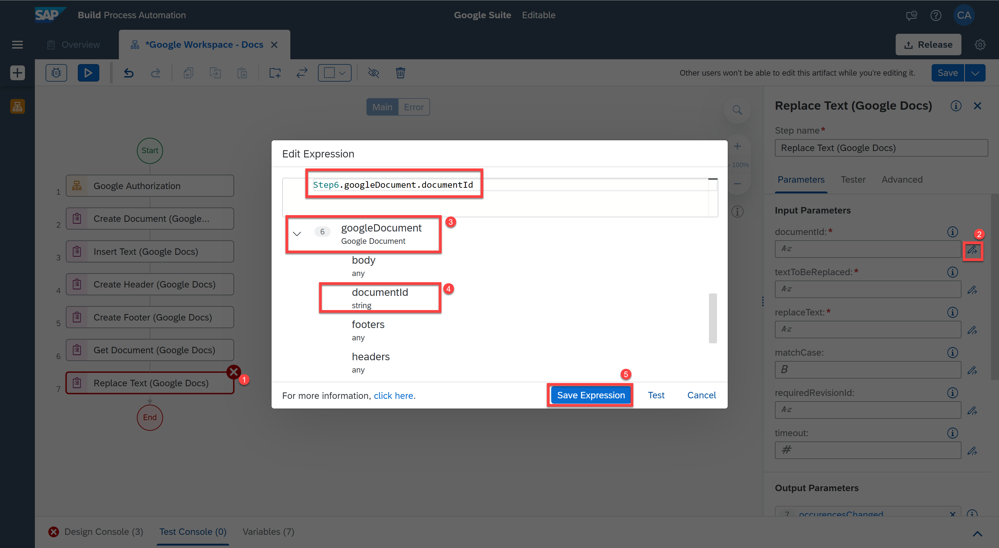

5. Now you will enter the parameters as below.

    |  **Parameter Name**    | **Value**
    |  :------------- | :-------------
    |  `textToBeReplaced`       | use
    |  `replaceText`       | create and update
    |  `matchCase` | true

    > **CAUTION:** Always remember to select the expression in quotes.

    `matchCase` parameter indicates whether the search of the text is case-sensitive.

     <!-- border -->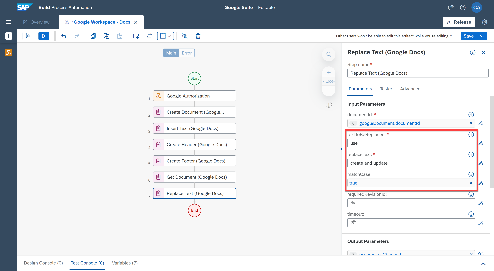

6. Lastly, you will disconnect your Google Workspace Account using the activity **Disconnect (Google)**. In the **Automation Details** panel, under **Tools**, search for the **Disconnect (Google)** and drag and drop it into the workflow.

7. **Save** the automation.  

    <!-- border -->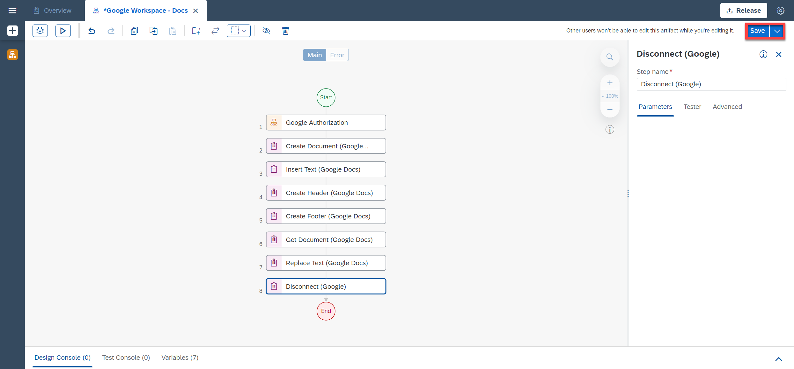  

### Test Google workspace to update the Google document in Google drive

You will now test your automation.

1. Choose **Test**.

2. Fill in the **Environment Variables**:
    - For `userEmail`: your Gmail user email
    - For `serviceAccountKeyPath`: the full path to the json file

    <!-- border -->

3. Choose **Test**.

    <!-- border -->

    The testing was successful.

4. You may go to your Google Docs and you will see that the document called Automation Document was successfully updated.

    <!-- border -->

5. After opening it, you will see that the text "use" was replaced by the text "create and update".

    <!-- border -->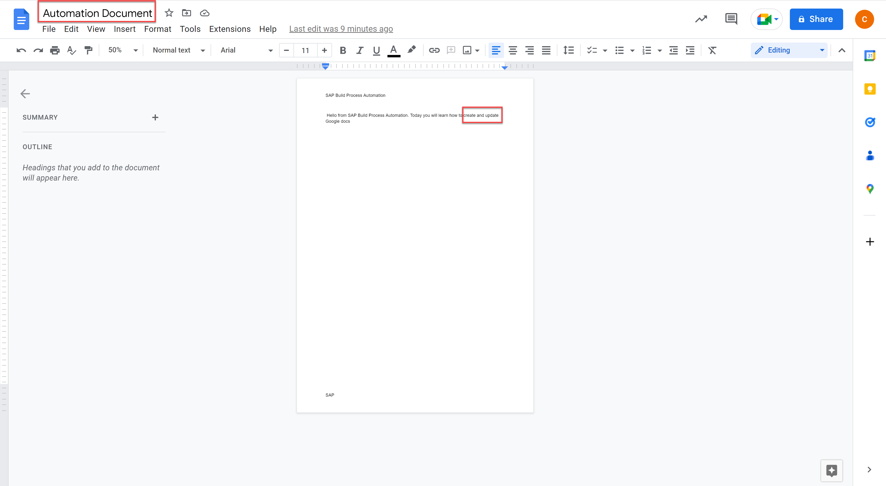
