# Use Google Workspace to create Google Sheets
<!-- description --> Use Google Workspace to create, retrieve the details and set the values of a Google spreadsheet

## Prerequisites
 - Complete [Google Authorization](spa-authorize-google-sdk) tutorial
 - Install and set up the [Desktop Agent 3](spa-setup-desktop-3-0-agent) to run the automation

## You will learn
  - How to use Google Workspace to import data from an excel sheet and create a new Google spreadsheet 
  - How to retrieve the details of a Google spreadsheet
  - How to set the values of a specified cells range in Google Sheet

## Intro
In this tutorial, you will build an automation that will import data from an excel file, create a Google spreadsheet named Order Details with the values from the excel file. The automation will then create a new Google sheet within the spreadsheet named Updated Order Status with values set to a specified cell range.

---

### Create an automation

1. In the **Lobby**, select the **Google Suite** project that has been done as part of previous tutorials as mentioned in pre-requisites.

2. In **Build Process Automation**, choose **Create** and then select **Automation**.

    <!-- border -->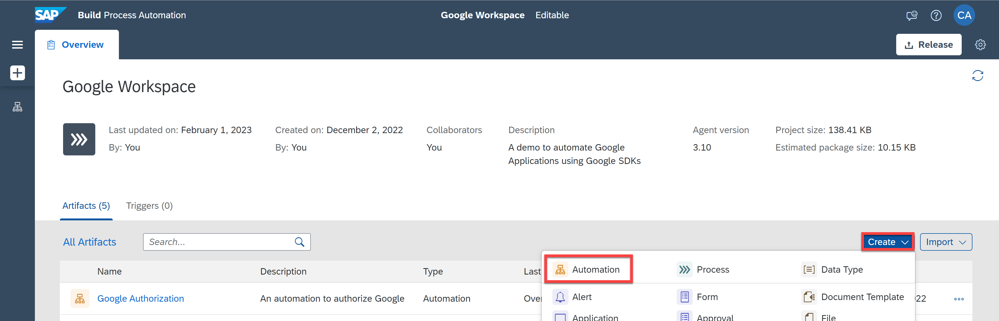

3. In the **Create Automation** window, enter **Google Workspace-Sheets** as name and **An automation to use Google Sheets** as a description.

    <!-- border -->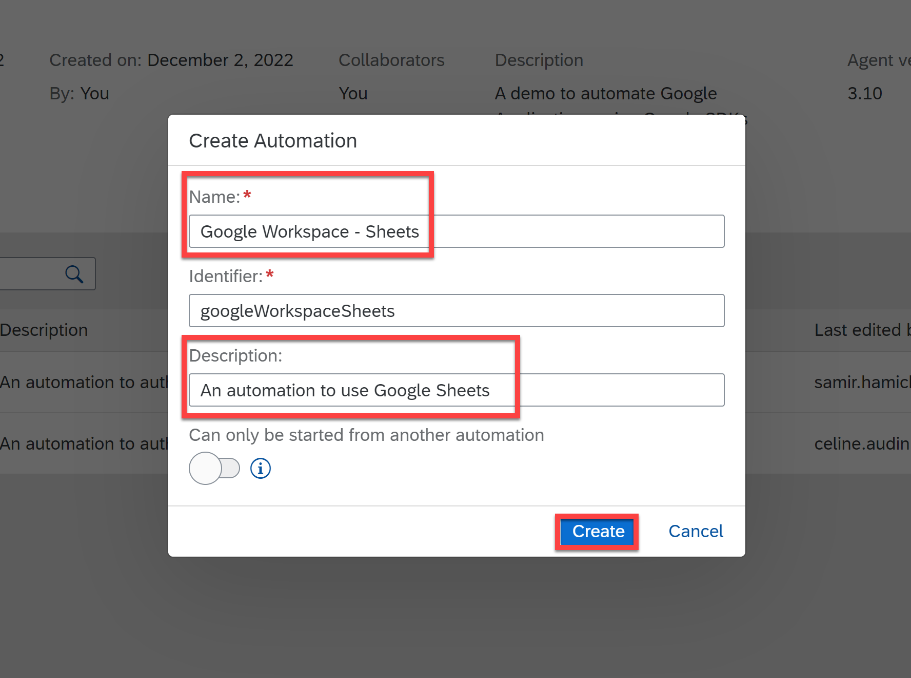

    You will be navigate to the automation editor of the newly created automation.

### Add input parameter

You will add one input parameter.

1. In the **Automation Details** panel, under **Input/Output**, choose **Add new input parameter**.

2. Add an input parameter as follows:

|  Field          | Input Parameter 1
|  :------------- | :-------------    
|  Name           | `excelPath`    
|  Type           | String           

<!-- border -->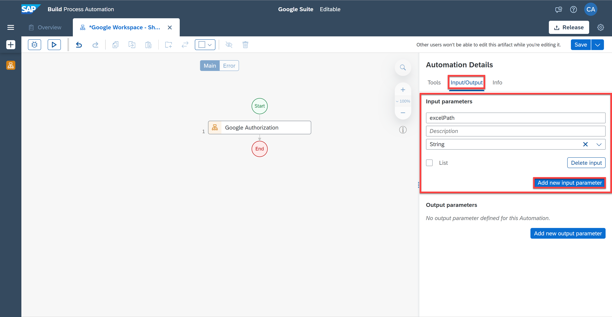

### Build an automation to use Google Sheets

1. In the **Automation Details** panel, under **Automations**, drag and drop the [Google Authorization](spa-authorize-google-sdk) automation you created.
    <!-- border -->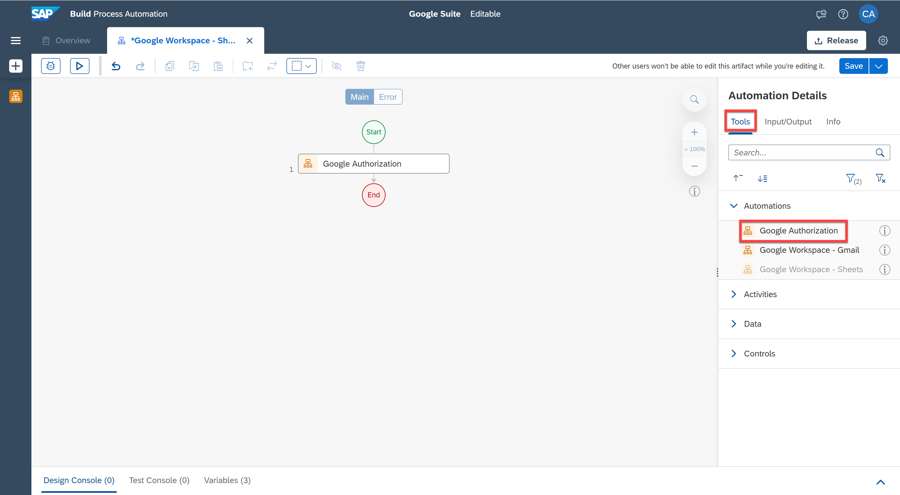

    You will import data and create a new Google spreadsheet.

2. In the **Automation Details** panel, under **Tools**, search for the **Import and Create (Google Sheet)** and drag and drop it into the workflow.

3. Select the activity. For the **location** parameter select `fileSystem` and for the `pathOrDriveFileId` select `0 excelPath`.

    > The location parameter refers to the type of location from which to pick the data to import and the path or drive field parameter refers to the path to the excel file stored on your local machine.

    <!-- border -->

4. Now search for the **Rename Spreadsheet (Google Sheet)** and drag and drop it into the workflow.

    > This activity will rename the existing Google spreadsheet.

5. Select the activity. For the `spreadsheetId` parameter, select the pencil next to the field to open the expression editor.

6. In the expression editor, copy and paste the following expression: `Step2.spreadSheetDetails.spreadSheetId`.

    <!-- border -->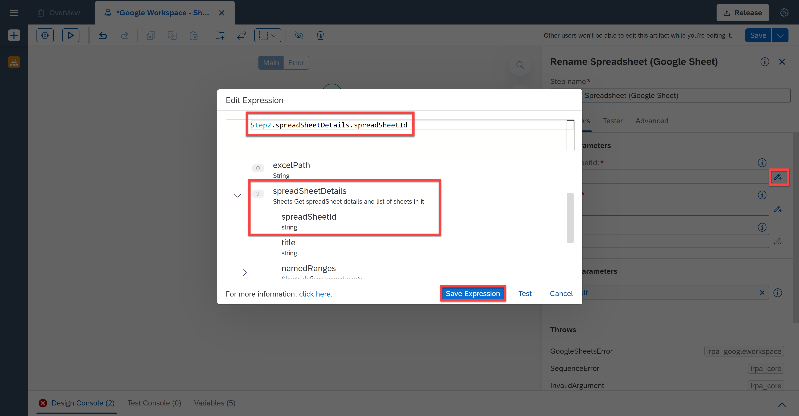

7. In the `newTitle` parameter field, enter `OrderDetails`.

    > This will rename the Google spreadsheet that you previously created to `OrderDetails`.

    <!-- border -->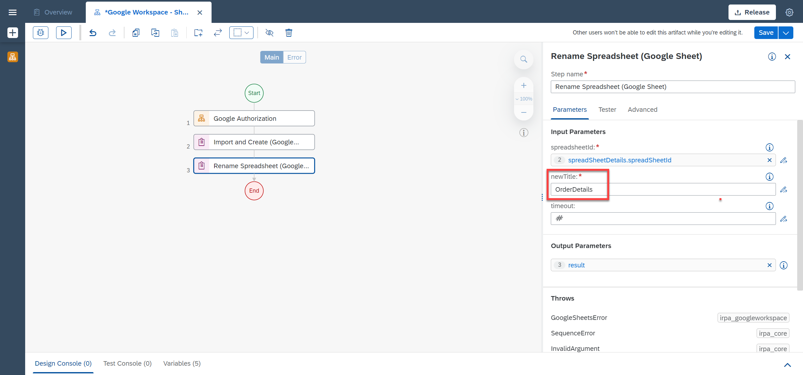

8. Search for **Get Spreadsheet Details (Google Sheet)** activity. Drag and drop it into the workflow.

9. Select the activity. For the `spreadSheetId` parameter, select the pencil next to the field to open the expression editor.

10. In the expression editor, copy and paste the following expression: `Step2.spreadSheetDetails.spreadSheetId`.

    <!-- border -->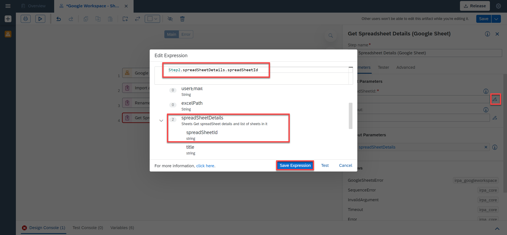

    > Now that you retrieved the details of the Google spreadsheet, you can get the details of a specific row.

11. Search for the **Get Last Row (Google Sheet)** activity to retrieve the details of last row. Drag and drop it into the workflow.

12. Select the activity. For the `spreadSheetId` parameter, select the pencil next to the field to open the expression editor.

13. In the expression editor, copy and paste the following expression: `Step2.spreadSheetDetails.spreadSheetId`.

    <!-- border -->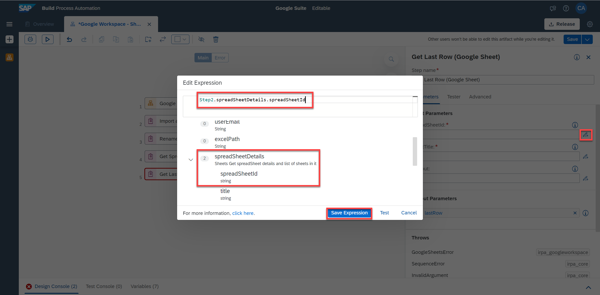

14. For the `sheetTitle` parameter, select the pencil next to the field to open the expression editor.

15. In the expression editor, copy and paste the following expression: `Step2.spreadSheetDetails.sheets[0].title`.

    > This specifies the name of the sheet in which you want to get the last row.

    <!-- border -->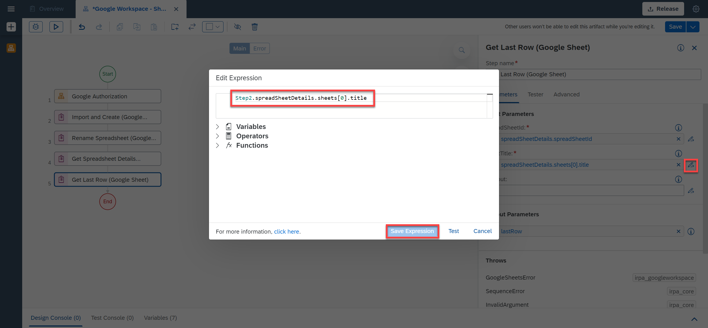

16. Search for the **Get Cell Values (Google Sheet)** activity.  Drag and drop it into the workflow.

    > This activity returns the values of the specified cell range in Google.

17. Select the activity. For the `spreadSheetId` parameter, select the pencil next to the field to open the expression editor.

18. In the expression editor, copy and paste the following expression: `Step2.spreadSheetDetails.spreadSheetId`.

    <!-- border -->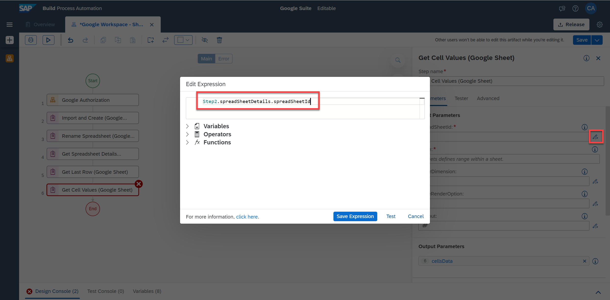

19. Under the **range** parameter field, select **Custom Data**.

20. For the `sheetTitle` parameter, select the pencil next to the field to open the expression editor.

21. In the expression editor, copy and paste the following expression: `Step2.spreadSheetDetails.sheets[0].title`.

    <!-- border -->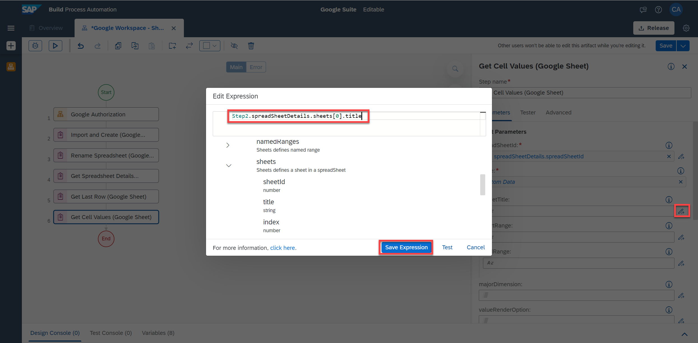

22. For the `startRange` parameter, enter **A1**.

23. For the `endRange` parameter, select the pencil next to the field to open the expression editor.

24. In the expression editor, copy and paste the following expression: `"A" + Step5.lastRow`.

25. Finally, for the `majorDimension` parameter, select **rows**.

    <!-- border -->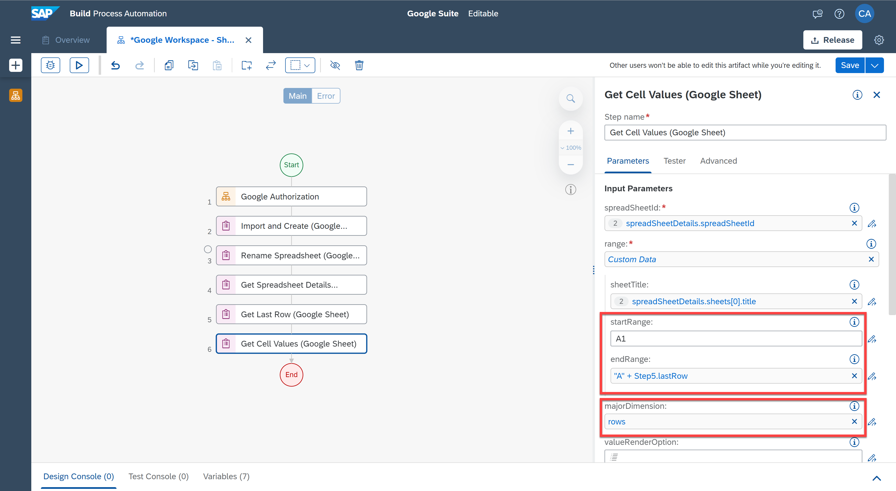

26. You will now add a sheet. To do so, search for the **Add Sheet (Google Sheet)** activity. Drag and drop it into the workflow.

27. Select the activity. For the `spreadSheetId` parameter, select the pencil next to the field to open the expression editor.

27. In the expression editor, copy and paste the following expression: `Step2.spreadSheetDetails.spreadSheetId`.

28. You will rename this new sheet to **Updated Order Status**. To do so, search for the **Rename Sheet (Google Sheet)**. Drag and drop it into the workflow.

29. Select the activity. For the `spreadSheetId` parameter, select the pencil next to the field to open the expression editor.

30. In the expression editor, copy and paste the following expression: `Step2.spreadSheetDetails.spreadSheetId`.

31. For the `sheetId` parameter, select the pencil next to the field to open the expression editor.

32. In the expression editor, copy and paste the following expression: `Step7.sheetDetails.sheetId`.

    <!-- border -->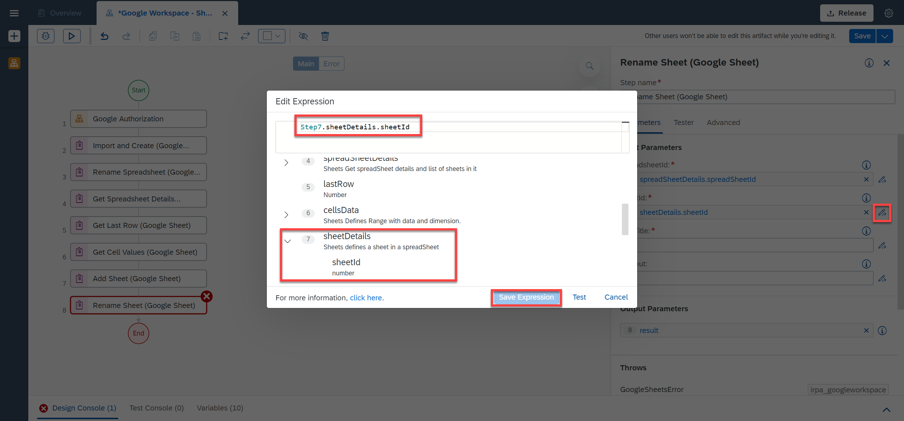

33. For the `newTitle` parameter, enter `UpdatedOrderStatus`and select the text in quotes.

    <!-- border -->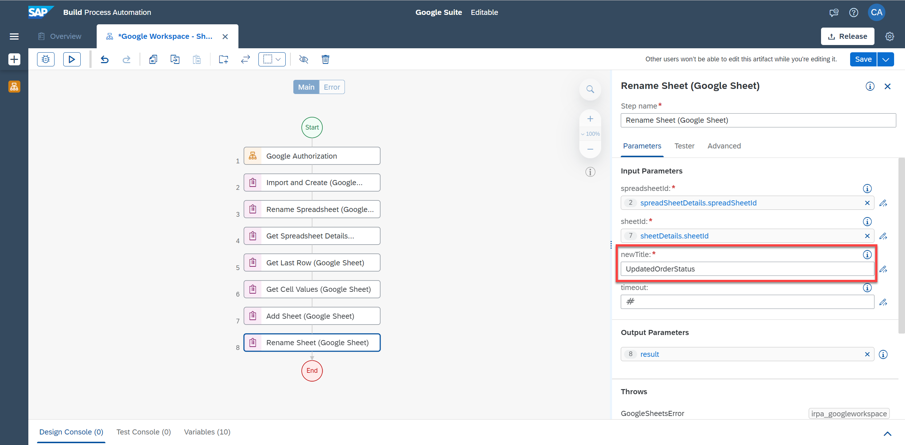

34. Search for the **Set Cell Values (Google Sheet)** activity. Drag and drop it into the workflow.

    > With Set Cell Values (Google Sheet) activity you push the values of a specified cell range in to Google sheet.

35. Select the activity. For the `spreadSheetId` parameter, select the pencil next to the field to open the expression editor.

36. In the expression editor, copy and paste the following expression: `Step2.spreadSheetDetails.spreadSheetId`.

37. For the **range** parameter, select **Custom Data**.

38. For `sheetTitle` parameter, enter `UpdatedOrderStatus` and select the text in quotes.

39. For the `startRange` parameter, enter **A1** and select the text in quotes.

40. For the `endRange` parameter, select the pencil next to the field to open the expression editor.

41. In the expression editor, copy and paste the following expression: `"A" + Step5.lastRow`.

42. For the **values** parameter, select the pencil next to the field to open the expression editor.

43. In the expression editor, copy and paste the following expression: `Step6.cellsData.values`.

    <!-- border -->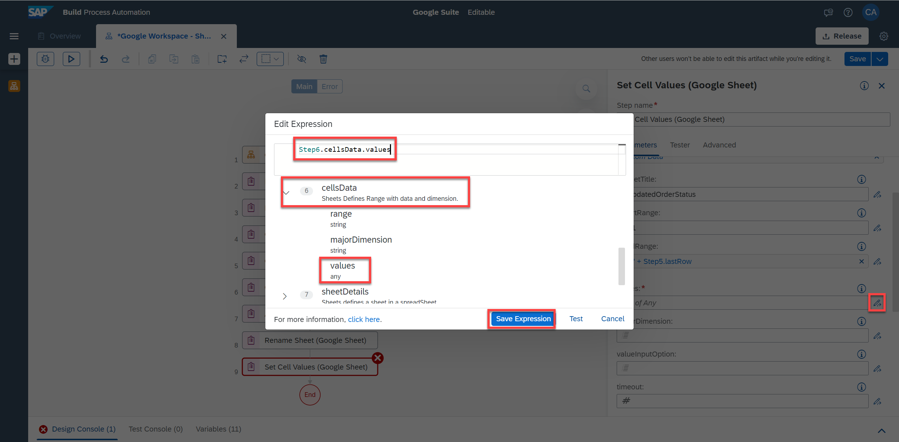

44. For `majorDimension` parameter, select **rows** and for `valueInputOption` parameter, select `userEntered`.

    <!-- border -->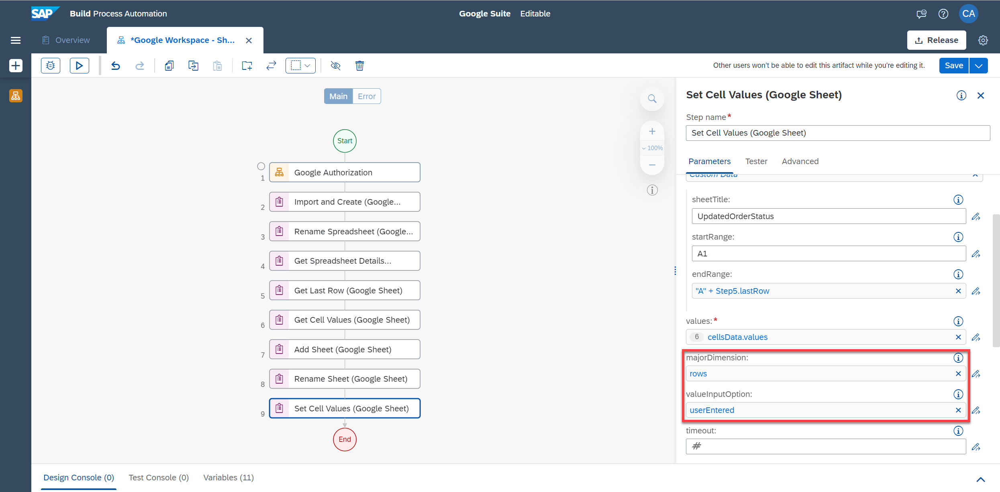

45. Drag and drop another **Set Cell Values (Google Sheet)** activity.

46. Select the activity. For the `spreadSheetId` parameter, select the pencil next to the field to open the expression editor.

47. In the expression editor, copy and paste the following expression: `Step2.spreadSheetDetails.spreadSheetId`.

48. For the **range** parameter, select **Custom Data**.

49. For `sheetTitle` parameter, enter `UpdatedOrderStatus` and select the text in quotes.

50. For the `startRange` parameter, enter **B1** and select the text in quotes.

51. For the `endRange` parameter, select the pencil next to the field to open the expression editor.

52. In the expression editor, copy and paste the following expression: `"B" + Step5.lastRow`.

    <!-- border -->

53. For the **values** parameter, select the pencil next to the field to open the expression editor.

54. In the expression editor, copy and paste the following expression: `['Order Status', 'Delivered', 'Delivered', 'In Time', 'In Time', 'Delivered', 'In Time', 'Delivered', 'In Time', 'In Time', 'Delivered']`.

    <!-- border -->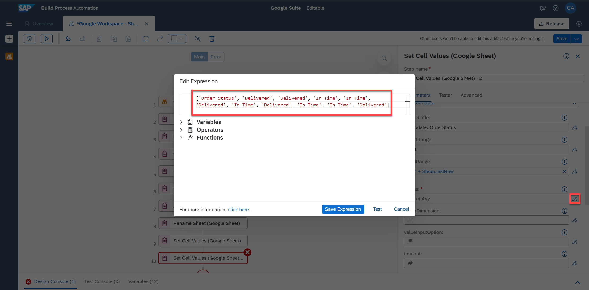

55. For the `majorDimension` parameter, select **rows**.

    Finally, you need to disconnect the Google Account.

56. Search for the **Disconnect (Google)** activity and drag and drop it into the workflow.

57. Save your work.

    <!-- border -->

### Test Google Workspace for Google Sheets

1. Choose **Test**.

2. Fill in the **Input parameters**:
    - For `excelPath`: the full path to the excel file

3. Fill in the **Environment Variables**:
    - For `userEmail`: your Gmail user email
    - For `serviceAccountKeyPath`: the full path to the json file

4. Choose **Test**.

    <!-- border -->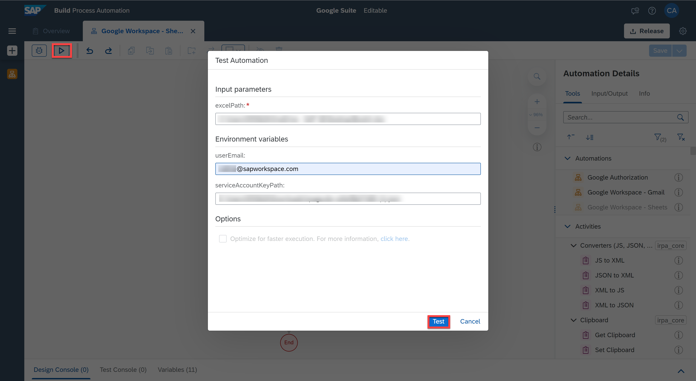

    The testing was successful.

    <!-- border -->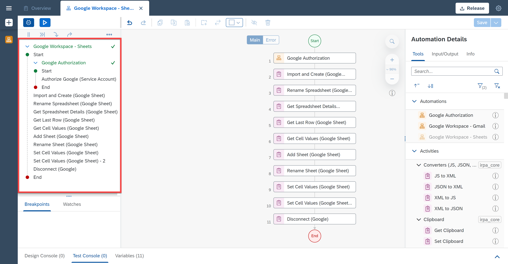

    If you go to your Google Account>Google Apps>Sheets you will see the created `OrderDetails` spreadsheet. Upon opening it, you will see the values from the excel file were imported on sheet1 and a new sheet was created named `updatedOrderStatus` with the corresponding values that were set in your automation.

    <!-- border -->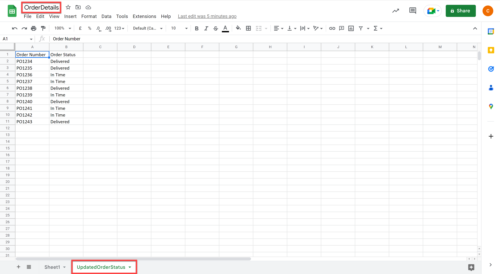

---
