# Use Google Workspace to create Google Slides
<!-- description --> Use Google Workspace to automate Google Slides in SAP Build Process Automation

## Prerequisites
 - Complete [Google Authorization](spa-authorize-google-sdk) tutorial
 - Install and set up the [Desktop Agent 3](spa-setup-desktop-3-0-agent) to run the automation

## You will learn
- How to use Google Workspace to automate the creation of a new presentation, add slides, a header, a list and an image
- How to retrieve the details of the presentation

## Intro
In this tutorial, you will build an automation that will create a presentation where you will add one slide with a header and a list and another slide with an image. You will then retrieve the presentation details through a log message that will be read in the test console.
---

### Create an automation

1. In the **Lobby**, select the **Google Suite** project that has been done as part of previous tutorials as mentioned in pre-requisites.

2. In **Build Process Automation**, choose **Create** and then select **Automation**.

    <!-- border -->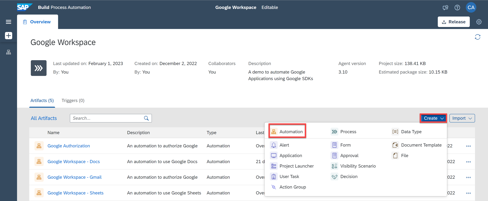

3. In the **Create Automation** window, enter **Google Workspace-Slides** as name and **An automation to use Google Slides** as a description.

    <!-- border -->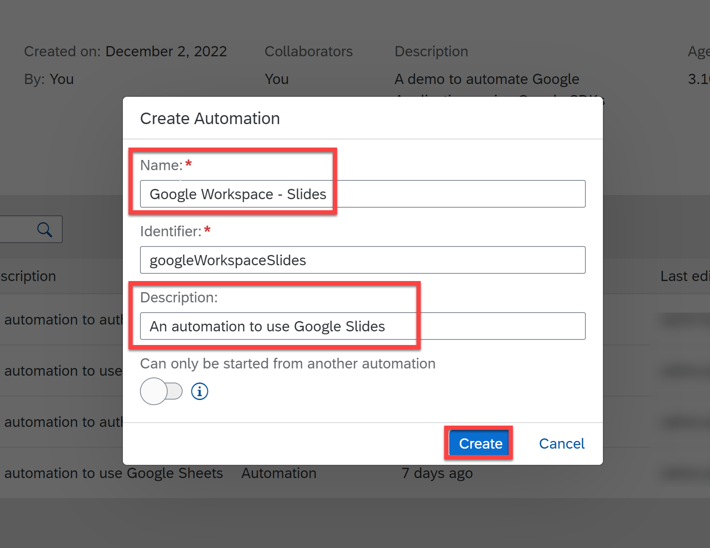

    You will be navigated to the automation editor of the newly created automation.

### Build an automation to use Google Slides

1. In the **Automation Details** panel, under **Automations**, drag and drop the [Google Authorization](spa-authorize-google-sdk) automation you created.

    <!-- border -->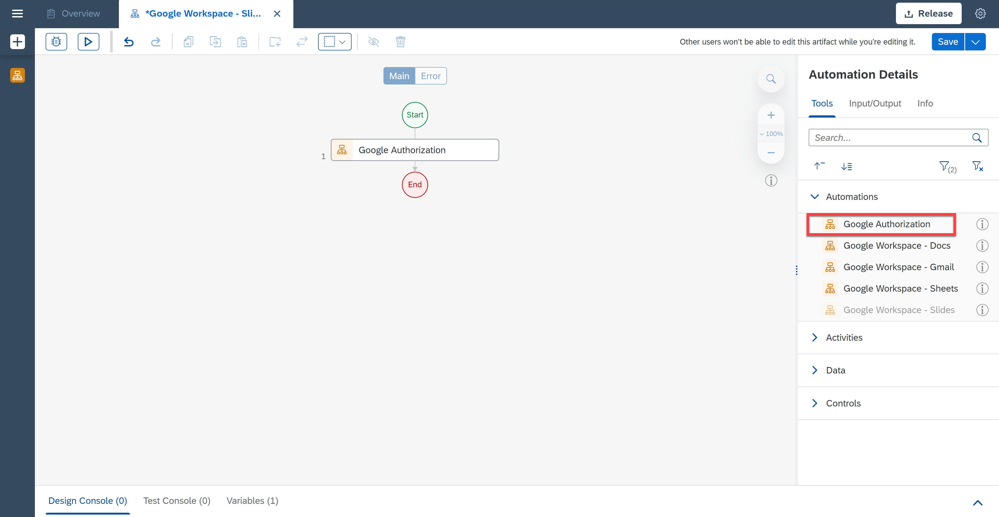

2. You will automate the creation of a new Google presentation in Google Slides. In the **Automation Details** panel, under **Tools**, search for the activity **Create Presentation (Google Slides)** and drag and drop it into the workflow.

    > This activity takes an optional parameter for title of document. If not specified untitled document will be created.

3. Select the activity. Under **Input Parameters** as a **title** type **Automation Presentation** and select the expression in quotes.

    <!-- border -->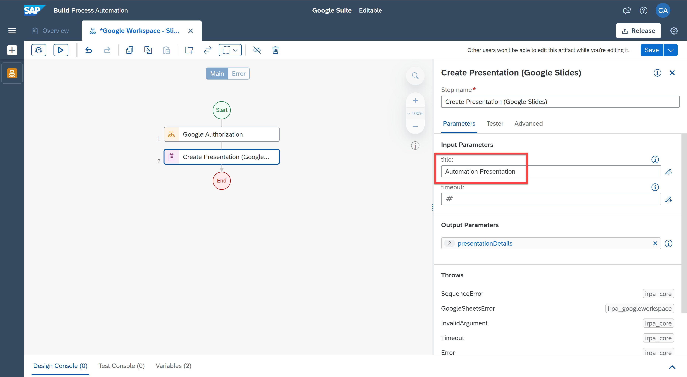

4.  You will now add a slide to the presentation you created. In the **Automation Details** panel, under **Tools**, search for the activity **Add Slide (Google Slides)** and drag and drop it into the workflow.

    > You will set the parameter for `presentationID`, the id of the presentation in which you want to add a slide.

    - Select the activity. Under **Input Parameters**, for `presentationId`, choose the pencil to open the expression editor.

    - Choose as **Variables**: `presentationDetails`>`presentationId`.

    - Choose **Save Expression**.

    <!-- border -->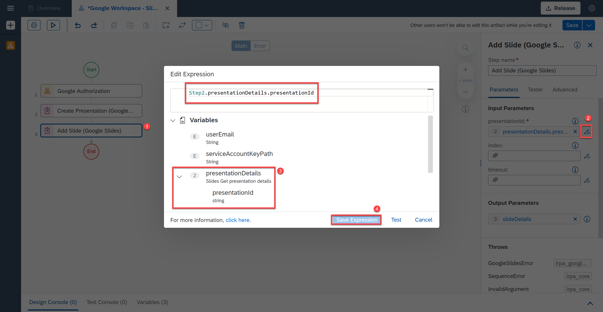

9. Now you will add a header to the slide you added. In the **Automation Details** panel, under **Tools**, search for the  activity **Add Slide Header (Google Slides)** and drag and drop it into the workflow.

    > You will set the parameter for `presentationID`, the id of the presentation in which you want to add a header.

    - Select the activity. Under **Input Parameters**, for `presentationId`, choose the pencil to open the expression editor.

    - Choose as **Variables**: `presentationDetails`>`presentationId`.

    - Choose **Save Expression**.

    <!-- border -->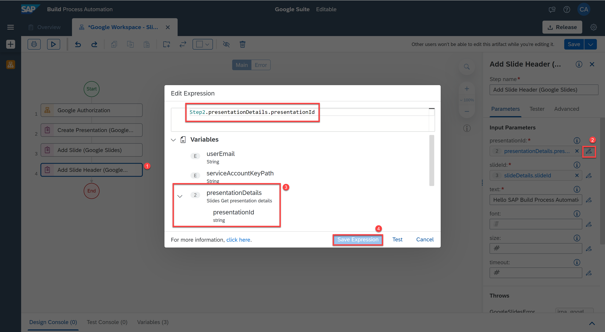

    > Now you will set the parameter for `slideId`, the id of the slide in which you want to add a header.

    - Under **Input Parameters**, for `slideId`, choose the pencil to open the expression editor.

    - Choose as **Variables**: `slideDetails`>`slideId`.

    - Choose **Save Expression**.

    <!-- border -->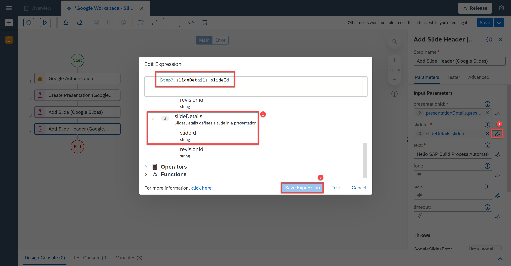

15. For **text** enter the text to be added in the slide header, here: **Hello SAP Build Process Automation!** and select the expression in quotes.

    <!-- border -->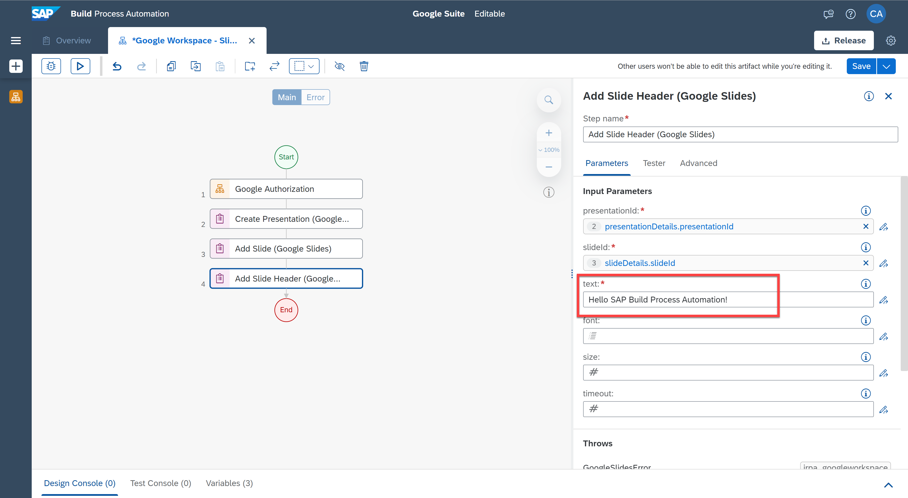

16. Next, you will create a list in the slide you added. In the **Automation Details** panel, under **Tools**, search for the activity **Create list (Google Slides)** and drag and drop it into the workflow.

    > You will set the parameter for `presentationID`, the id of the presentation in which you want to add a list.

    - Select the activity. Under **Input Parameters**, for `presentationId`, choose the pencil to open the expression editor.

    - Choose as **Variables**: `presentationDetails`>`presentationId`.

    - Choose **Save Expression**.

    <!-- border -->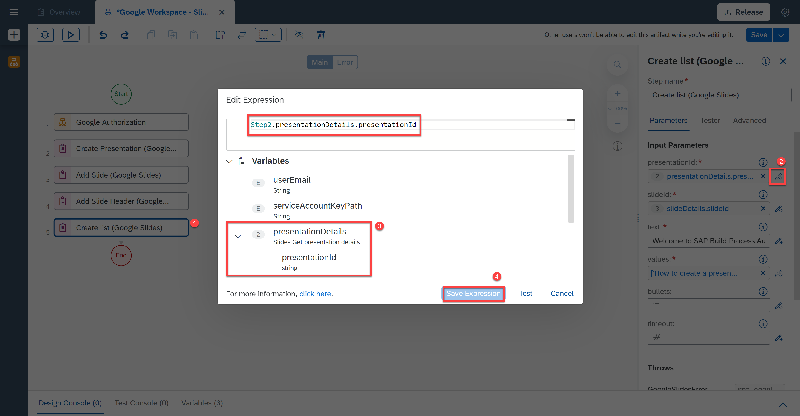

    > Now you will set the parameter for `slideID`, the id of the slide in which you want to add a list.

    - Under **Input Parameters**, for `slideId`, choose the pencil to open the expression editor.

    - Choose as **Variables**: `slideDetails`>`slideId`.

    - Choose **Save Expression**.

    <!-- border -->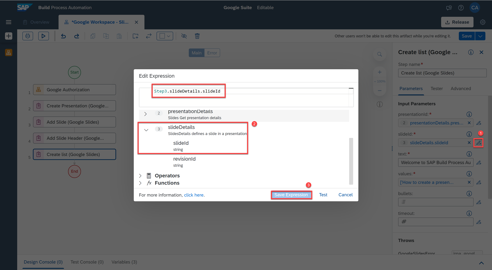

22. For **text** enter the description of the list, here: **Welcome to SAP Build Process Automation, you will learn:** and select the expression in quotes.

    <!-- border -->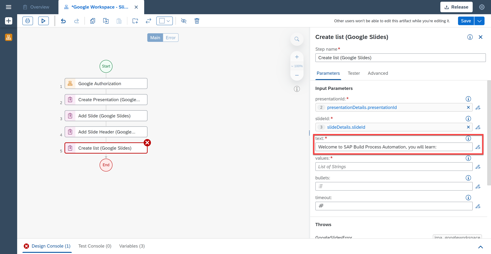

23. For **values** you will enter the array of values to be added as the list items. Choose the pencil to open the expression editor.

24. In the expression editor enter the following code: `['How to create a presentation', 'How to create a list', 'How to insert images']`

21. Choose **Save Expression**.

    <!-- border -->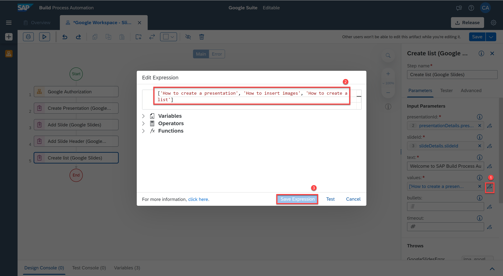

    You will add a slide to the presentation.

    > Please note that an existing slide can be updated. To get the slide id for an existing presentation, you can open the slide in the browser and id can be fetched from the URL.

    > Once slide id is obtained, one can use Add Slide, Add Image, Add Text and Add Slide Header etc. activities within a slide to update it. It is also possible to add list and table in the slide.

22. In the **Automation Details** panel, under **Tools**, search for the **Add Slide (Google Slides)** and drag and drop it into the workflow.

    > You will set the parameter for `presentationID`, the id of the presentation in which you want to add a slide.

    - Select the activity. Under **Input Parameters**, for `presentationId`, choose the pencil to open the expression editor.

    - Choose as **Variables**: `presentationDetails`>`presentationId`.

    - Choose **Save Expression**.

    <!-- border -->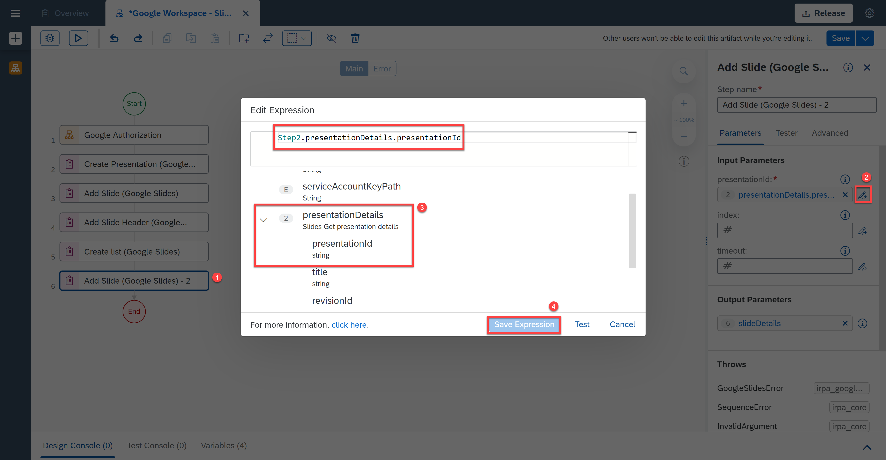

    You will now add an image in this slide.

26. In the **Automation Details** panel, under **Tools**, search for the **Add Image (Google Slides)** and drag and drop it into the workflow.

    > You will set the parameter for `prensentationID`, the id of the presentation in which you want to add an image.

    - Select the activity. Under **Input Parameters**, for `presentationId`, choose the pencil to open the expression editor.

    - Choose as **Variables**: `presentationDetails`>`presentationId`.

    - Choose **Save Expression**.

    <!-- border -->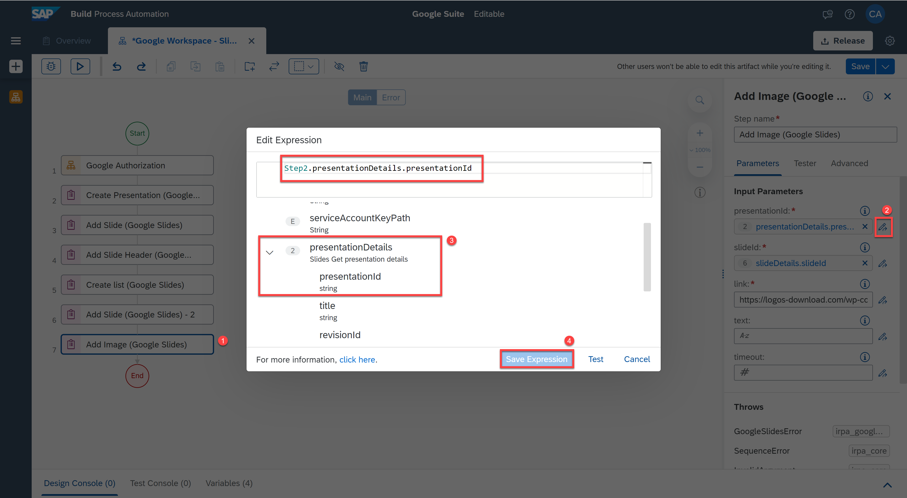

    > Now you will set the parameter for `slideID`, the id of the slide in which you want to add an image.

    - Under **Input Parameters**, for `slideId`, choose the pencil to open the expression editor.

    - Choose as **Variables**: `slideDetails`>`slideId`.

    > **CAUTION:** Please select the `slideDetails` of step 6 of your automation (the slide you just added)

    - Choose **Save Expression**.

    <!-- border -->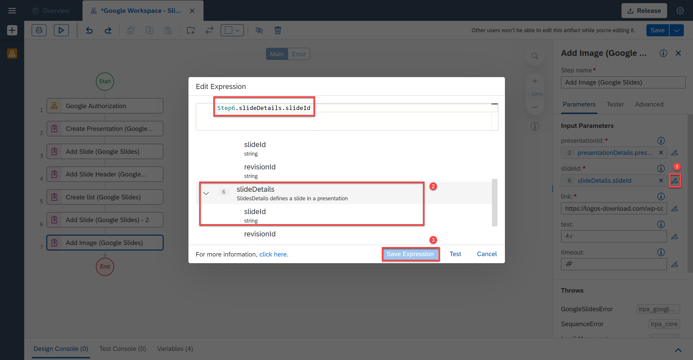

29. Finally you will insert the image. For **link** you will insert the link of the image to be added in the slide.

    Link: `https://logos-download.com/wp-content/uploads/2016/08/SAP_logo.png`

    > **CAUTION:** The URL should start with http:// or https://. The image must be less than 50MB in size, cannot exceed 25 megapixels and must be in PNG, JPEG or GIF format.

    <!-- border -->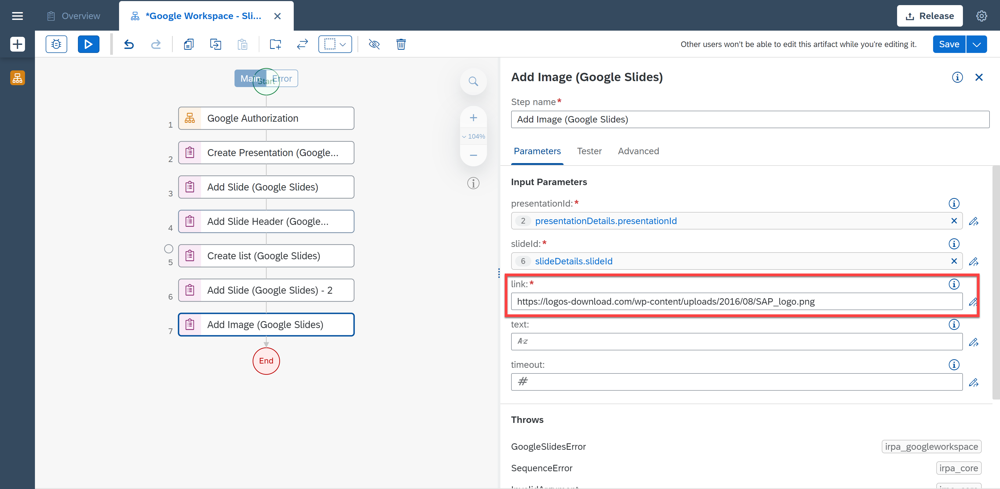

    > You will now retrieve the details of your Google Presentation and log them in a message.

30. In the **Automation Details** panel, under **Tools**, search for the activity **Get Presentation Details (Google Slides)** and drag and drop it into the workflow.

    > You will set the parameter for `presentationID`, the id of the presentation for which you want to get the details.

    - Select the activity. Under **Input Parameters**, for `presentationId`, choose the pencil to open the expression editor.

    - Choose as **Variables**: `presentationDetails`>`presentationId`.

    - Choose **Save Expression**.

    <!-- border -->

26. In the **Automation Details** panel, under **Tools**, search for the **Log Message** and drag and drop it into the workflow.

27. Select the activity. For **message** parameter, select **result** to log the details of the presentation.

    Finally you will disconnect the Google Account.

28. In the **Automation Details** panel, under **Tools**, search for the **Disconnect (Google)** and drag and drop it into the workflow.

29. Save the automation.

    <!-- border -->

### Test Google Workspace for Slides

You will now test your automation.

1. Choose **Test**.

2. Fill in the **Environment Variables**:
    - For `userEmail`: your Gmail user email
    - For `serviceAccountKeyPath`: the full path to the json file

    <!-- border -->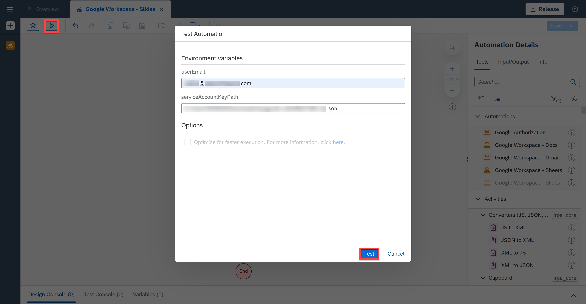

3. Choose **Test**.

    <!-- border -->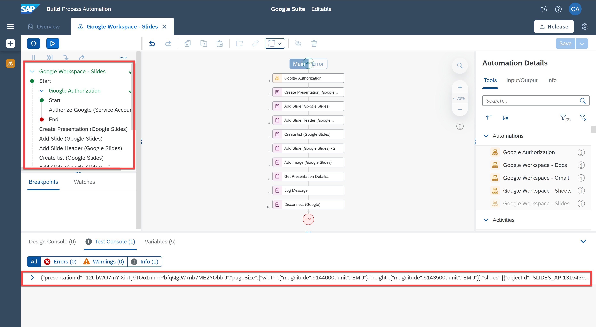

    The testing was successful. You may see the details of the presentation in the test console.

4. You may go to your Google Slides and you will see that a presentation called Automation Presentation was successfully created.

    <!-- border -->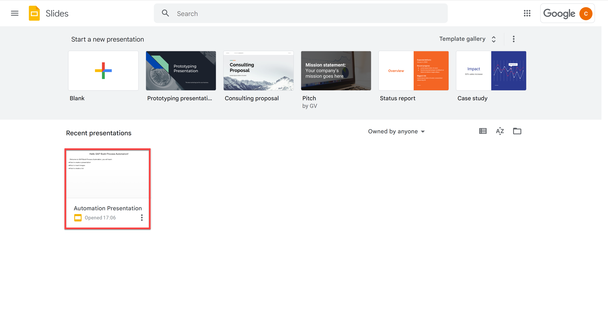

5. After opening it, you will see that two slides were successfully created in the presentation. The first with a header and a list, the other with the image.

    <!-- border -->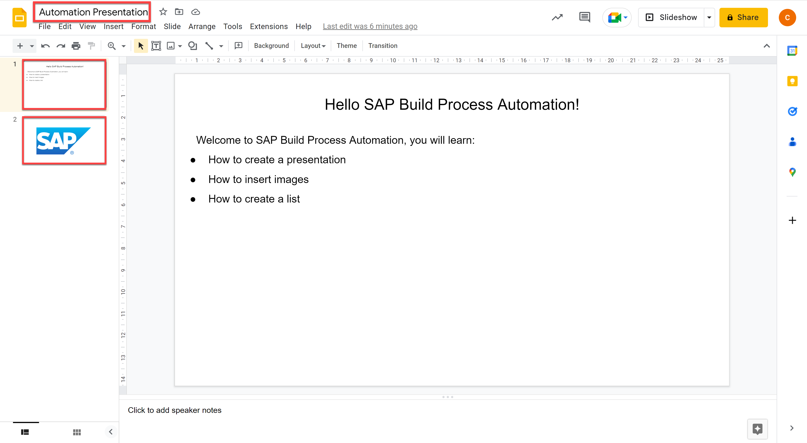
