# Use Microsoft 365 Cloud SDK to Create Calendar Events
<!-- description --> Use Microsoft 365 Cloud SDK to automate calendar activities in SAP Build Process Automation.

## Prerequisites
 - Access to a [SAP BTP tenant with SAP Build Process Automation](spa-subscribe-booster)
 - [Install and Setup the Desktop Agent](spa-setup-desktop-3-0-agent) to run the automation
 - Configure [Azure Application](https://help.sap.com/docs/intelligent-robotic-process-automation/cloud-studio-user-guide/configure-azure-application-and-use-with-microsoft-365-sdk#loio8d47b169478a46bd91c506c51e0872b3)

## You will learn
- How to use Microsoft 365 Cloud SDK activities
- How to check users availability and send a meeting request
- How to update, search for and delete a calendar event

## Intro

> **IMPORTANT:** Please refer to sample **Manage calendar events with Microsoft Office 365** in the SAP Build Store if you face any issues while following the tutorial. To retrieve the sample refer to **step 13** of this tutorial

In this tutorial, you will build an automation that will check availabilities of a candidate and a list of interviewers. Depending on attendees' availabilities, a meeting request for an interview is sent. You will then update the meeting request sent. Finally, you will search for the meeting request sent and delete it from the calendars.

---

### Create the external authentication

Once you have successfully configured the Azure application as mentioned in Prerequisites, you are now ready to create an external authentication in SAP Build Process Automation tenant.

1. Log in to SAP Build Process Automation tenant.

2. Navigate to **Control Tower > External Authentication**.

    <!-- border -->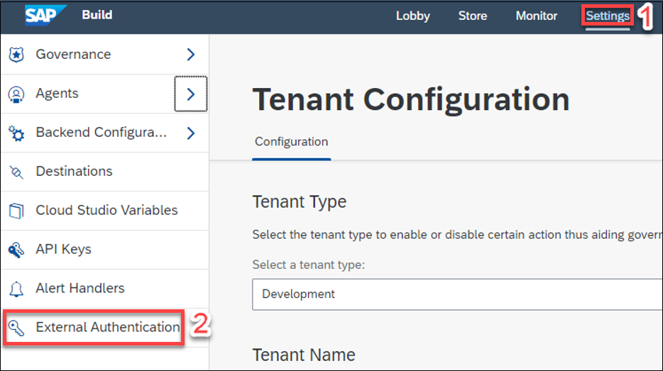

3. On the External Authentication page, click **Create New Authentication**.

    <!-- border -->

4. On the **Create Authentication** popup window, select Microsoft 365.

5. Enter a name in the **Name** field such as **Office 365**.

6. Optional: Enter a short description in the **Description** field.

7. Enter the **Client ID** received at step Configure Azure Application > Find Relevant IDs that Define the Application > Application (client) ID.

8. Enter the **Client Secret** received at step Configure Azure Application > Create a Client Credential.

9. Enter the **Tenant ID** received at step Configure Azure Application > Find Relevant IDs that Define the Application > Application (tenant) ID.

10. Select the desired scope in the **Scope** field. 

    > For this tutorial, you will need Calendars Read/Write scope.

11. Choose **Create**.

    <!-- border -->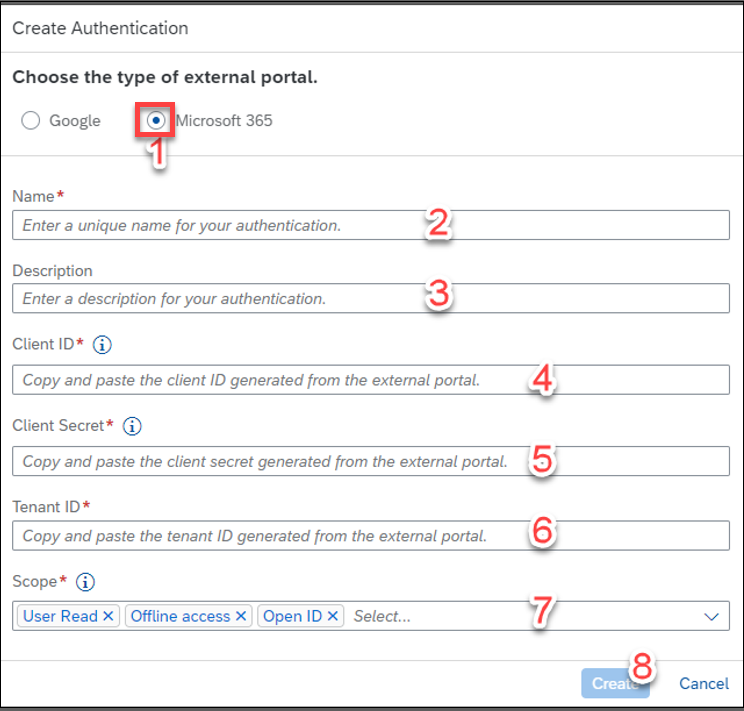

### Register the external authentication

Once the external authentication is created, it will be visible on your Desktop Agent 3.

1. Open the Desktop Agent. Once you are connected to the tenant, choose **Settings > External Authentication**. 

    <!-- border -->

    > The agent receives and shows a list of registration items defined in SAP Build Process Automation External Authentication settings.

2. Select Office 365 authentication.

    <!-- border -->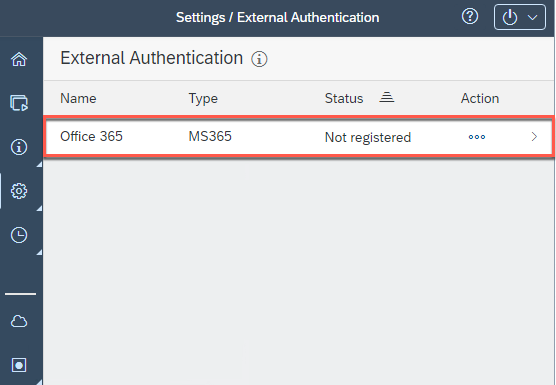

3. Enter the email address of the identity in the **Email** field to authenticate the identity. 

    > The authentication of the activities is done with that identity.
    
4. Choose **save**.

    <!-- border -->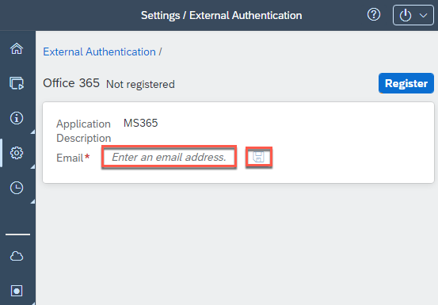

    > Each registration item can be registered or unregistered given a user email address.

5. Select **Register** button. 

    <!-- border -->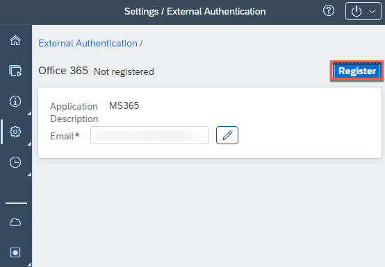

6. In the newly opened window, consent for agent to use your ID with the activities.

7.  The confirmation of registration will appear. 

    <!-- border -->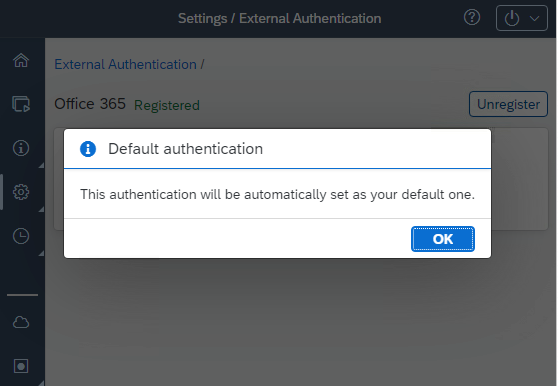

### Create a project

1. Navigate to the SAP Build lobby. Choose **Create** button.

    <!-- border -->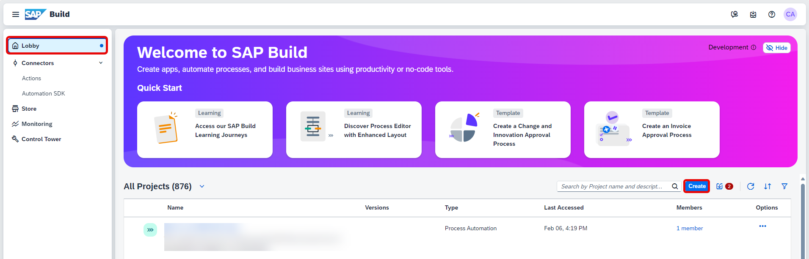

2. Select **Build an Automated Process**.

    <!-- border -->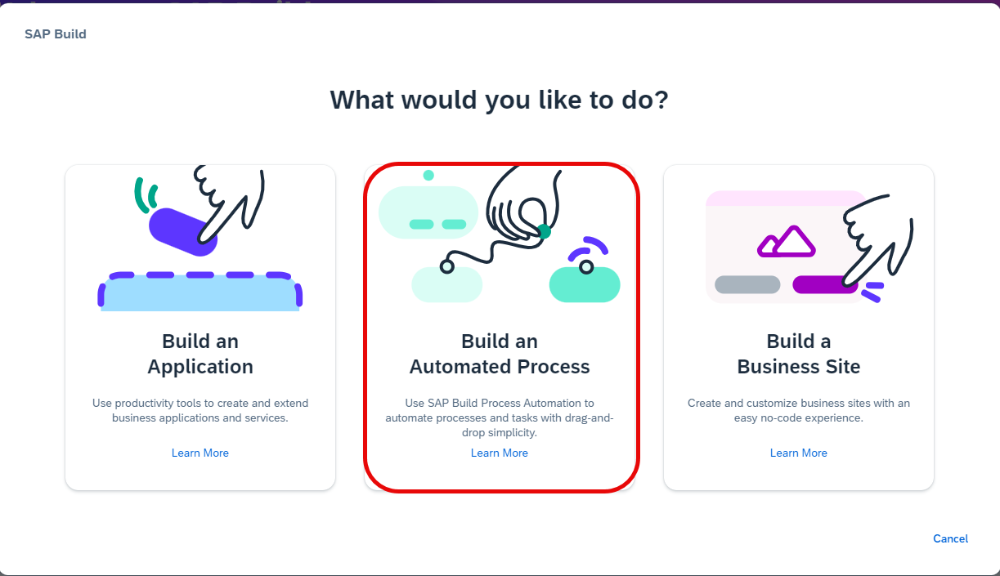

3. Choose **Task Automation**.

    <!-- border -->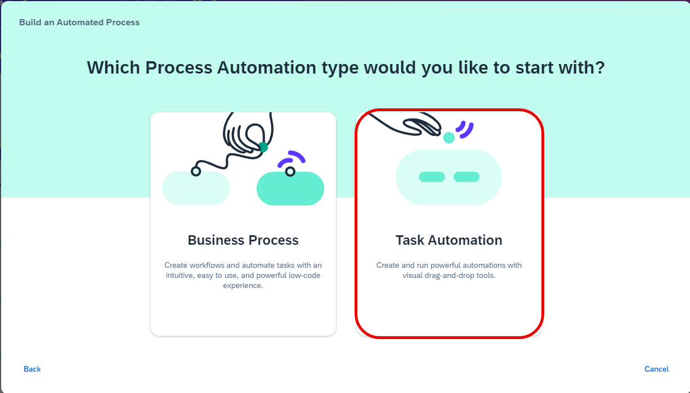

4. Provide a **Name** for the project such as: **Calendar activities for Microsoft 365**.

5. Provide a **Short Description** for the project such as: **This project sends a meeting request for an interview depending on a candidate's and a list of interviewers' availability. It will then update the meeting request that was sent and finally delete the meeting from the calendars.** 

6. Choose **Create**.

    <!-- border -->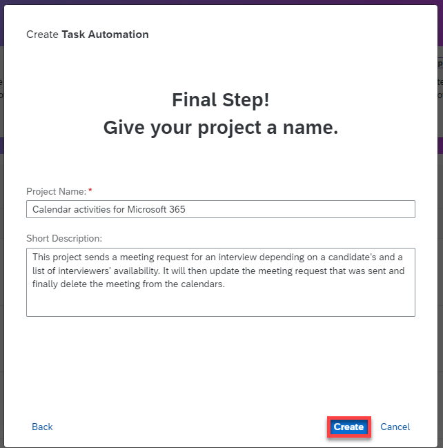

7. Select the agent version that is registered on your system and choose **Confirm**.

    <!-- border -->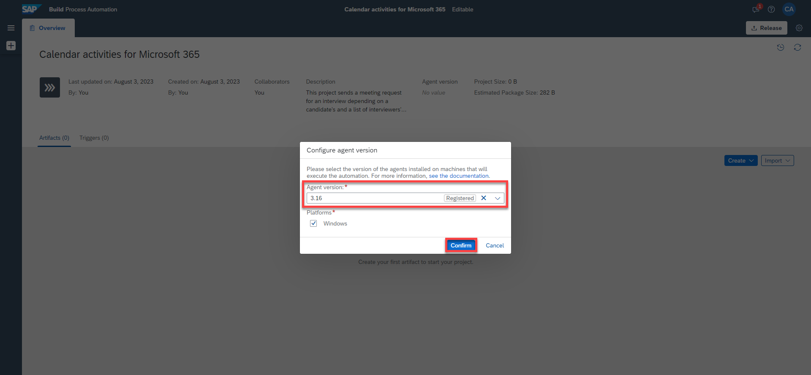

8. Provide a name for the automation such as **Check attendees availability**.

9. Provide a description for the automation such as **Check attendees availability to send meeting request for an interview**.

10. Choose **Create**.

    <!-- border -->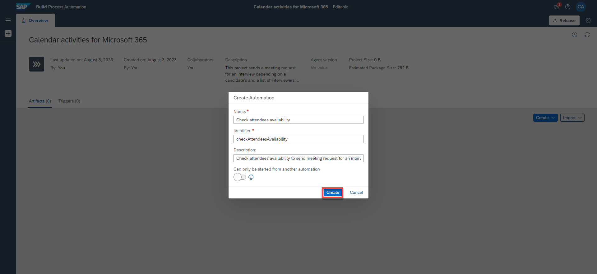

### Add Microsoft 365 Cloud SDK

You will be navigated to the automation editor where you can build your automation. In order to use Microsoft 365 activities, you need to add the Microsoft 365 Cloud SDK to your project.

1. Choose **Settings**.

2. In the **Project Properties** window, select **Dependencies > Add dependency > Add a Business Process project dependency**.

    <!-- border -->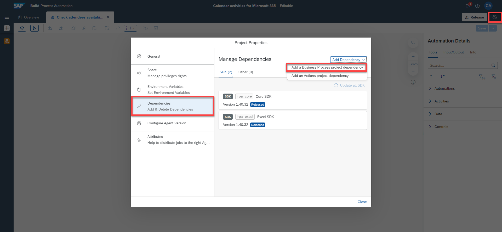

3. Under Add dependency search for **Microsoft 365 Cloud SDK** and **Add** it.

    <!-- border -->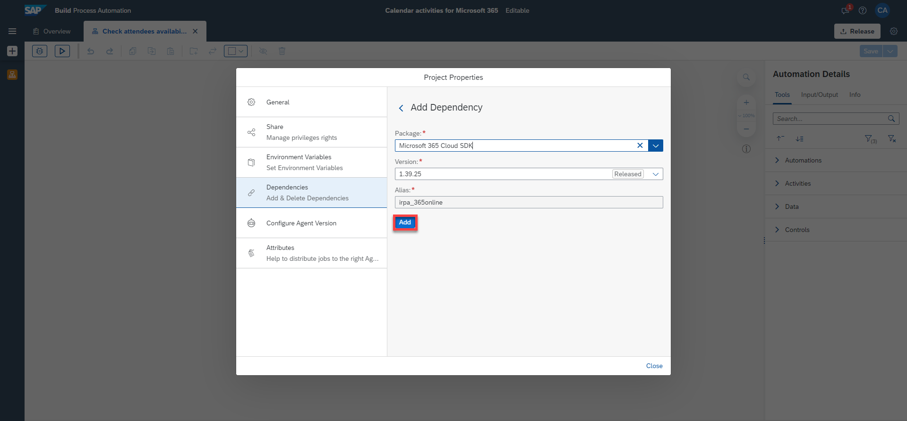

4. **Close** the window.

### Create a data type

A data type is an artifact describing a data structure that can be used as an input and/or output parameter in automations or processes. In our use case, you will create a data type called **Attendee** that will include the first name, the last name and the email of the candidate and the interviewer(s).

1. Navigate back to the **Overview** tab.

    <!-- border -->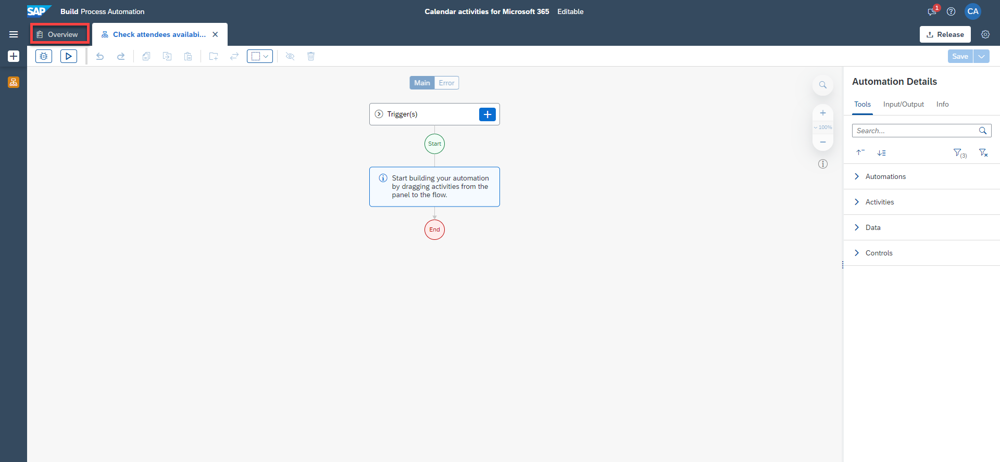

2. Choose **Create > Data Type**.

    <!-- border -->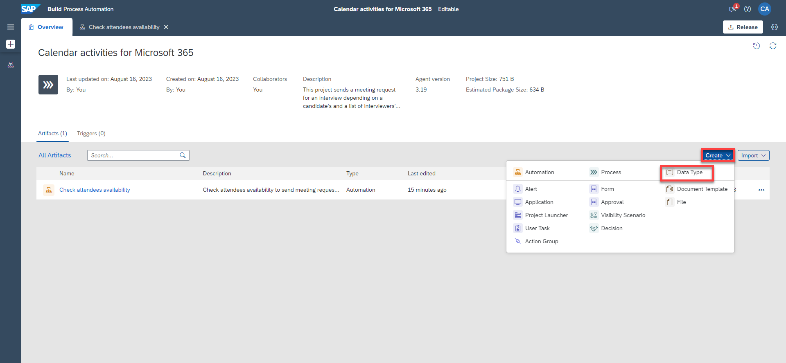

3. In the **Create Data Type** pop-up, enter **Attendee** as name and **Contact information of user attending the meeting** as description.

    > A unique identifier is automatically created from the name you entered. If not, you must manually create an identifier.

4. Choose **Create**.

    <!-- border -->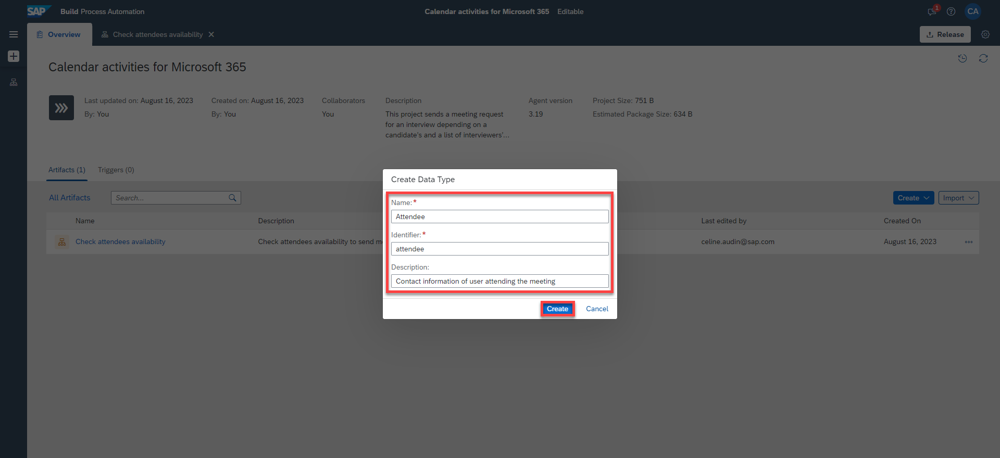

    A new tab opens in the main panel. You can now add the fields that will be included in your data type.
    
5. Choose the **New Field** button.

6. In the **Field Details** on the right, enter as name `firstName`, and select **String** as type.

    <!-- border -->

7. Repeat the above steps to add three other fields such as:

    |  Field Value  | Field 2   | Field 4 | Field 3 
    |  :------------| :---------| :-------| :------------
    |  Name         | `lastName`|`email`  | `isCandidate`    
    |  Type         | String    | String  | Boolean
                
8. Choose **Save**.
   
    <!-- border -->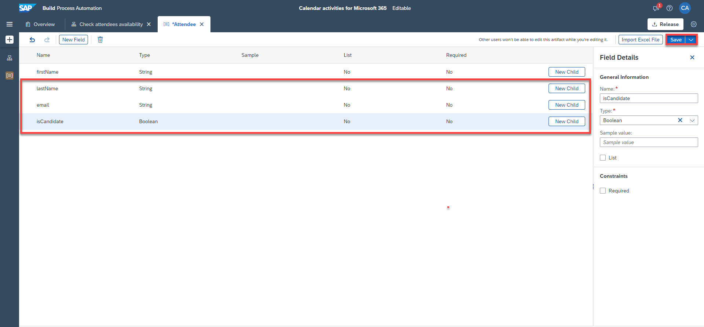

    You will notice that the last field you created is of type boolean that is to differentiate if it is a candidate or an interviewer.

### Create input parameters

An input or output parameter is a variable that is passed, received, or sent from one automation, SDK activity or control to another. This variable allows you to manipulate data that you can use in your workflow. Input or output parameters have a name (optionally a description) and data that complies to a type.

1. Navigate back to your automation, on the right-hand side panel, go the **Input/Output** section and click **Add new input parameter**.

    <!-- border -->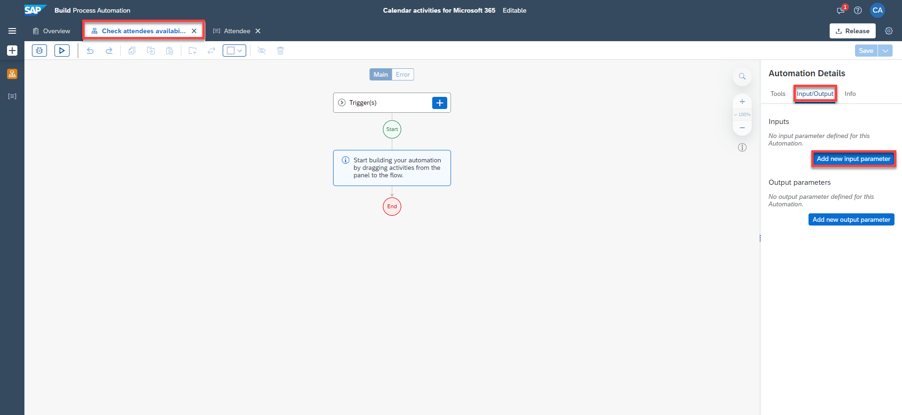

2. Enter a **name**: `interviewers`.

3. Enter a **description**: Contacts of interviewers.

4. Start typing attendee in the type field and select **Attendee**.

    <!-- border -->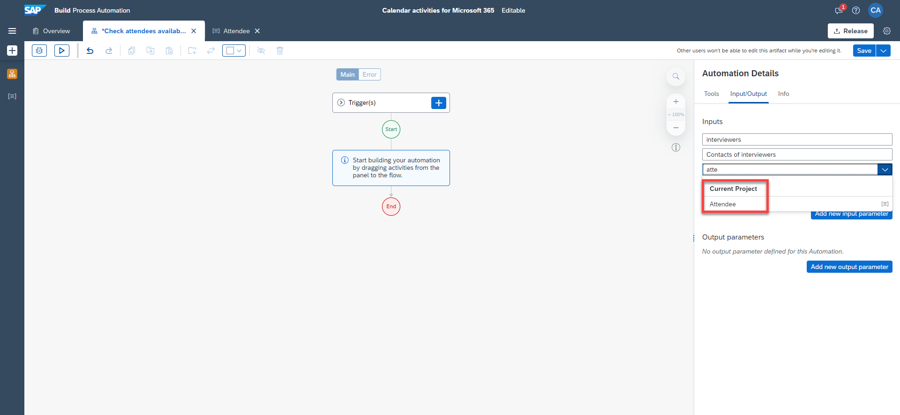

5. Check **List** since this input parameter may contain several interviewers.

6. Choose **Add new input parameter**.

    <!-- border -->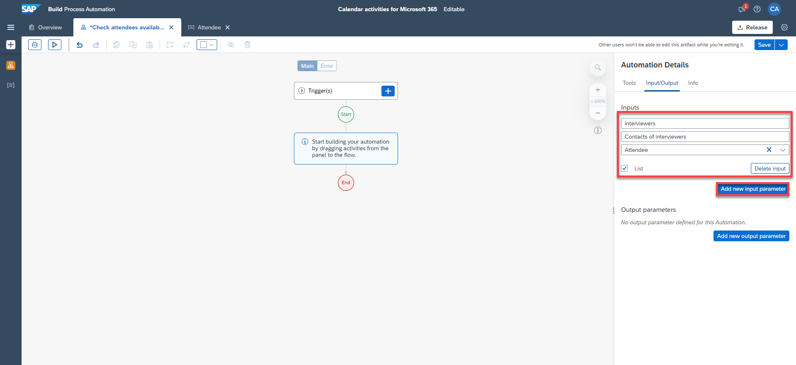

7. Enter a **name**: `candidate`.

8. Enter a **description**: Contacts of the candidate.

9. Select **Attendee** as **type**.

    <!-- border -->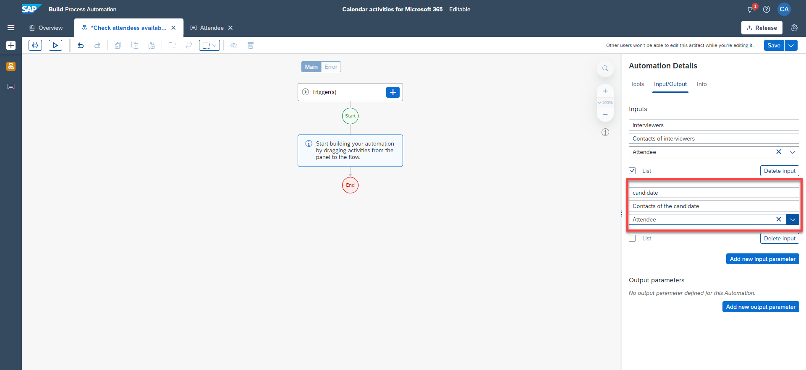

10. Similarly, create the following input parameters as follows:

    |  Field Value  | Input Parameter 1     | Input Parameter 2     
    |  :------------| :---------------------| :---------------------
    |  Name         | `meetingStartTime`    |`meetingEndTime`      
    |  Description  | Beginning of the meeting | End of the meeting 
    |  Type         | String                | String                
  
11. Choose **Save**.

    <!-- border -->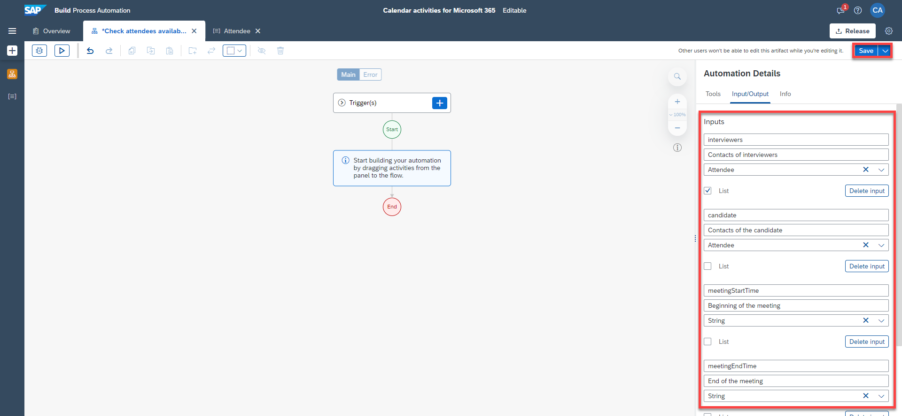

### Build an automation to send a meeting request

1. Under **Automation Details** panel, under **Tools**, search for **Select 365online Authentication** activity and drag and drop it into the workflow.

    > This activity sets the authentication that will be used for the Microsoft Office 365 activities. 

    <!-- border -->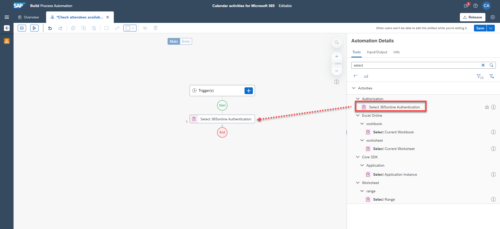

    You will now create a list of string variable that will output the email addresses of the candidate and the interviewer(s).

2. Under **Automation Details** panel, under **Tools**, search for **String** data type. Drag and drop the activity into the workflow.

    <!-- border -->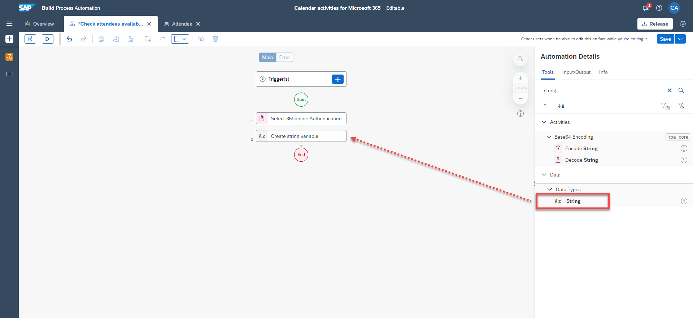

3. Select the activity and do the following:

    - Check **List** as you are creating a list of emails of attendees.
    
    - Under **Output Parameters**, change the name to `emailAddresses`.

    <!-- border -->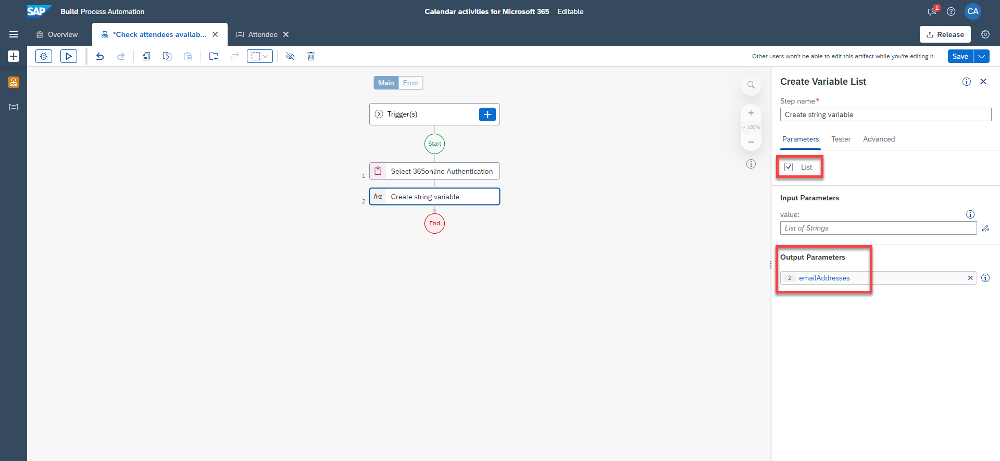

4. Under **Automation Details** panel, under **Tools**, search for **For Each** control and drag and drop it into the workflow.

    <!-- border -->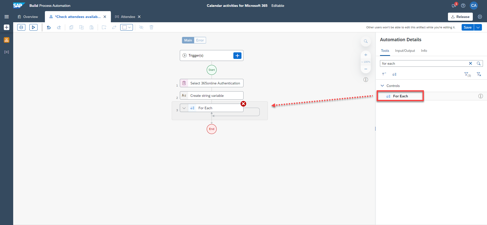

5. Select the activity and set the looping list to input parameter **interviewers** created before.

    <!-- border -->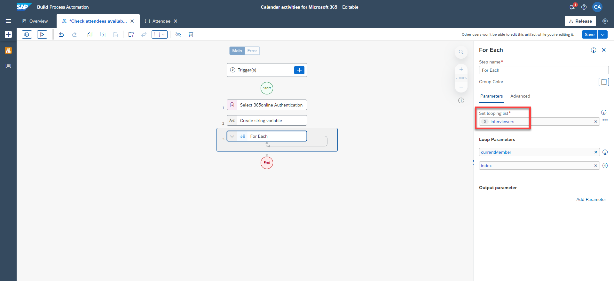

6. Under **Automation Details** panel, under **Tools**, search for **Add Item (list)**.

    > This will add an item to an existing list. In this use case, for each interviewers' email you will add them to the the list of emails created above.

    <!-- border -->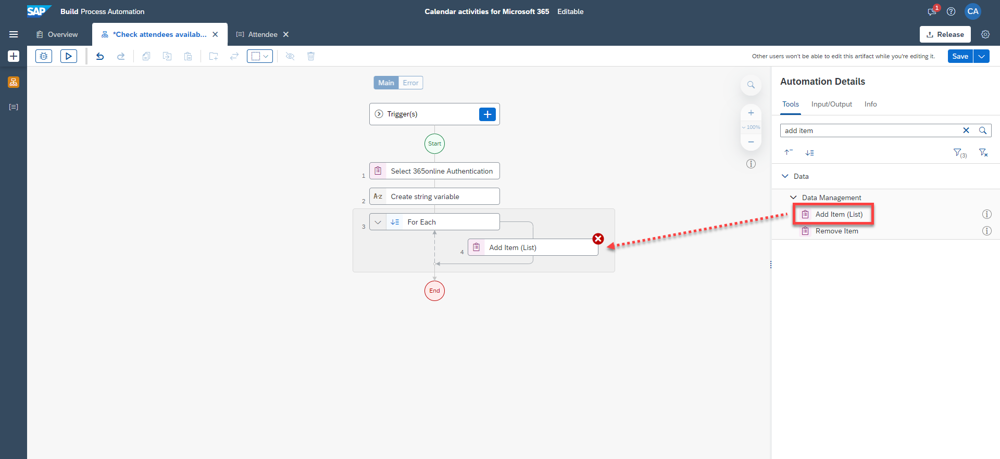

7. Select the activity and do the following:

    - Change the **Step name** to **Add interviewers email**.
    
    - Under `list` input parameter, select `emailAddresses`.
    
    - Under `itemToAdd` input parameter, choose open the expression editor icon.

    <!-- border -->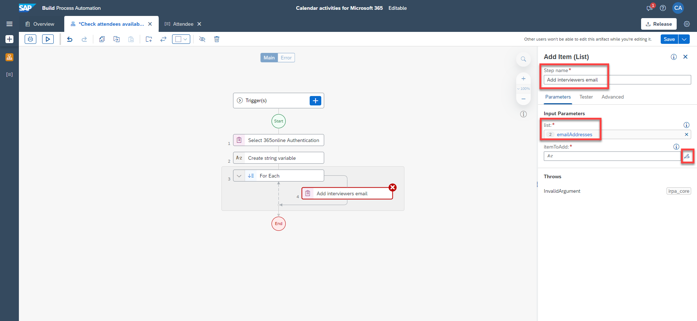  

8. Select **Variables > interviewers > email**.

    <!-- border -->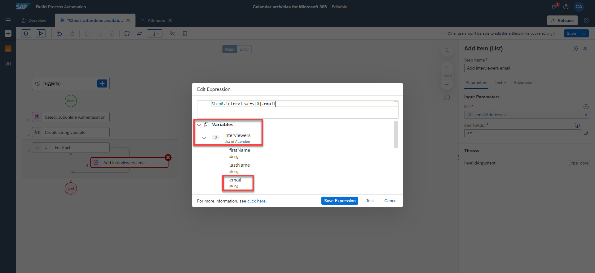  

9. Within [0] of the formula, insert variable index and choose **Save Expression**.

    <!-- border -->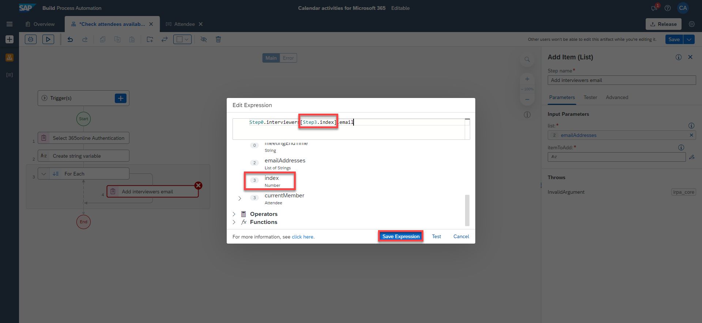  

    > ### What is going on?
    > The automation will loop through each interviewers' email and will be added to the list of emails. 

    > As another option that would yield the same result, you may select **Variables > current Member > email**. The expression would hence read `Step3.currentMember.email`

10.  Under **Automation Details** panel, under **Tools**, search for **Add Item (list)** and drag and drop into the workflow outside the **For each** loop.

    <!-- border -->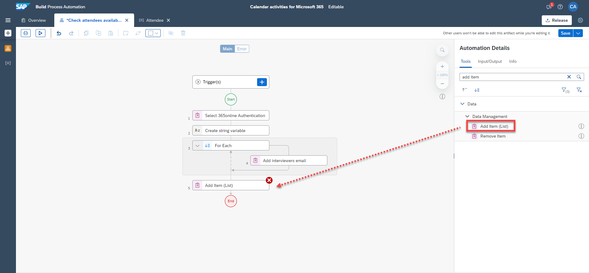  

11. Select the activity and do the following:

    - Change the **Step name** to **Add candidate email**.
    
    - Under `list` input parameter, select `emailAddresses`.
    
    - Under `itemToAdd` input parameter, choose open the expression editor icon.

    <!-- border -->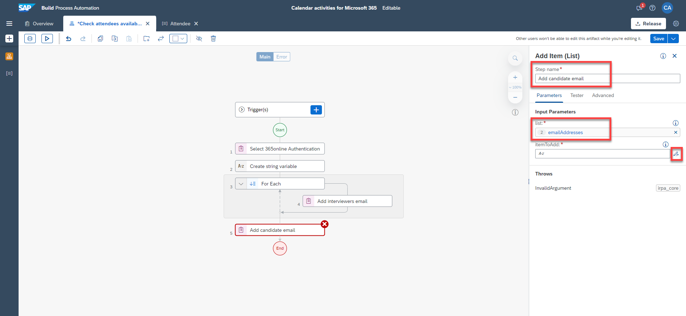

12. Select **Variables > candidate > email** and choose **Save Expression**.

    <!-- border -->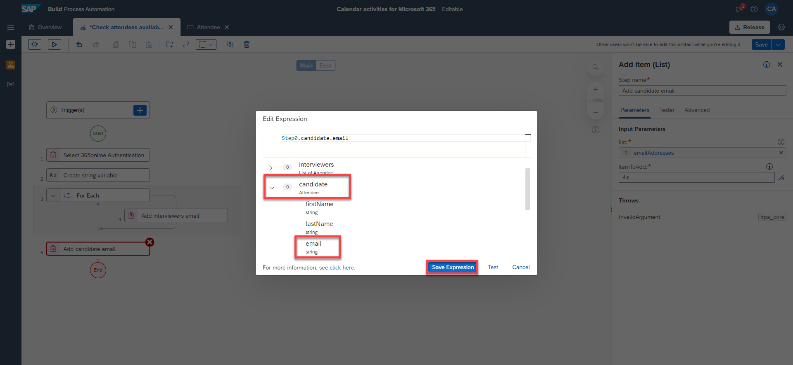     

    You have successfully created a list of emails including the emails of the candidate and the interviewers.

13. Now under **Automation Details** panel, under **Tools**, search for **Check Users Availability** activity and drag and drop it into the workflow.

    > This activity checks the availability of the attendees (candidate and interviewers).

    <!-- border -->

14. Select the activity and follow the below steps:

    - Under `emailAddresses` input parameter, select `emailAddresses`.

    - Under `startDateTime` input parameter, select **Create Custom Data**.

    <!-- border -->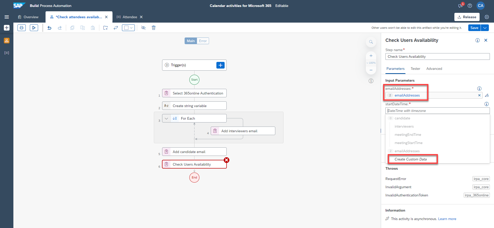

    - Under `dateTime` input parameter, select `meetingStartTime`.

    - Under `endDateTime` input parameter, select **Create Custom Data**.

    - Under `dateTime` input parameter, select `meetingEndTime`.

    - Save your work.

    <!-- border -->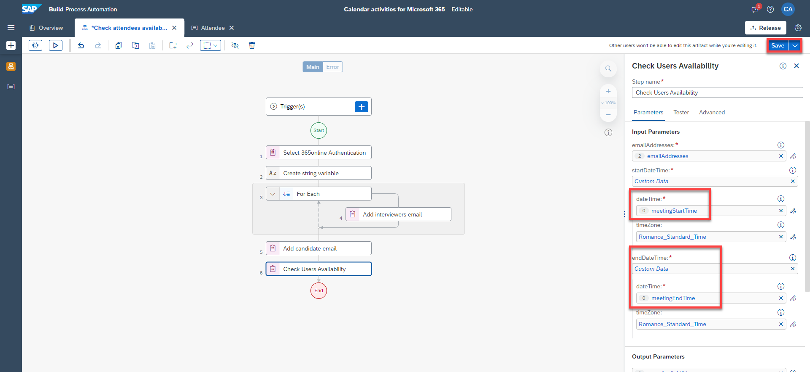

15. Click on the canvas. Under **Automation Details** panel, under **Tools**, search for **Boolean** data type. Drag and drop the data type into the workflow.

    > This variable will have two possible values, true or false.

    <!-- border -->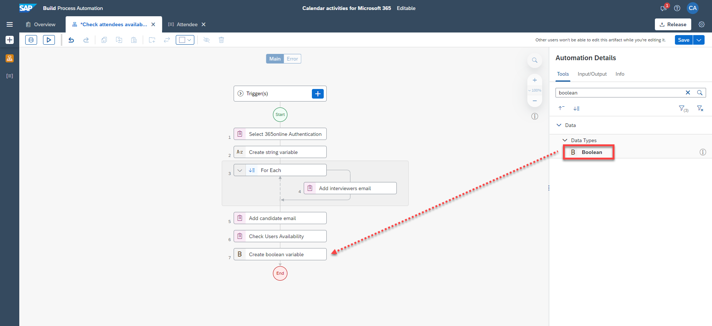

16. Select the activity and change the name of the **Output Parameter** to `availabilityResult`.

    <!-- border -->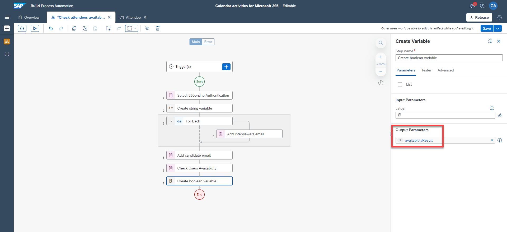

17. Click on the canvas. Under **Automation Details** panel, under **Tools**, search for **For Each** control and drag and drop it into the workflow.

    <!-- border -->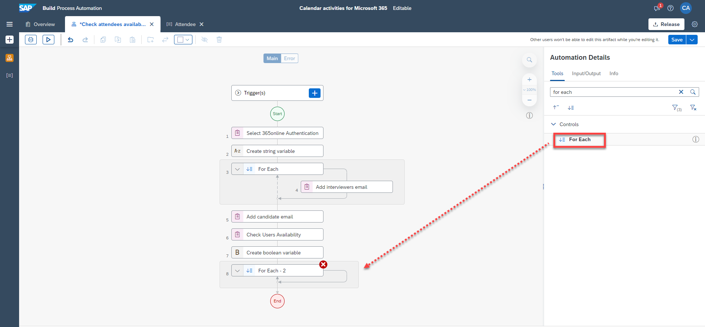

18. Select the activity and under **Set looping list** parameter, choose `usersAvailabilities`.

    <!-- border -->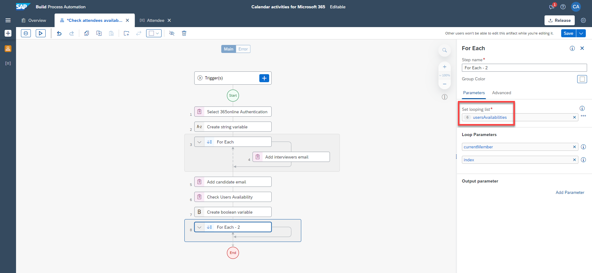

19. Click on the canvas. Under **Automation Details** panel, under **Tools**, search for **Any** data type and drag and drop it inside the **For Each** loop.

    <!-- border -->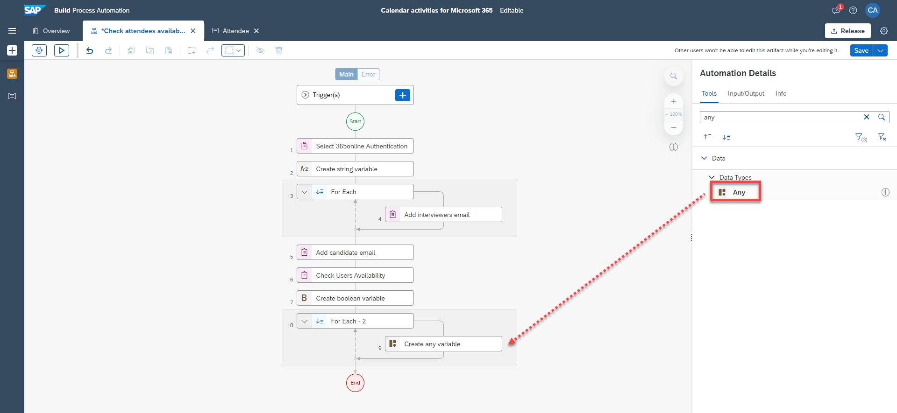

20. Select the data type and change the name to **member**. 

21. Under **value** input parameter, select `currentMember`.

22. Rename the output parameter to **member**.

23. Save your work.

    <!-- border -->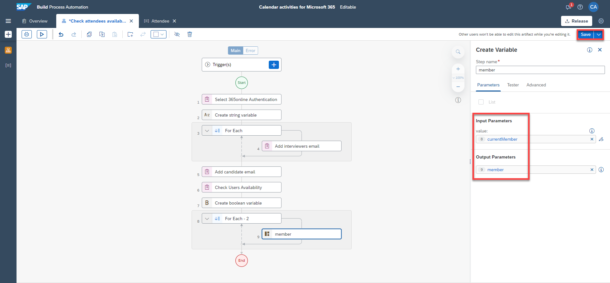

24. Click on the canvas. Under **Automation Details** panel, under **Tools**, search for the **Condition** control and drag and drop it into the workflow below the data type **member**.

    <!-- border -->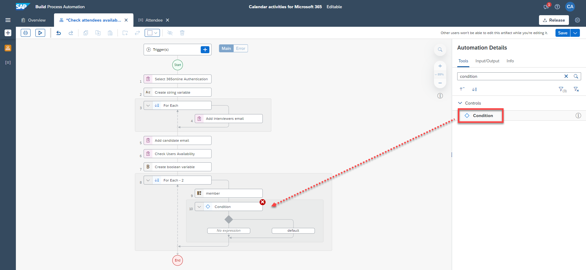

25. Select the control and choose the three dots next to **Condition Expression**, then select **Edit Formula**.

    <!-- border -->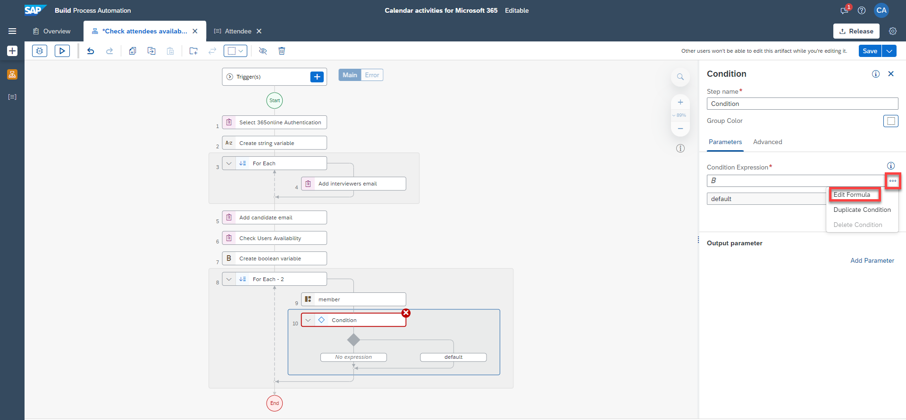

26. In the expression editor, please copy and paste the following formula:

    `Step9.member.isAvailableOrTentativeOnTimeSlot`

27. Choose **Save Expression**.

    <!-- border -->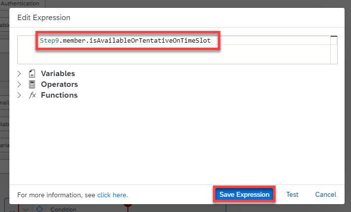

28. Click on the canvas. Under **Automation Details** panel, under **Tools**, search for **Set Variable Value** and drag and drop it into the workflow below the default branch.

    <!-- border -->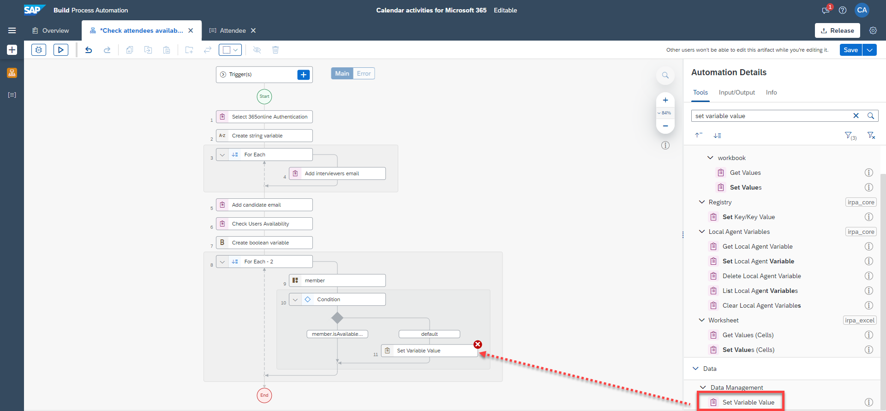

29. Select the activity and under **variable** input parameter, select `availabilityResult`.

30. Under **value** input parameter, choose **false**.

    <!-- border -->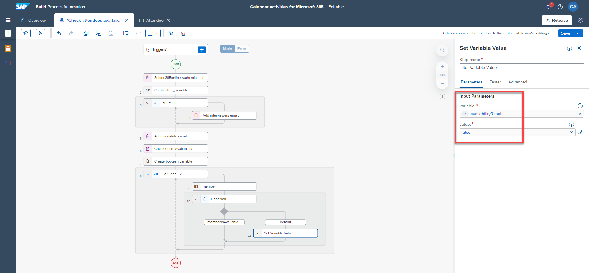

    > ### What is going on?
    > This sets the value of the `availabilityResult` variable to FALSE, meaning that users are NOT available or tentative on the time slot selected.

31. Click on the canvas. Under **Automation Details** panel, under **Tools**, search for **Log message** activity and drag and drop it into the workflow below the **Set Variable Value**.

    <!-- border -->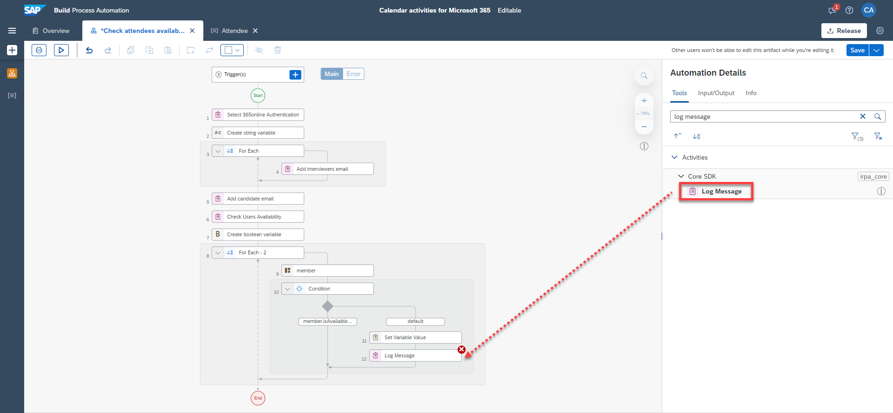

32. Select the activity. Under **message** input parameter, choose open the expression editor.

33. Copy and paste the following expression:

    `'The meeting request could not be sent to' + ' ' + Step0.candidate.firstName + ' ' + Step0.candidate.lastName + ' ' + 'because user ' + Step9.member.emailAddress + ' is unavailable between ' + Step0.meetingStartTime + ' and ' + Step0.meetingEndTime`

34. Choose **Save Expression**.

    <!-- border -->

35. Click on the canvas. Under **Automation Details** panel, under **Tools**, search for **End** control and drag and drop it below the **Log Message** activity.

    <!-- border -->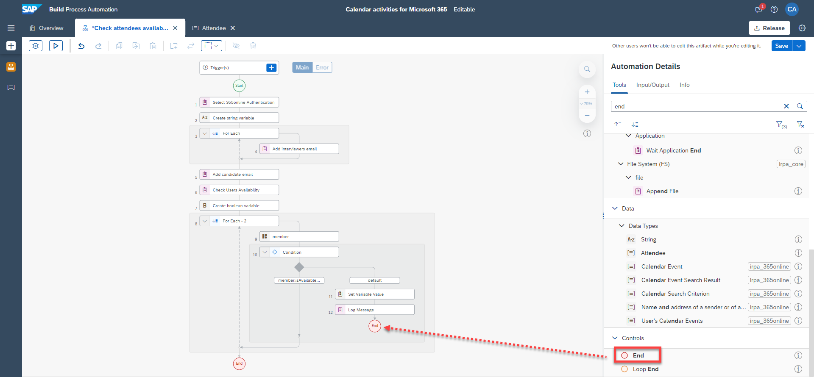

36. Now you will create an output parameter. Choose **Input/Output** tab and do the following:

    - Choose **Add new output parameter**.
    - Enter `successfulMeetingRequest` as name.
    - Select **Boolean** as type.
    
    <!-- border -->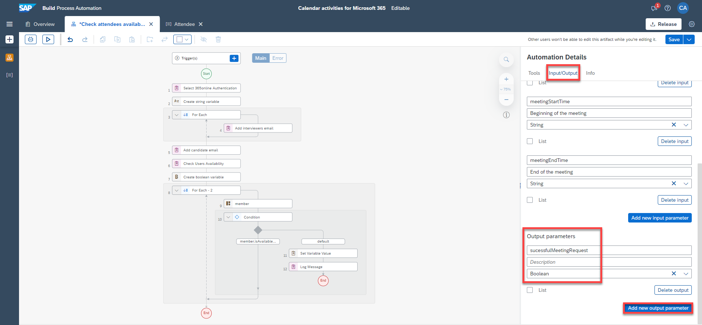

37. Select the **End** control.
 
38. As `sucessfulMeetingRequest` output parameter, select **false**.

    <!-- border -->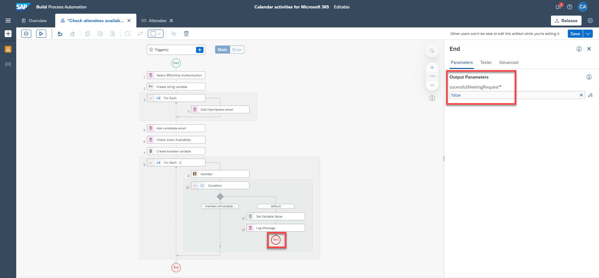
 
    > ### What is going on?
    > This ends the default condition (if users are unavailable on time slot). The meeting request will not be successful and hence will not be sent.
  
    Now you will define the other option (if users are available or tentative on time slot).

39. Click on the canvas. Under **Automation Details** panel, under **Tools**, search for **Send Meeting Request** activity and drag and drop it into the workflow outside the **For Each** loop. 

    <!-- border -->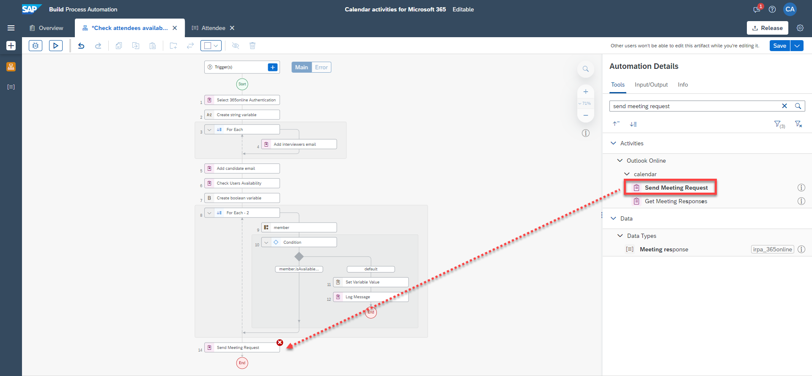

40. Select the activity and follow the below steps:

    - Under `meetingParameters` input parameter, select **Create Custom Data**.

    <!-- border -->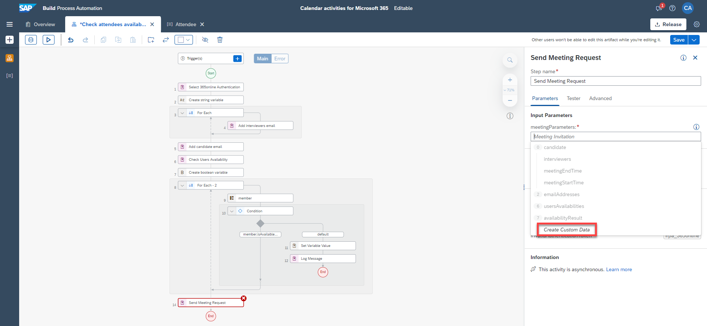

    - Under `mandatoryEmailAddresses` input parameter, select `emailAddresses `.

    - Under **subject** input parameter, enter: **Interview request** and select the expression in quotes.

    - Under **body** input parameter, enter: Congratulations! You have been selected for an <b>interview</b> and select the expression in quotes.

    <!-- border -->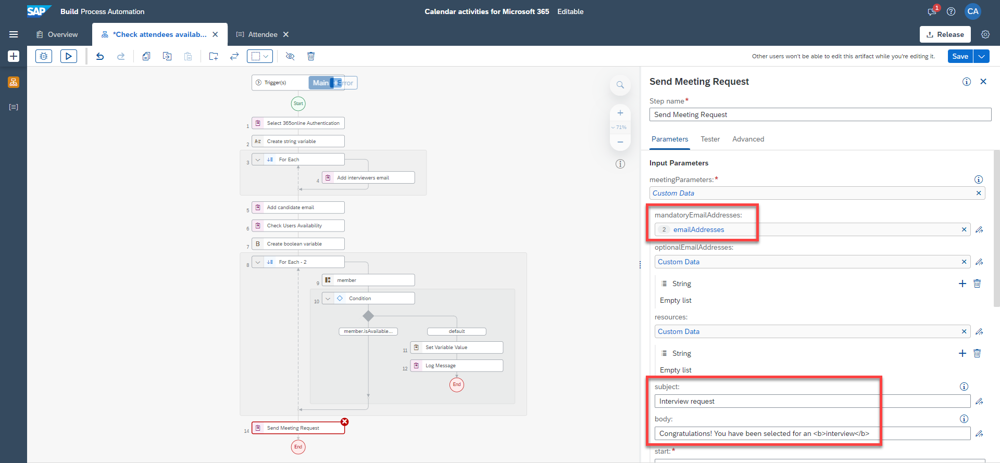

    - Under **start** input parameter, select **Custom Data**.

    - Under `dateTime` input parameter, select `meetingStartTime`.

    - Under **end** input parameter, select **Custom Data**.

    - Under `dateTime` input parameter, select `meetingEndTime`.

     <!-- border -->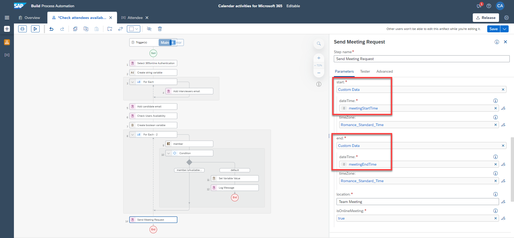

41. Click on the canvas. Under **Automation Details** panel, under **Tools**, search for **Set Variable Value** and drag and drop it into the workflow below **Send Meeting Request** activity.

    <!-- border -->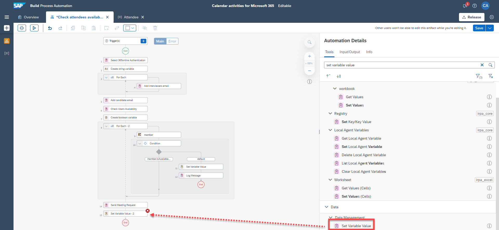

42. Select the activity and under **variable** input parameter, select `availabilityResult`.

43. Under **value** input parameter, choose **true**.

    <!-- border -->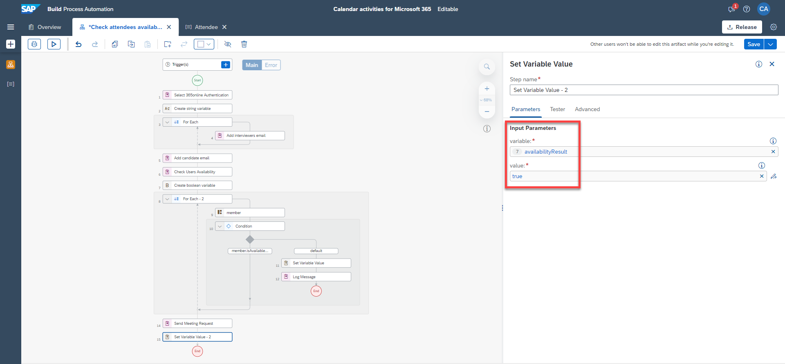

    > ### What is going on?
    > This sets the value of the `availabilityResult` variable to TRUE, meaning that users are available or tentative on the time slot selected.

44. Click on the canvas. Under **Automation Details** panel, under **Tools**, search for **Log message** activity and drag and drop it into the workflow below the **Set Variable Value - 2**.

    <!-- border -->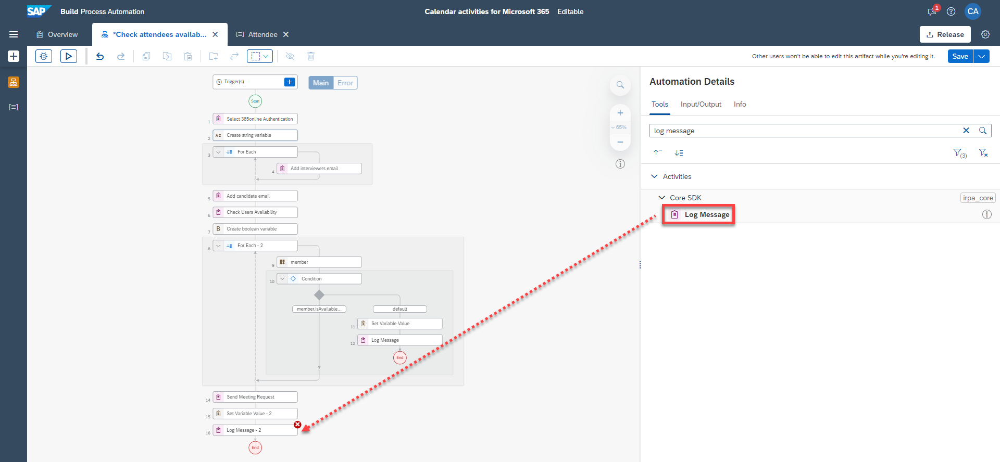

45. Select the activity. Under **message** input parameter, choose open the expression editor.

46. Copy and paste the following expression:

    `'The meeting request was successfully sent to' + ' ' + Step0.candidate.firstName + ' ' + Step0.candidate.lastName`

47. Choose **Save Expression**.

    <!-- border -->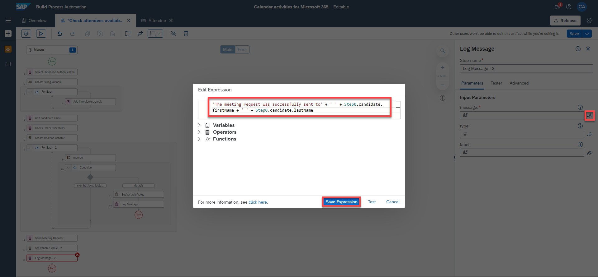

48. Choose the **End** control.

49. Under `successfullMeetingRequest` output parameter, select `availabilityResult` variable created above.

50. Save your work.

   <!-- border -->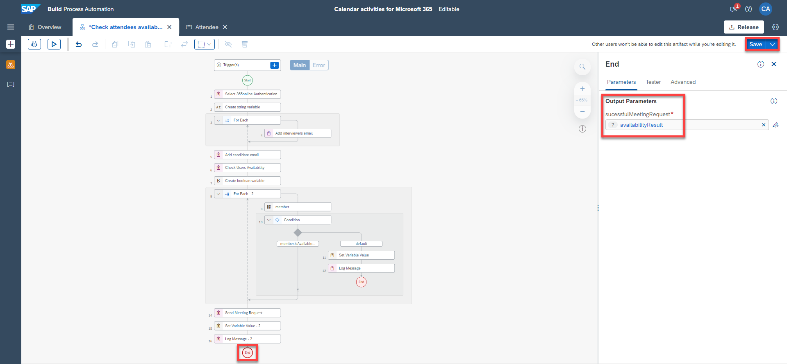

### Test the automation

Now that you are done designing your automation, you may test it. Let's assume you would like to check the availability of the list of interviewers and the candidate during the time slot 13h00 until 14h00 on September 1st to see if users are available for a meeting.

1. Choose Test.

    <!-- border -->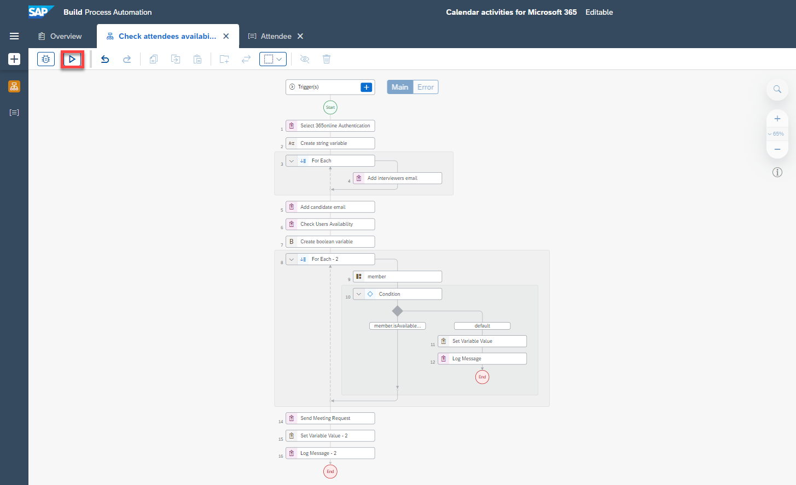

2. Now fill in the required input parameters:

    - `interviewers`: the first name, last name and email of the interviewer. You can add more interviewers by selecting **+**
    - `candidate`: the first name, last name and email of the candidate. Please select `isCandidate`
    - `meetingStartTime`: the time you would like to start the meeting. The format required is: YYYY-MM-DDTHH:MM:SS such as 2023-09-01T13:00:00
    - `meetingEndTime`: the time you would like to end the meeting. The format required is: YYYY-MM-DDTHH:MM:SS such as 2023-09-01T14:00:00

3. Choose Test.

    <!-- border -->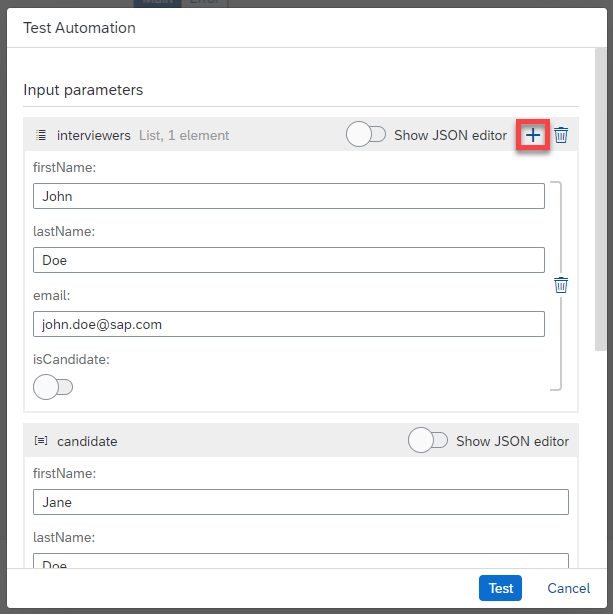

    <!-- border -->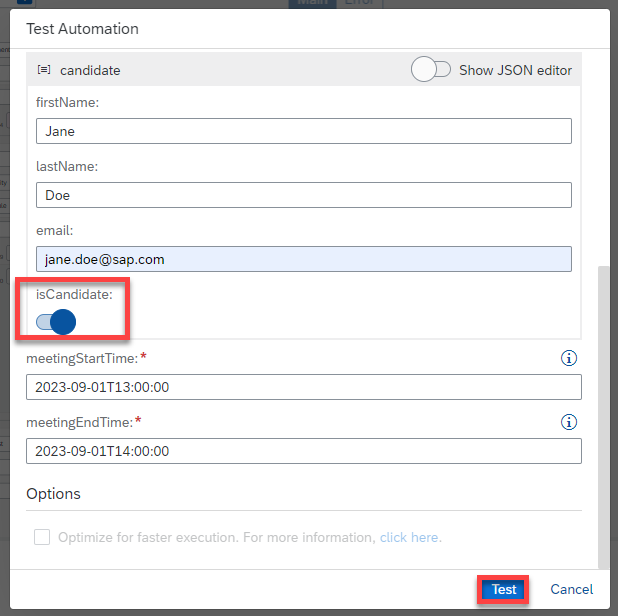

4. The testing was successful. If you go to the **Test Console**, you can see the confirmation message appear: *The meeting request was successfully sent to Jane Doe*.

    <!-- border -->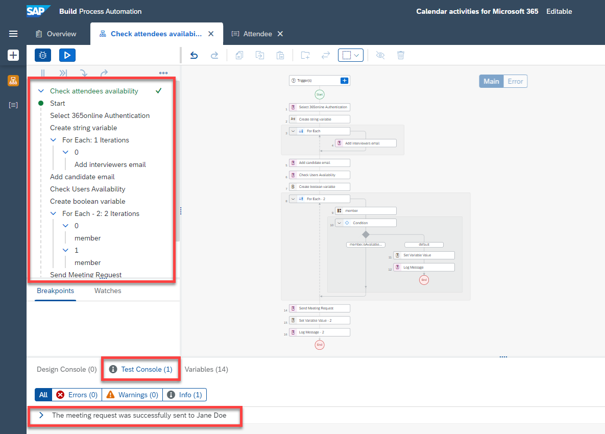

5. Go to **Send Meeting Request**, select **Tester** and under **Output Parameters** copy the `meetingId` value and paste it in notes for example. You will need this value later to update the meeting request.

    <!-- border -->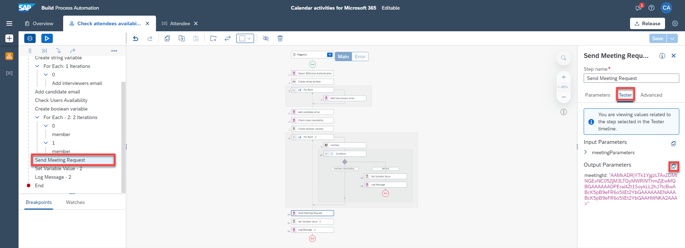

6. On the other hand, if one or more users are not available during the availability time slot, the bot would respond in this matter:

    <!-- border -->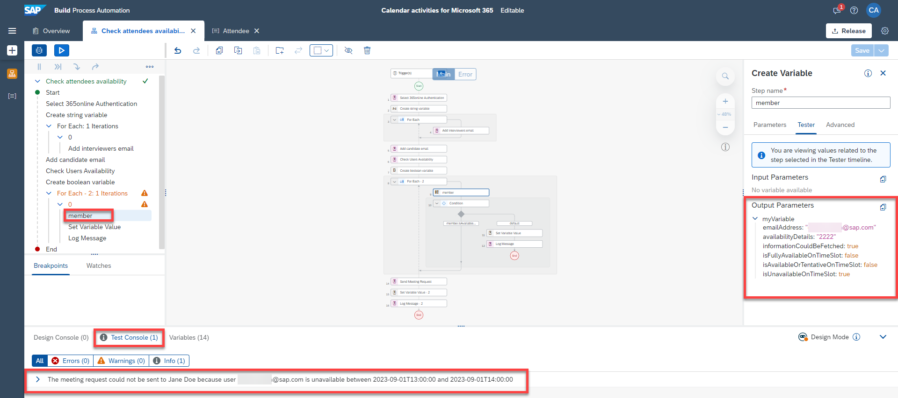

### Build an automation to update the calendar event

Now you will create an automation that will update the meeting request you just sent.

1. Go to **Overview** tab and select **Create** > **Automation**.

    <!-- border -->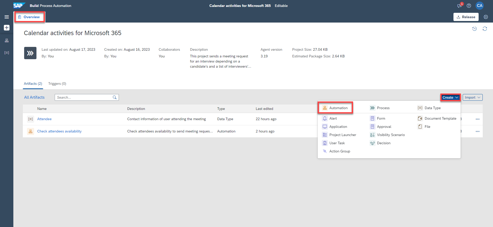

2. In the **Create Automation** pop-up do the following:

    - Enter **Update Calendar Event** as name.
    - Enter **Update the interview request with a change of time** as description.
    - Choose **Create**.

    <!-- border -->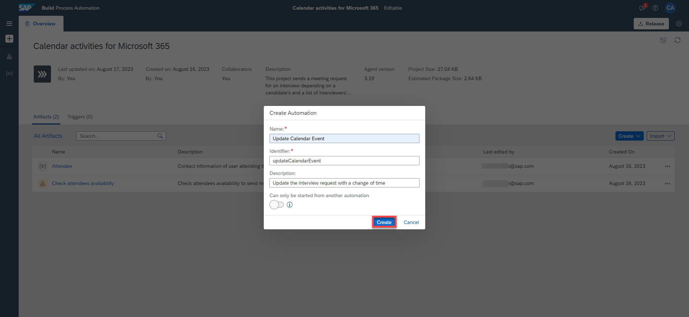

    You will be directed to the automation editor where you can start building your automation.

3. Create input parameters. Go to **Input/Output** tab.

4. Choose **Add new input parameter** and add the following inputs:

    |  Field Value  | Input Parameter 1     | Input Parameter 2  | Input Parameter 3       | Input Parameter 4 
    |  :------------| :---------------------| :------------------| :-----------------------| :----------------
    |  Name         | `meetingId`           |`updateMeetingSubject`    | `updateMeetingStartTime` | `updateMeetingEndTime`
    |  Description  | Id of the meeting request sent | New subject for the meeting | New start time for the meeting | New end time for the meeting
    |  Type         | String                | String                | String               | String            

5. Choose **save**.

    <!-- border -->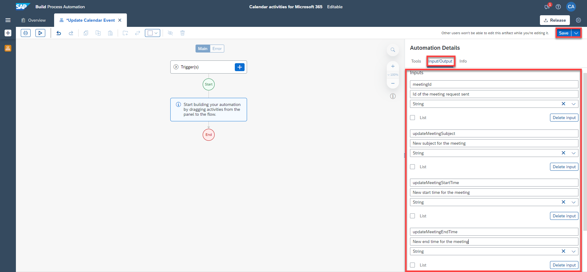

6. Under **Automation Details** panel, under **Tools**, search for **Select 365online Authentication** activity and drag and drop it into the workflow.

    <!-- border -->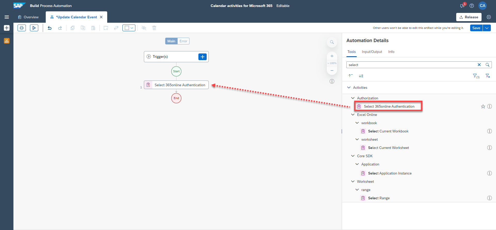

 7. Under **Automation Details** panel, under **Tools**, search for **Update Event** activity and drag and drop it into the workflow.

    <!-- border -->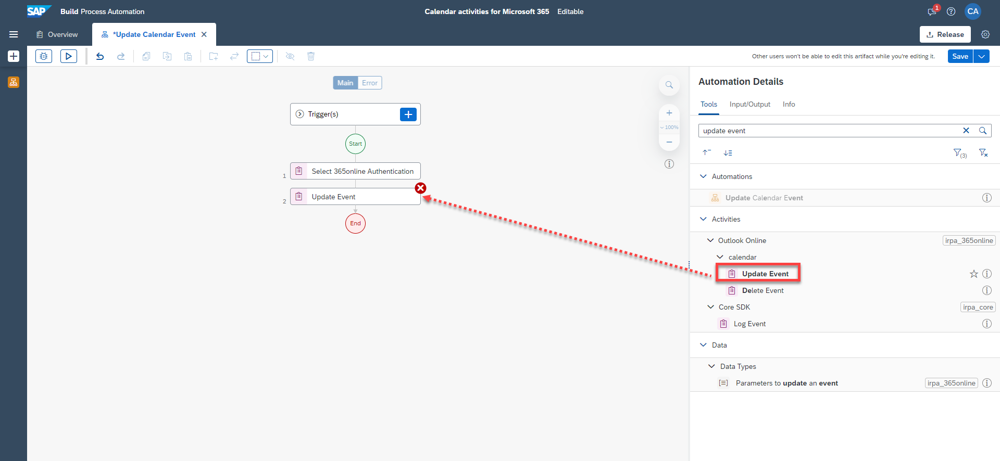

8. Select the activity.

9. Under `eventId` input parameter, select `meetingId`.

10. Under `eventUpdateParameters` input parameter, select **Create Custom Data**.

    <!-- border -->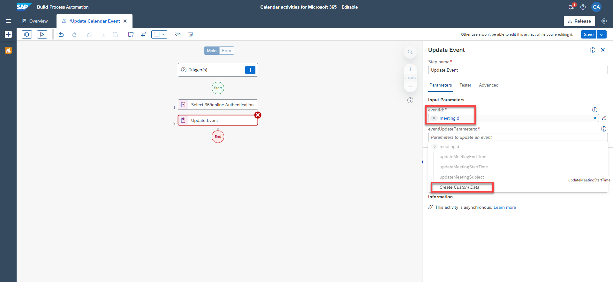

11. Under `subject` input parameter, select `updateMeetingSubject`.

12. Under `start` parameter, select **Create Custom Data** and select `updateMeetingStartTime` under `dateTime`.

13. Similarly, under `end` parameter, select **Create Custom Data** and select `updateMeetingEndTime` under `dateTime`.

14. Choose **Save**.

    <!-- border -->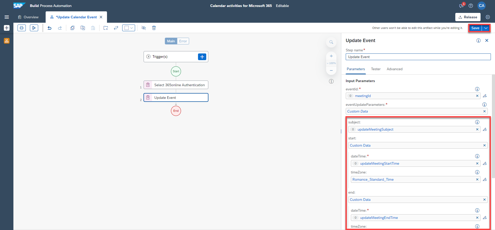

### Test the automation 

1. Choose **test**.

    You need to fill in the input parameters created with the corresponding values. 

2. For `meetingId`, paste the value you copied previously without the brackets and the quotes.

3. For `updateMeetingSubject`, enter **New interview request**.

4. For `updateMeetingStartTime`, enter a new start time such as 2023-09-01T13:00:00.

5. For `updateMeetingEndTime`, enter a new end time such as 2023-09-01T13:30:00.

6. Choose **Test**.

    <!-- border -->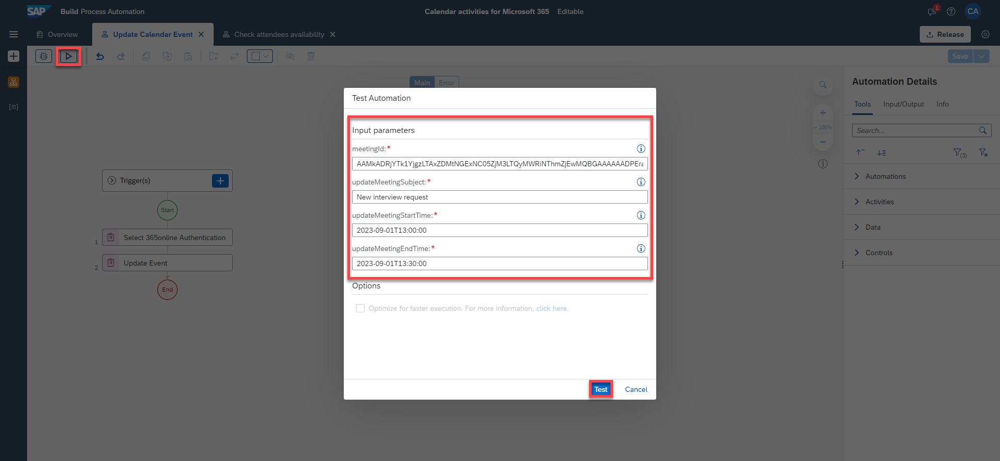

    The testing was successful. A new meeting request is sent with the updated details above.

    <!-- border -->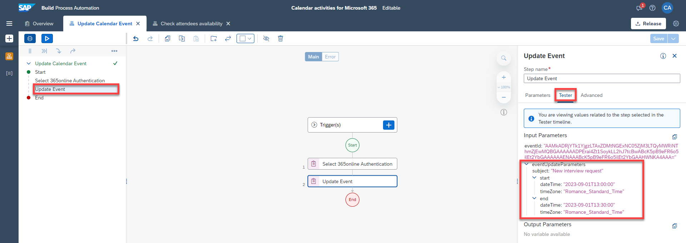

    > Please note that the `eventId` will not change its value.

### Build an automation to search and delete the calendar event

As a last step, you will now delete the meeting request from the calendar.

1. Navigate to the **Overview** tab, and choose **Create** > **Automation**.

    <!-- border -->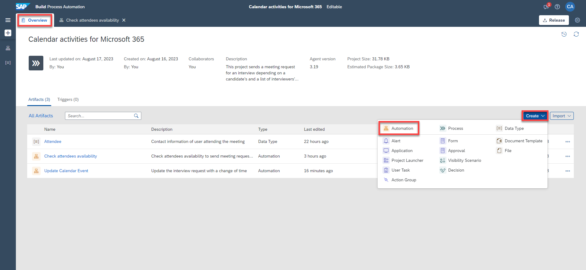

2. In the **Create Automation** pop-up do the following:

    - Enter **Search and delete calendar event** as name.
    - Enter **Search and delete the interview request** as description.
    - Choose **Create**.

    <!-- border -->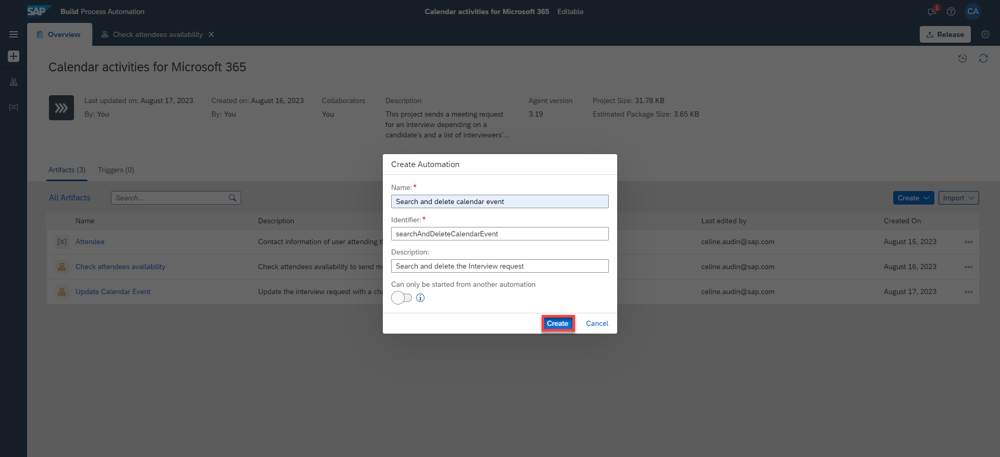

    You will be directed to the automation editor where you can start building your automation.

3. Create input parameters. Go to **Input/Output** tab.

4. Choose **Add new input parameter** and add the following input:

    |  Field Value  | Input Parameter 
    |  :------------| :------------------
    |  Name         |`startDateTime`    
    |  Description  | Beginning time of the meeting
    |  Type         | String                        

5. Choose **save**.

    <!-- border -->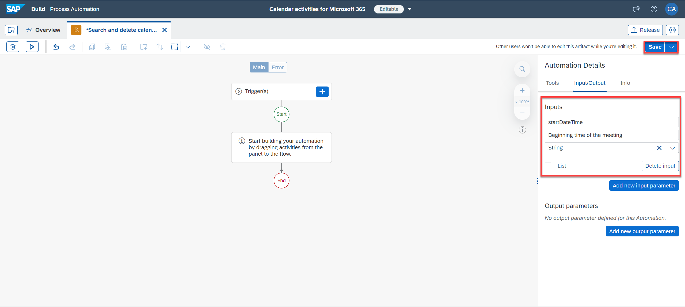

6. Under **Automation Details** panel, under **Tools**, search for **Select 365online Authentication** activity and drag and drop it into the workflow.

    <!-- border -->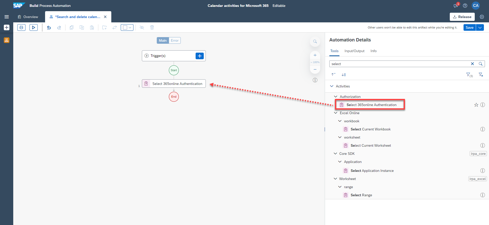

7. Under **Automation Details** panel, under **Tools**, search for **Search Calendar Events** activity and drag and drop it into the workflow.

    <!-- border -->

8. Select the activity.

9. Under `calendarSearchCriteria` input parameter, select **Create Custom Data**.

10. Next to Calendar Search Criterion, choose the **+**.

11. Under Calendar Search Criterion, select **Create Custom Data**.

12. Under `element` parameter, choose `subject`.

13. Under `value` parameter, type **Interview request** and select the expression under quotes.

    > ### What is going on?
    > You are setting the values of the parameters of the automation that will search a specific calendar event. In this case, the subject of the event will have as value **Interview request**.

    <!-- border -->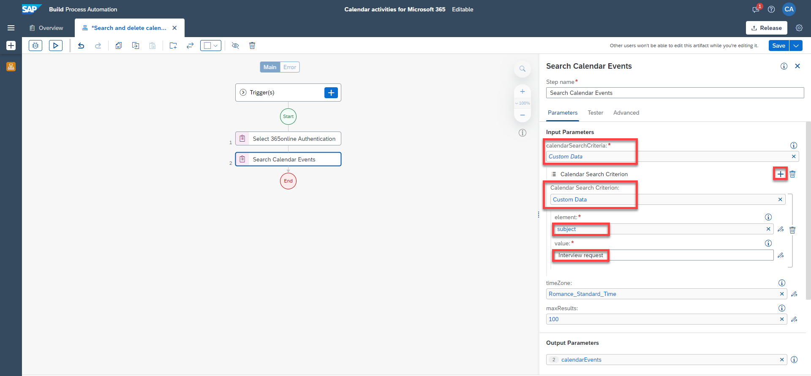

    Now you will set the value of another parameter `startDateTime` to search for an event that will have a specific beginning.

14. Next to Calendar Search Criterion, choose the **+** again.

15. Under Calendar Search Criterion, select **Create Custom Data**.

16. Under `element` parameter, select `startDateTime`.

17. Under `value` parameter, select `startDateTime`.

    <!-- border -->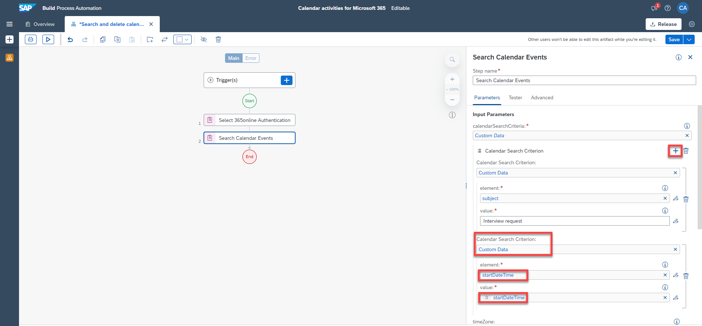

    > Please note that the output parameter for this activity is `calendarEvents`.

18. Under **Automation Details** panel, under **Tools**, search for **Delete Event** activity and drag and drop it into the workflow.

    <!-- border -->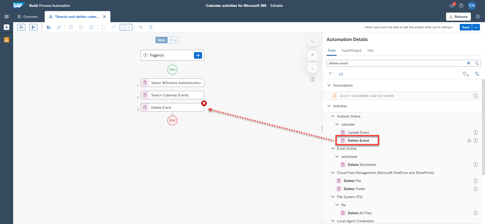

19. Select the activity.

20. Under `eventId` input parameter, open the expression editor.

21. Choose **Variables** > **calendar Events** > **id**.

22. Choose **Save Expression**.

23. Choose **Save**.

    <!-- border -->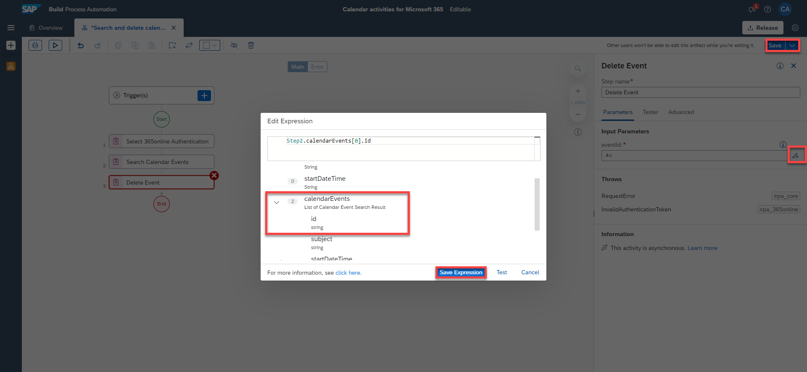
    
    > ### What is going on?
    > You are setting the value of the `eventId` to the id of the `calendarEvents` output parameter from **Search Calendar Events** activity in step 2.

### Test the automation

1. Choose **Test**.

    You need to fill in the input parameters created with the corresponding values. 

2. For `meetingId`, paste the value you copied previously without the brackets and the quotes.

3. For `startDateTime`, enter the start time of the meeting such as 2023-09-01T13:00:00.

4. Choose **Test**.

    <!-- border -->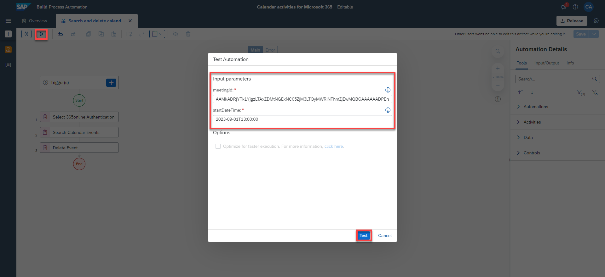
    
    The testing was successful. The bot searches for the calendar event that has **Interview request** as a subject and a beginning time of September 1st 2023 at 13h00. Then it outputs the corresponding Id of the event found which is called **New interview request** with a start time of 13h00 and an end time of 13h30 on September 1st 2023. Lastly, it proceeds to delete it from the calendar.

    <!-- border -->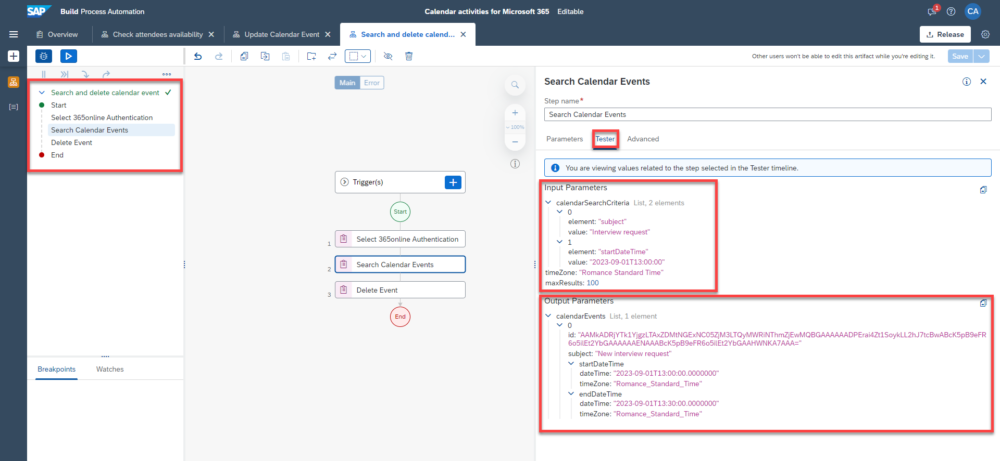

    <!-- border -->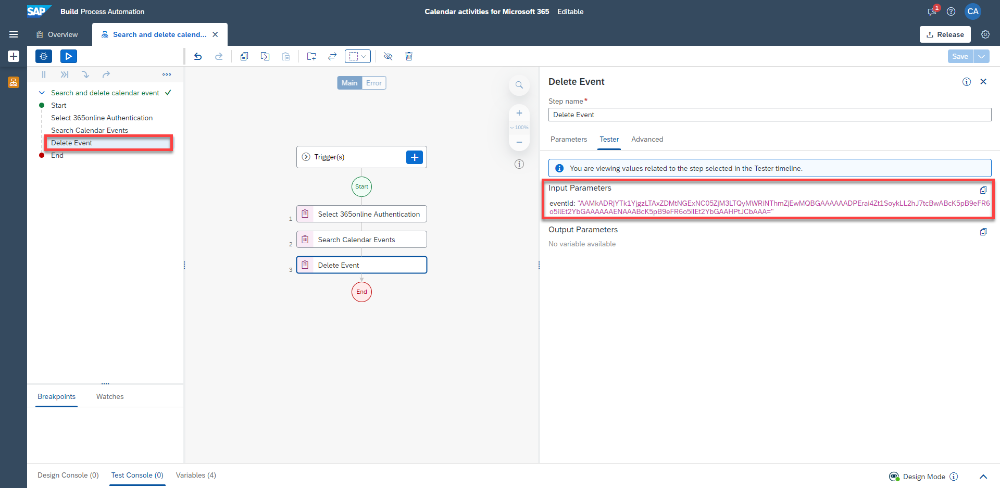

### Retrieve sample project from the store (Optional)

This sample project can be downloaded from the SAP Build Store.

To retrieve this sample, please follow these steps:
    
1. From the SAP Build Lobby, navigate to Store.
   
2. Search for the sample project: **Manage calendar events with Microsoft Office 365**.
   
3. Choose **Create from Template** to retrieve the sample and save it as a new project in your lobby.

    <!-- border -->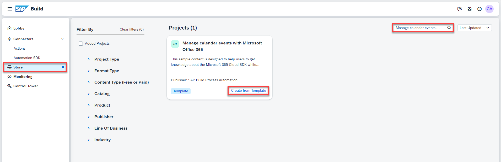

4. Choose **Create**.

    <!-- border -->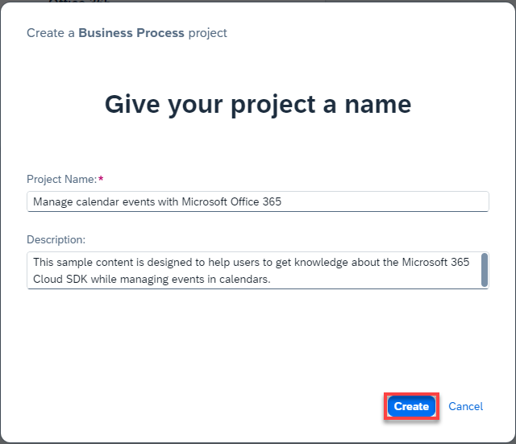

    Your project gets created in editable version. You may release and deploy it and run the project.
    
5. Navigate back to the lobby by clicking on the SAP logo.
  
    <!-- border -->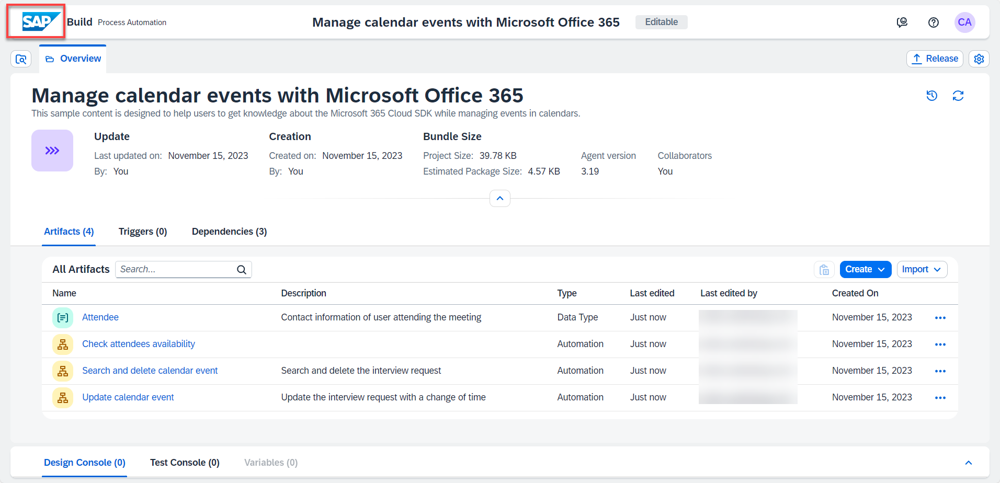

    You can see your project is available in the lobby.
  
    <!-- border -->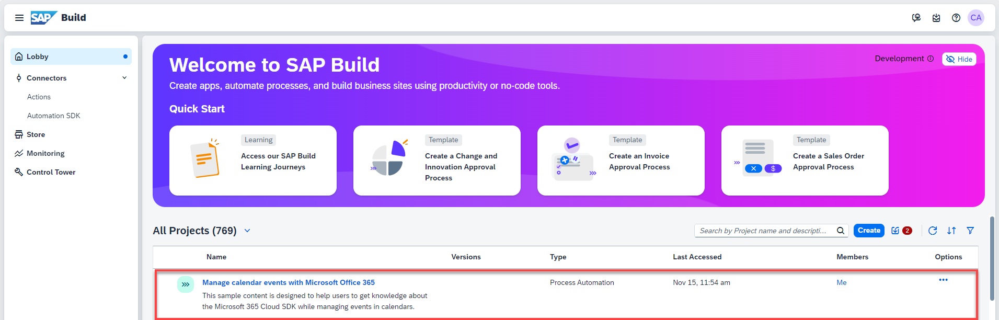

